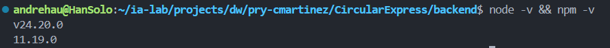

# ISS-00 — Requisitos Previos y Entorno de Desarrollo

| Campo | Detalle |
| :--- | :--- |
| **Identificador** | `ISS-00` |
| **Módulo / Feature** | `src/features/business/core` |
| **Prerrequisitos (DoR)** | Ninguno |
| **Sistema Objetivo** | CircularGuajira Backend API (Express 5 + TS + Sequelize) |

---

## 1. Definición de Ready (DoR)
Antes de iniciar el desarrollo de esta Issue, verifica que:
1. Las Issues de prerrequisito (**Ninguno**) hayan sido completadas y verificadas.
2. El entorno de desarrollo y la base de datos estén operativos.

---

## 2. Descripción y Objetivos
### 1. ISS-00 — Requisitos previos

### Detalle de Implementación
**Objetivo:** Verificar y preparar el entorno de desarrollo Node.js y motor de Base de Datos.
**Bloqueado por:** Ninguno.

##### Criterios de aceptación
* [x] Node.js v20+ instalado.
* [x] npm v10+ instalado.
* [x] Motor de BD accesible (MySQL / PostgreSQL / MSSQL / Oracle).

##### Pasos
```bash
node -v
npm -v
```

##### Verificación
```bash
node -v && npm -v
```

---

## 3. Definición de Done (DoD) y Verificación
Para marcar esta Issue como **Completada**, debes validar:
1. Compilación de TypeScript exitosa (`npm run build` o `npx tsc --noEmit`).
2. Arranque del servidor sin errores de sintaxis o de conexión a BD (`npm run dev`).
3. Ejecución y respuesta HTTP esperada en los endpoints del módulo (`.http` / REST Client).
4. Verificación de persistencia en la base de datos o interfaz Swagger `/api/docs`.
