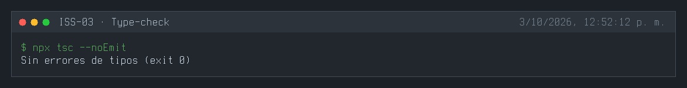
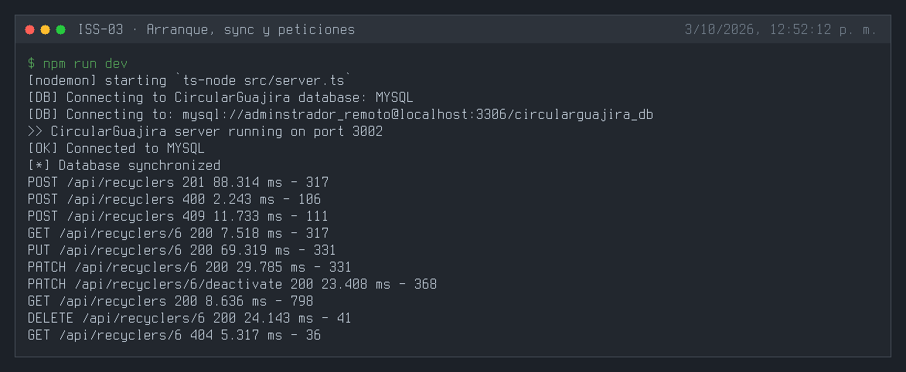
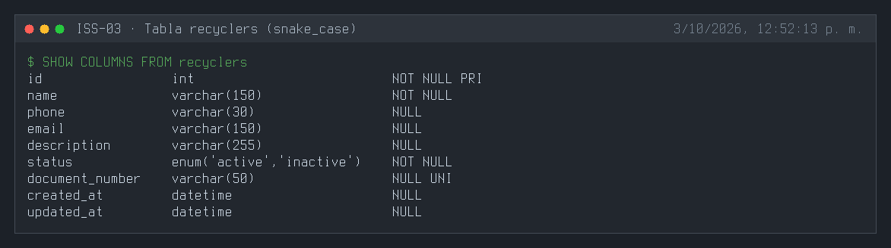
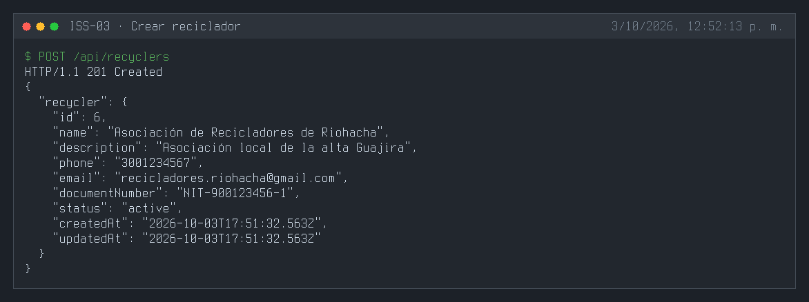
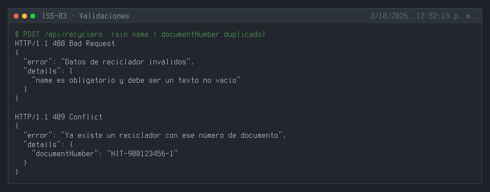
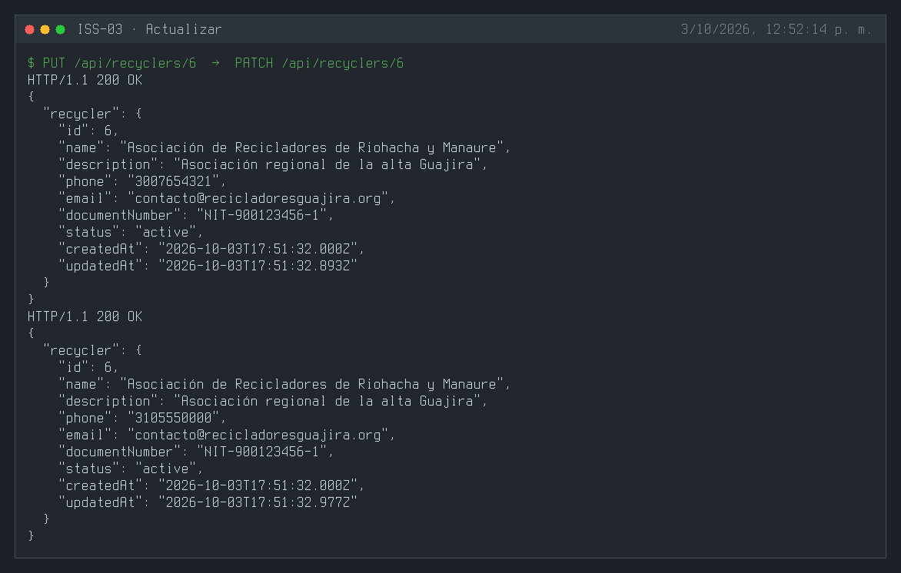
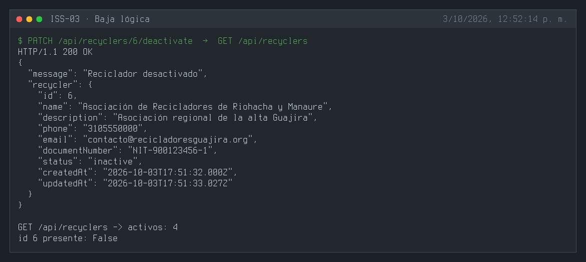
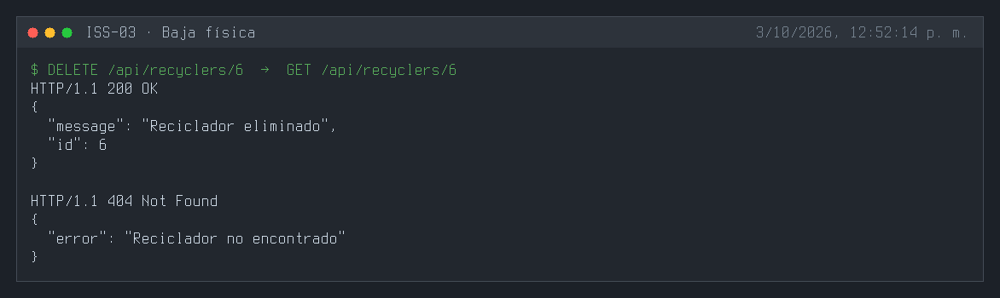

# ISS-03 — Feature Recycler (Modelo, Controlador y Rutas Base)

| Campo | Detalle |
| :--- | :--- |
| **Identificador** | `ISS-03` |
| **Módulo / Feature** | `src/features/business/feature-recycler` |
| **Prerrequisitos (DoR)** | ISS-02 |
| **Sistema Objetivo** | CircularGuajira Backend API (Express 5 + TS + Sequelize) |

---

## 1. Definición de Ready (DoR)
Antes de iniciar el desarrollo de esta Issue, verifica que:
1. Las Issues de prerrequisito (**ISS-02**) hayan sido completadas y verificadas.
2. El entorno de desarrollo y la base de datos estén operativos.

---

## 2. Descripción y Objetivos
### 4. ISS-03-A…E — Feature Recycler (Reciclador)

### Detalle de Implementación
**Objetivo:** Construir la base y CRUD completo de la entidad `Recycler` (`recyclers`), rutas sin autenticación y pruebas HTTP.
**Bloqueado por:** ISS-02.

##### Criterios de aceptación
* [x] Modelo `recycler.model.ts` con atributos `name`, `description`, `phone`, `email`, `document_number`, `status` y `timestamps: true`.
* [x] Controller `recycler.controller.ts` implementando `create`, `getAll`, `getOne`, `updatePut`, `updatePatch`, `deletePhysical`, `deleteLogical`.
* [x] Rutas `recycler.routes.ts` mapeando `/api/recicladores`. *(Implementado como `recyclers.routes.ts` en `/api/recyclers`, ver desviaciones.)*
* [x] Carpeta `http/` con archivos `.http` para pruebas REST Client.
* [x] Sincronización en `config/index.ts` y agregador `routes/index.ts`.

#### 4.1 Modelo Recycler (`src/features/business/recycler/recycler.model.ts`)
```bash
: > src/features/business/recycler/recycler.model.ts
cat >> src/features/business/recycler/recycler.model.ts << 'EOF'
import { DataTypes, Model } from "sequelize";
import { sequelize } from "../../../database/db";

export interface RecyclerI {
  id?: number;
  name: string;
  description?: string;
  phone?: string;
  email?: string;
  document_number?: string;
  status: "active" | "inactive";
  createdAt?: Date;
  updatedAt?: Date;
}

export class Recycler extends Model {
  public id!: number;
  public name!: string;
  public description!: string;
  public phone!: string;
  public email!: string;
  public document_number!: string;
  public status!: "active" | "inactive";
  public readonly createdAt!: Date;
  public readonly updatedAt!: Date;
}

Recycler.init(
  {
    name: {
      type: DataTypes.STRING,
      allowNull: false,
    },
    description: {
      type: DataTypes.STRING,
      allowNull: true,
    },
    phone: {
      type: DataTypes.STRING,
      allowNull: true,
    },
    email: {
      type: DataTypes.STRING,
      allowNull: true,
    },
    document_number: {
      type: DataTypes.STRING,
      allowNull: true,
      unique: true,
    },
    status: {
      type: DataTypes.ENUM("active", "inactive"),
      defaultValue: "active",
      allowNull: false,
    },
  },
  {
    sequelize,
    modelName: "Recycler",
    tableName: "recyclers",
    timestamps: true,
  }
);
EOF
```

#### 4.2 Controller Recycler (`src/features/business/recycler/recycler.controller.ts`)
```bash
: > src/features/business/recycler/recycler.controller.ts
cat >> src/features/business/recycler/recycler.controller.ts << 'EOF'
import { Request, Response } from "express";
import { Recycler, RecyclerI } from "./recycler.model";

function paramId(req: Request): number {
  const raw = req.params.id;
  const value = Array.isArray(raw) ? raw[0] : raw;
  return Number(value);
}

export class RecyclerController {
  public async create(req: Request, res: Response) {
    try {
      const body = req.body as RecyclerI;
      const recycler = await Recycler.create({
        name: body.name,
        description: body.description ?? null,
        phone: body.phone ?? null,
        email: body.email ?? null,
        document_number: body.document_number ?? null,
        status: body.status ?? "active",
      });
      res.status(201).json({ recycler });
    } catch (error) {
      res.status(500).json({ error: "Error creando reciclador", detail: String(error) });
    }
  }

  public async getAll(req: Request, res: Response) {
    try {
      const recyclers = await Recycler.findAll({
        where: { status: "active" },
      });
      res.status(200).json({ recyclers });
    } catch (error) {
      res.status(500).json({ error: "Error obteniendo recicladores", detail: String(error) });
    }
  }

  public async getOne(req: Request, res: Response) {
    try {
      const id = paramId(req);
      const recycler = await Recycler.findByPk(id);
      if (!recycler) {
        res.status(404).json({ error: "Reciclador no encontrado" });
        return;
      }
      res.status(200).json({ recycler });
    } catch (error) {
      res.status(500).json({ error: "Error obteniendo reciclador", detail: String(error) });
    }
  }

  public async updatePut(req: Request, res: Response) {
    try {
      const id = paramId(req);
      const body = req.body as RecyclerI;
      const recycler = await Recycler.findByPk(id);
      if (!recycler) {
        res.status(404).json({ error: "Reciclador no encontrado" });
        return;
      }
      await recycler.update({
        name: body.name,
        description: body.description ?? null,
        phone: body.phone ?? null,
        email: body.email ?? null,
        document_number: body.document_number ?? null,
        status: body.status ?? recycler.status,
      });
      res.status(200).json({ recycler });
    } catch (error) {
      res.status(500).json({ error: "Error actualizando reciclador (PUT)", detail: String(error) });
    }
  }

  public async updatePatch(req: Request, res: Response) {
    try {
      const id = paramId(req);
      const body = req.body as Partial<RecyclerI>;
      const recycler = await Recycler.findByPk(id);
      if (!recycler) {
        res.status(404).json({ error: "Reciclador no encontrado" });
        return;
      }
      await recycler.update(body);
      res.status(200).json({ recycler });
    } catch (error) {
      res.status(500).json({ error: "Error actualizando reciclador (PATCH)", detail: String(error) });
    }
  }

  public async deletePhysical(req: Request, res: Response) {
    try {
      const id = paramId(req);
      const recycler = await Recycler.findByPk(id);
      if (!recycler) {
        res.status(404).json({ error: "Reciclador no encontrado" });
        return;
      }
      await recycler.destroy();
      res.status(200).json({ message: "Reciclador eliminado físicamente", id });
    } catch (error) {
      res.status(500).json({ error: "Error eliminando reciclador", detail: String(error) });
    }
  }

  public async deleteLogical(req: Request, res: Response) {
    try {
      const id = paramId(req);
      const recycler = await Recycler.findByPk(id);
      if (!recycler) {
        res.status(404).json({ error: "Reciclador no encontrado" });
        return;
      }
      await recycler.update({ status: "inactive" });
      res.status(200).json({ message: "Reciclador desactivado (baja lógica)", recycler });
    } catch (error) {
      res.status(500).json({ error: "Error desactivando reciclador", detail: String(error) });
    }
  }
}
EOF
```

#### 4.3 Rutas Recycler (`src/features/business/recycler/recycler.routes.ts`)
```bash
: > src/features/business/recycler/recycler.routes.ts
cat >> src/features/business/recycler/recycler.routes.ts << 'EOF'
import { Application } from "express";
import { RecyclerController } from "./recycler.controller";

export class RecyclerRoutes {
  public recyclerController: RecyclerController = new RecyclerController();

  public routes(app: Application): void {
    // Colección
    app
      .route("/api/recicladores")
      .get(this.recyclerController.getAll.bind(this.recyclerController))
      .post(this.recyclerController.create.bind(this.recyclerController));

    // Recurso individual por ID
    app
      .route("/api/recicladores/:id")
      .get(this.recyclerController.getOne.bind(this.recyclerController))
      .put(this.recyclerController.updatePut.bind(this.recyclerController))
      .patch(this.recyclerController.updatePatch.bind(this.recyclerController))
      .delete(this.recyclerController.deletePhysical.bind(this.recyclerController));

    // Baja lógica
    app
      .route("/api/recicladores/:id/deactivate")
      .patch(this.recyclerController.deleteLogical.bind(this.recyclerController));
  }
}
EOF
```

#### 4.4 Cableado en Agregadores (`routes/index.ts` y `config/index.ts`)
```bash
: > src/routes/index.ts
cat >> src/routes/index.ts << 'EOF'
import { RecyclerRoutes } from "../features/business/recycler/recycler.routes";

export class Routes {
  public recyclerRoutes: RecyclerRoutes = new RecyclerRoutes();
}
EOF
```

**PARCHE** — `src/config/index.ts`: Importar modelo, conectar base de datos y agregar ruta de recicladores.

```ts
import { sequelize, getDatabaseInfo, testConnection } from "../database/db";
import "../features/business/recycler/recycler.model";
import { Routes } from "../routes/index";

// Dentro de App class:
public routePrv: Routes = new Routes();

private routes(): void {
  this.routePrv.recyclerRoutes.routes(this.app);
}

private async dbConnection(): Promise<void> {
  try {
    const dbInfo = getDatabaseInfo();
    console.log(`🔗 Intentando conectar a: ${dbInfo.engine.toUpperCase()}`);
    const isConnected = await testConnection();
    if (!isConnected) {
      throw new Error(`No se pudo conectar a la base de datos ${dbInfo.engine.toUpperCase()}`);
    }
    await sequelize.sync({ force: false, alter: true });
    console.log(`📦 Base de datos sincronizada exitosamente`);
  } catch (error) {
    console.error("❌ Error al conectar con la base de datos:", error);
    process.exit(1);
  }
}
```

#### 4.5 Pruebas REST Client (`src/features/business/recycler/http/recyclers.create.http`)
```bash
mkdir -p src/features/business/recycler/http
: > src/features/business/recycler/http/recyclers.create.http
cat >> src/features/business/recycler/http/recyclers.create.http << 'EOF'
### Feature Recycler — CREATE
@baseUrl = http://localhost:4000

POST {{baseUrl}}/api/recicladores
Content-Type: application/json

{
  "name": "Asociación de Recicladores de Riohacha",
  "description": "Asociación local de la alta Guajira",
  "phone": "3001234567",
  "email": "recicladores.riohacha@gmail.com",
  "document_number": "NIT-900123456-1",
  "status": "active"
}
EOF
```

---

---

**Evidencias:**










---

## 3. Definición de Done (DoD) y Verificación
Para marcar esta Issue como **Completada**, debes validar:
1. Compilación de TypeScript exitosa (`npm run build` o `npx tsc --noEmit`).
2. Arranque del servidor sin errores de sintaxis o de conexión a BD (`npm run dev`).
3. Ejecución y respuesta HTTP esperada en los endpoints del módulo (`.http` / REST Client).
4. Verificación de persistencia en la base de datos o interfaz Swagger `/api/docs`.

---

## 4. Cierre y trazabilidad
| Campo | Detalle |
| :--- | :--- |
| **Estado** | ✅ Completada |
| **Commit de implementación** | [`e1a91f9`](https://github.com/DW-2026-IISem/dw-2026-Andreushin/commit/e1a91f91700f09a1cdbb3be71f837d1e8040c348) |
| **Hash completo** | `e1a91f91700f09a1cdbb3be71f837d1e8040c348` |
| **Issue GitHub** | [#14](https://github.com/DW-2026-IISem/dw-2026-Andreushin/issues/14) |
| **Fecha de cierre** | 2026-10-03 |

**Verificación realizada:** `npx tsc --noEmit` sin errores; `npm run dev` conecta a MySQL y `sync({ alter: true })` deja la tabla `recyclers` con columnas snake_case; `POST` 201, `POST` sin `name` 400, `documentNumber` duplicado 409, `GET /:id` 200, `PUT` 200, `PATCH` 200, `PATCH /:id/deactivate` 200 y el registro sale de `GET /api/recyclers`, `DELETE` 200 y luego 404.

**Desviaciones respecto al ISS** (por las convenciones de `docs/prompt.MD` §3.4, commit `c5a2c7f`):
- Estructura por capas en `src/features/business/recyclers/` (model, `dto/`, repository, service, controller, routes) en lugar de modelo/controller/rutas planos; se agrega `src/shared/` (AppError, BaseController, withTransaction).
- Atributos camelCase (`documentNumber`) con `underscored: true`; las columnas siguen en snake_case.
- Ruta `/api/recyclers` en lugar de `/api/recicladores`.
- Validación de entrada en el service (400) y unicidad de `documentNumber` (409), que el ISS no pedía.
- La tabla `recyclers` ya existía en la BD (proyecto anterior); el `alter` eliminó sus columnas viejas. Quedan 4 filas antiguas referenciadas por tablas de ese proyecto (`sales`, `settlements`).
