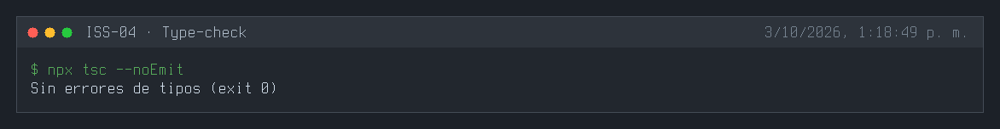
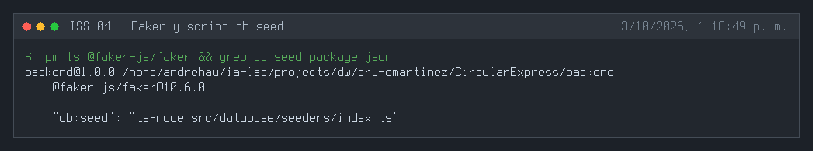
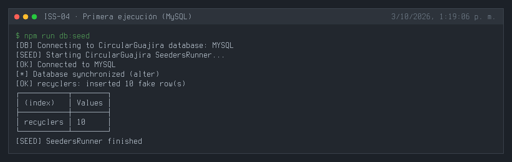
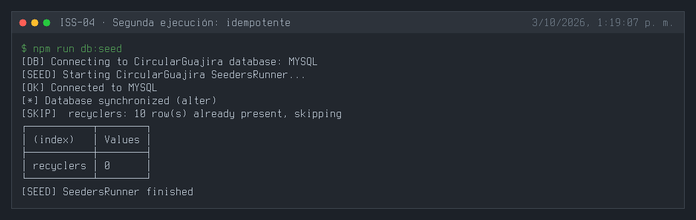
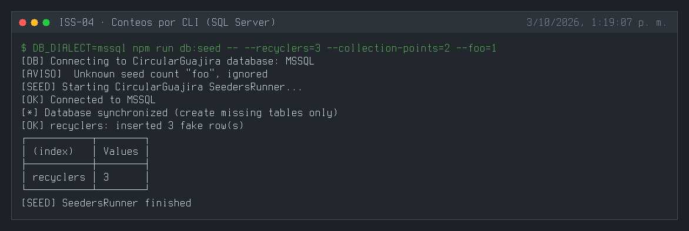
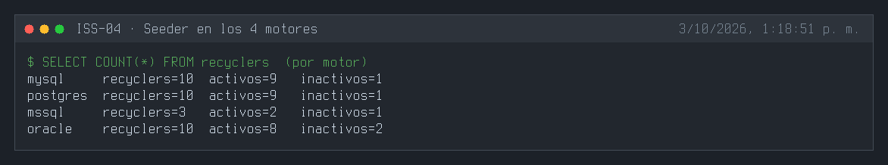
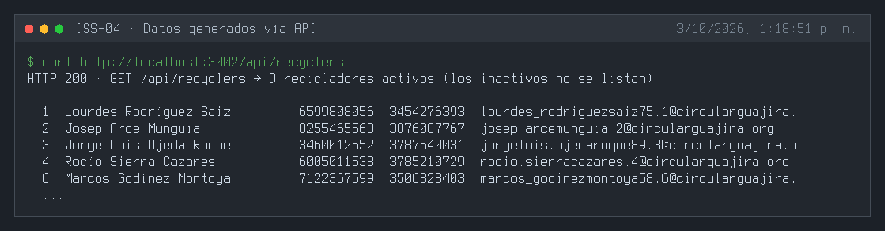

# ISS-04 — Poblamiento de Datos Idempotente con Faker y Runner Externe

| Campo | Detalle |
| :--- | :--- |
| **Identificador** | `ISS-04` |
| **Módulo / Feature** | `src/features/business/core` |
| **Prerrequisitos (DoR)** | ISS-03 |
| **Sistema Objetivo** | CircularGuajira Backend API (Express 5 + TS + Sequelize) |

---

## 1. Definición de Ready (DoR)
Antes de iniciar el desarrollo de esta Issue, verifica que:
1. Las Issues de prerrequisito (**ISS-03**) hayan sido completadas y verificadas.
2. El entorno de desarrollo y la base de datos estén operativos.

---

## 2. Descripción y Objetivos
### 5. ISS-04 — Seeders con Faker (Feature + Runner Externe)

### Detalle de Implementación
**Objetivo:** Crear el seeder de `Recycler` con `@faker-js/faker` y el orquestador global `SeedersRunner` en `src/database/seeders`.
**Bloqueado por:** ISS-03-A.

##### Criterios de aceptación
* [x] `@faker-js/faker` instalado.
* [x] Archivo `recycler.seeder.ts` dentro de `features/business/recycler/`. *(Implementado como `recyclers/recyclers.seeder.ts`, ver desviaciones.)*
* [x] Archivo `counts.ts` y `index.ts` en `src/database/seeders/`.
* [x] Script `npm run db:seed` en `package.json`.

#### 5.1 Instalación de Faker
```bash
npm install -D @faker-js/faker@^10.6.0
```

#### 5.2 Seeder del Feature Recycler (`src/features/business/recycler/recycler.seeder.ts`)
```bash
: > src/features/business/recycler/recycler.seeder.ts
cat >> src/features/business/recycler/recycler.seeder.ts << 'EOF'
import { faker } from "@faker-js/faker";
import { Recycler } from "./recycler.model";

export async function seedRecyclers(count: number): Promise<number> {
  if (count <= 0) return 0;
  const existing = await Recycler.count();
  if (existing > 0) {
    console.log(`⏭️ recyclers: ya hay ${existing} registro(s), omitiendo`);
    return 0;
  }
  const rows = Array.from({ length: count }, (_, i) => ({
    name: faker.person.fullName(),
    description: `Reciclador independiente sector ${faker.location.city()}`,
    phone: faker.phone.number({ style: "national" }),
    email: `reciclador.${i}.${faker.string.alphanumeric(4)}@circularguajira.org`.toLowerCase(),
    document_number: `${faker.number.int({ min: 10000000, max: 99999999 })}`,
    status: "active" as const,
  }));
  await Recycler.bulkCreate(rows);
  console.log(`✅ recyclers: insertados ${count} registros falsos`);
  return count;
}
EOF
```

#### 5.3 Conteos y Orquestador (`src/database/seeders/counts.ts` e `index.ts`)
```bash
: > src/database/seeders/counts.ts
cat >> src/database/seeders/counts.ts << 'EOF'
export type SeedCounts = {
  recyclers: number;
  routes: number;
  collection_points: number;
  collections: number;
  materials: number;
  material_rates: number;
  plants: number;
  material_lots: number;
  weighings: number;
  material_sales: number;
  settlements: number;
};

export const DEFAULT_SEED_COUNTS: SeedCounts = {
  recyclers: 10,
  routes: 5,
  collection_points: 15,
  collections: 10,
  materials: 8,
  material_rates: 8,
  plants: 3,
  material_lots: 6,
  weighings: 20,
  material_sales: 10,
  settlements: 10,
};

export function resolveSeedCounts(argv: string[] = process.argv.slice(2)): SeedCounts {
  const counts: SeedCounts = { ...DEFAULT_SEED_COUNTS };
  for (const arg of argv) {
    const m = arg.match(/^--([a-zA-Z_]+)=(\d+)$/);
    if (!m) continue;
    const key = m[1] as keyof SeedCounts;
    if (key in counts) counts[key] = Number(m[2]);
  }
  return counts;
}
EOF
```

```bash
: > src/database/seeders/index.ts
cat >> src/database/seeders/index.ts << 'EOF'
import dotenv from "dotenv";
import { sequelize, testConnection } from "../db";
import "../../features/business/recycler/recycler.model";
import { seedRecyclers } from "../../features/business/recycler/recycler.seeder";
import { resolveSeedCounts } from "./counts";

dotenv.config();

export async function runAllSeeders(): Promise<void> {
  const counts = resolveSeedCounts();
  console.log("🌱 Iniciando SeedersRunner CircularGuajira...");
  const ok = await testConnection();
  if (!ok) throw new Error("No hay conexión a la base de datos");
  await sequelize.sync({ force: false, alter: true });

  await seedRecyclers(counts.recyclers);
  console.log("🌱 SeedersRunner finalizado con éxito");
}

if (require.main === module) {
  runAllSeeders()
    .then(async () => {
      await sequelize.close();
      process.exit(0);
    })
    .catch(async (err) => {
      console.error("❌ Error en seeders:", err);
      await sequelize.close();
      process.exit(1);
    });
}
EOF
```

**PARCHE** — `package.json` (añadir en `scripts`):
```json
"db:seed": "ts-node -- src/database/seeders/index.ts"
```

---

---

**Evidencias:**









---

## 3. Definición de Done (DoD) y Verificación
Para marcar esta Issue como **Completada**, debes validar:
1. Compilación de TypeScript exitosa (`npm run build` o `npx tsc --noEmit`).
2. Arranque del servidor sin errores de sintaxis o de conexión a BD (`npm run dev`).
3. Ejecución y respuesta HTTP esperada en los endpoints del módulo (`.http` / REST Client).
4. Verificación de persistencia en la base de datos o interfaz Swagger `/api/docs`.

---

## 4. Cierre y trazabilidad
| Campo | Detalle |
| :--- | :--- |
| **Estado** | ✅ Completada |
| **Commit de implementación** | [`d2929b1`](https://github.com/DW-2026-IISem/dw-2026-Andreushin/commit/d2929b1872ee0171e12418c1ec13088f57dd5707) |
| **Hash completo** | `d2929b1872ee0171e12418c1ec13088f57dd5707` |
| **Commit relacionado** | [`245bede`](https://github.com/DW-2026-IISem/dw-2026-Andreushin/commit/245bede) `fix(iss-03)`: sync repetible en los 4 motores (detectado durante esta verificación) |
| **Issue GitHub** | [#17](https://github.com/DW-2026-IISem/dw-2026-Andreushin/issues/17) |
| **Fecha de cierre** | 2026-10-03 |

**Verificación realizada:** `npx tsc --noEmit` sin errores; en MySQL `npm run db:seed` inserta 10 recicladores y una segunda ejecución los omite (idempotencia); `--recyclers=3` inserta 3 en SQL Server y la clave desconocida `--foo` se ignora con aviso; el seeder corre también en PostgreSQL y Oracle; `GET /api/recyclers` lista los recicladores activos generados.

**Desviaciones respecto al ISS** (convenciones de `docs/prompt.MD` §3.4):
- Seeder como clase `RecyclersSeeder` en `features/business/recyclers/recyclers.seeder.ts` (el ISS indica `recycler/recycler.seeder.ts` con función suelta); usa el repository en lugar del modelo directo.
- Claves de `SeedCounts` en camelCase (`collectionPoints`); la CLI acepta kebab, snake y camelCase.
- `SeedersRunner` como clase y sync vía `syncDatabase()` (sin `alter` en SQL Server, ver `fix(iss-03)` 245bede).
- Datos más realistas que el ejemplo del ISS: locale en español, celulares colombianos, municipios de La Guajira y ~10 % de inactivos.
