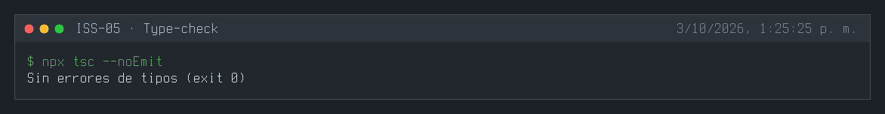
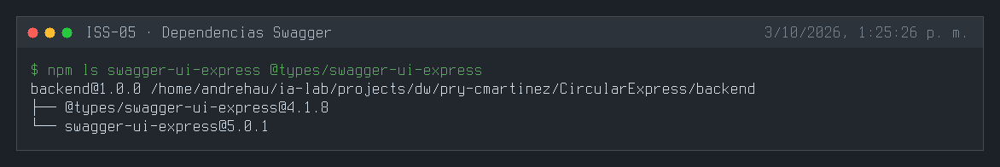
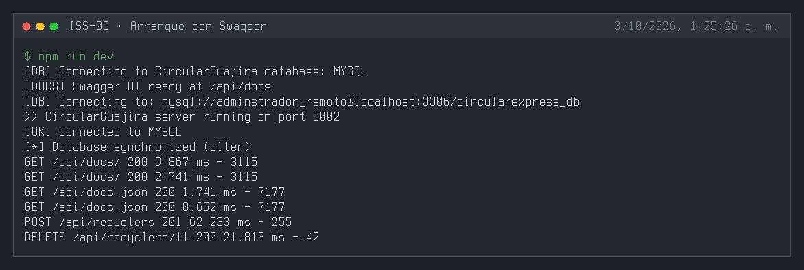
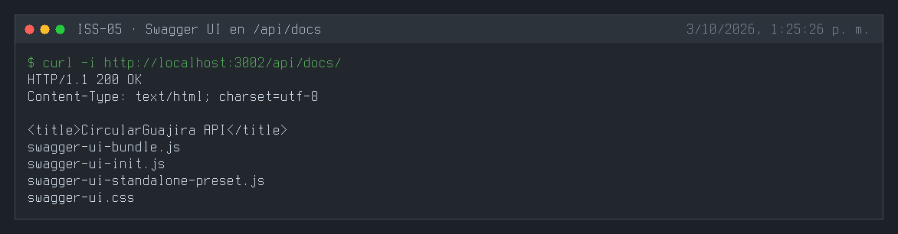
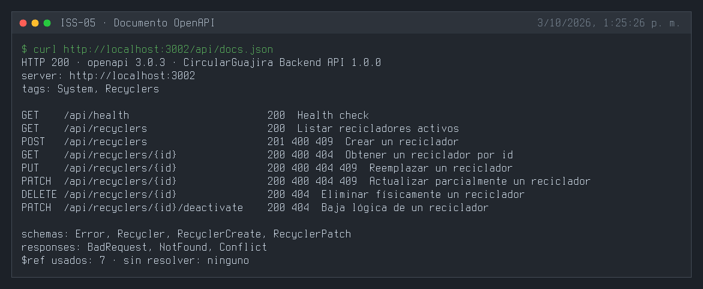
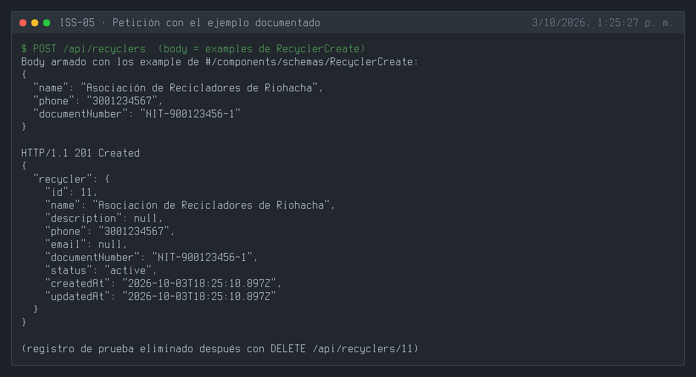

# ISS-05 — Documentación Interactiva OpenAPI 3 / Swagger

| Campo | Detalle |
| :--- | :--- |
| **Identificador** | `ISS-05` |
| **Módulo / Feature** | `src/features/business/core` |
| **Prerrequisitos (DoR)** | ISS-03 |
| **Sistema Objetivo** | CircularGuajira Backend API (Express 5 + TS + Sequelize) |

---

## 1. Definición de Ready (DoR)
Antes de iniciar el desarrollo de esta Issue, verifica que:
1. Las Issues de prerrequisito (**ISS-03**) hayan sido completadas y verificadas.
2. El entorno de desarrollo y la base de datos estén operativos.

---

## 2. Descripción y Objetivos
### 6. ISS-05 — Swagger / OpenAPI 3

### Detalle de Implementación
**Objetivo:** Integrar Swagger UI para documentar interactivamente las APIs en `/api/docs`.
**Bloqueado por:** ISS-03-E.

##### Criterios de aceptación
* [x] Instalar `swagger-ui-express` y sus tipos.
* [x] `recycler.swagger.ts` dentro de `features/business/recycler/`. *(Implementado como `recyclers/recyclers.swagger.ts`, ver desviaciones.)*
* [x] Registry `src/swagger/index.ts`.
* [x] Montaje de Swagger UI en `src/config/index.ts`.

#### 6.1 Instalación
```bash
npm install swagger-ui-express@^5.0.1
npm install -D @types/swagger-ui-express@^4.1.8
```

#### 6.2 Documentación del Feature Recycler (`src/features/business/recycler/recycler.swagger.ts`)
```bash
: > src/features/business/recycler/recycler.swagger.ts
cat >> src/features/business/recycler/recycler.swagger.ts << 'EOF'
export const recyclerSwagger = {
  tags: [
    {
      name: "Recicladores",
      description: "Gestión de recicladores y asociaciones (CircularGuajira)",
    },
  ],
  paths: {
    "/api/recicladores": {
      get: {
        tags: ["Recicladores"],
        summary: "Listar recicladores activos",
        responses: {
          "200": { description: "Lista de recicladores activos" },
        },
      },
      post: {
        tags: ["Recicladores"],
        summary: "Crear un reciclador",
        requestBody: {
          required: true,
          content: {
            "application/json": {
              schema: { $ref: "#/components/schemas/RecyclerCreate" },
            },
          },
        },
        responses: {
          "201": { description: "Reciclador creado exitosamente" },
        },
      },
    },
  },
  components: {
    schemas: {
      RecyclerCreate: {
        type: "object",
        required: ["name"],
        properties: {
          name: { type: "string" },
          description: { type: "string" },
          phone: { type: "string" },
          email: { type: "string" },
          document_number: { type: "string" },
        },
      },
    },
  },
};
EOF
```

#### 6.3 Registry Swagger (`src/swagger/index.ts`)
```bash
mkdir -p src/swagger
: > src/swagger/index.ts
cat >> src/swagger/index.ts << 'EOF'
import { Application } from "express";
import swaggerUi from "swagger-ui-express";
import { recyclerSwagger } from "../features/business/recycler/recycler.swagger";

const featureSwaggerModules = [recyclerSwagger];

export function buildOpenApiDocument() {
  const tags: unknown[] = [];
  const paths: Record<string, unknown> = {};
  const schemas: Record<string, unknown> = {};

  for (const mod of featureSwaggerModules) {
    tags.push(...mod.tags);
    Object.assign(paths, mod.paths);
    if (mod.components?.schemas) {
      Object.assign(schemas, mod.components.schemas);
    }
  }

  return {
    openapi: "3.0.3",
    info: {
      title: "CircularGuajira Backend API",
      version: "1.0.0",
      description: "API de la Cadena de Reciclaje CircularGuajira (Express + Sequelize)",
    },
    servers: [{ url: `http://localhost:${process.env.PORT || 4000}`, description: "Servidor Local" }],
    tags,
    paths,
    components: { schemas },
  };
}

export function setupSwagger(app: Application): void {
  const document = buildOpenApiDocument();
  app.use("/api/docs", swaggerUi.serve, swaggerUi.setup(document));
  app.get("/api/docs.json", (_req, res) => res.json(document));
  console.log("📘 Swagger UI listo en: /api/docs");
}
EOF
```

---

---

**Evidencias:**








---

## 3. Definición de Done (DoD) y Verificación
Para marcar esta Issue como **Completada**, debes validar:
1. Compilación de TypeScript exitosa (`npm run build` o `npx tsc --noEmit`).
2. Arranque del servidor sin errores de sintaxis o de conexión a BD (`npm run dev`).
3. Ejecución y respuesta HTTP esperada en los endpoints del módulo (`.http` / REST Client).
4. Verificación de persistencia en la base de datos o interfaz Swagger `/api/docs`.

---

## 4. Cierre y trazabilidad
| Campo | Detalle |
| :--- | :--- |
| **Estado** | ✅ Completada |
| **Commit de implementación** | [`8d832e7`](https://github.com/DW-2026-IISem/dw-2026-Andreushin/commit/8d832e7c63805eae125bbb8059944c65c87c3ca3) |
| **Hash completo** | `8d832e7c63805eae125bbb8059944c65c87c3ca3` |
| **Issue GitHub** | [#18](https://github.com/DW-2026-IISem/dw-2026-Andreushin/issues/18) |
| **Fecha de cierre** | 2026-10-03 |

**Verificación realizada:** `npx tsc --noEmit` sin errores; el servidor arranca con `Swagger UI ready at /api/docs`; `GET /api/docs/` responde 200 con la interfaz Swagger UI; `GET /api/docs.json` devuelve un documento OpenAPI 3.0.3 con 8 operaciones (health + CRUD de recyclers) y sus 7 `$ref` resueltos; un `POST /api/recyclers` con los `example` del esquema `RecyclerCreate` responde 201 (registro de prueba eliminado después).

**Desviaciones respecto al ISS** (convenciones de `docs/prompt.MD` §3.4):
- Archivo `recyclers/recyclers.swagger.ts`, tag `Recyclers`, rutas `/api/recyclers` y propiedades camelCase (`documentNumber`) en lugar de `recycler.swagger.ts`, `Recicladores`, `/api/recicladores` y `document_number`.
- Se documentan los 7 endpoints del CRUD con respuestas de error (el ISS solo mostraba GET y POST).
- Contrato tipado `FeatureSwagger` (`src/swagger/swagger.types.ts`) y componentes compartidos (`Error`, `BadRequest`, `NotFound`, `Conflict`) en el registry; `/api/health` documentado bajo el tag `System`.
