# ISS-06 — Feature Route (Rutas de Recolección por Municipio)

| Campo | Detalle |
| :--- | :--- |
| **Identificador** | `ISS-06` |
| **Módulo / Feature** | `src/features/business/feature-route` |
| **Prerrequisitos (DoR)** | ISS-03 |
| **Sistema Objetivo** | CircularGuajira Backend API (Express 5 + TS + Sequelize) |

---

## 1. Definición de Ready (DoR)
Antes de iniciar el desarrollo de esta Issue, verifica que:
1. Las Issues de prerrequisito (**ISS-03**) hayan sido completadas y verificadas.
2. El entorno de desarrollo y la base de datos estén operativos.

---

## 2. Descripción y Objetivos
### 7. ISS-06 — Feature Route (Rutas de Recolección)

### Detalle de Implementación
**Objetivo:** Implementar el feature de Rutas de Recolección (`routes`).
**Bloqueado por:** ISS-05.

#### 7.1 Modelo Route (`src/features/business/route/route.model.ts`)
```bash
mkdir -p src/features/business/route/http
: > src/features/business/route/route.model.ts
cat >> src/features/business/route/route.model.ts << 'EOF'
import { DataTypes, Model } from "sequelize";
import { sequelize } from "../../../database/db";

export interface RouteI {
  id?: number;
  name: string;
  description?: string;
  status: "active" | "inactive";
  createdAt?: Date;
  updatedAt?: Date;
}

export class Route extends Model {
  public id!: number;
  public name!: string;
  public description!: string;
  public status!: "active" | "inactive";
  public readonly createdAt!: Date;
  public readonly updatedAt!: Date;
}

Route.init(
  {
    name: { type: DataTypes.STRING, allowNull: false },
    description: { type: DataTypes.STRING, allowNull: true },
    status: { type: DataTypes.ENUM("active", "inactive"), defaultValue: "active", allowNull: false },
  },
  { sequelize, modelName: "Route", tableName: "routes", timestamps: true }
);
EOF
```

#### 7.2 Controller y Routes
```bash
: > src/features/business/route/route.controller.ts
cat >> src/features/business/route/route.controller.ts << 'EOF'
import { Request, Response } from "express";
import { Route, RouteI } from "./route.model";

function paramId(req: Request): number {
  const raw = req.params.id;
  return Number(Array.isArray(raw) ? raw[0] : raw);
}

export class RouteController {
  public async create(req: Request, res: Response) {
    try {
      const body = req.body as RouteI;
      const route = await Route.create({ name: body.name, description: body.description ?? null, status: body.status ?? "active" });
      res.status(201).json({ route });
    } catch (error) { res.status(500).json({ error: "Error creando ruta", detail: String(error) }); }
  }

  public async getAll(req: Request, res: Response) {
    try {
      const routes = await Route.findAll({ where: { status: "active" } });
      res.status(200).json({ routes });
    } catch (error) { res.status(500).json({ error: "Error consultando rutas", detail: String(error) }); }
  }

  public async getOne(req: Request, res: Response) {
    try {
      const route = await Route.findByPk(paramId(req));
      if (!route) { res.status(404).json({ error: "Ruta no encontrada" }); return; }
      res.status(200).json({ route });
    } catch (error) { res.status(500).json({ error: "Error consultando ruta", detail: String(error) }); }
  }

  public async updatePut(req: Request, res: Response) {
    try {
      const route = await Route.findByPk(paramId(req));
      if (!route) { res.status(404).json({ error: "Ruta no encontrada" }); return; }
      await route.update(req.body);
      res.status(200).json({ route });
    } catch (error) { res.status(500).json({ error: "Error actualizando ruta", detail: String(error) }); }
  }

  public async deleteLogical(req: Request, res: Response) {
    try {
      const route = await Route.findByPk(paramId(req));
      if (!route) { res.status(404).json({ error: "Ruta no encontrada" }); return; }
      await route.update({ status: "inactive" });
      res.status(200).json({ message: "Ruta desactivada", route });
    } catch (error) { res.status(500).json({ error: "Error desactivando ruta", detail: String(error) }); }
  }
}
EOF
```

```bash
: > src/features/business/route/route.routes.ts
cat >> src/features/business/route/route.routes.ts << 'EOF'
import { Application } from "express";
import { RouteController } from "./route.controller";

export class RouteRoutes {
  public routeController: RouteController = new RouteController();

  public routes(app: Application): void {
    app.route("/api/rutas")
      .get(this.routeController.getAll.bind(this.routeController))
      .post(this.routeController.create.bind(this.routeController));

    app.route("/api/rutas/:id")
      .get(this.routeController.getOne.bind(this.routeController))
      .put(this.routeController.updatePut.bind(this.routeController));

    app.route("/api/rutas/:id/deactivate")
      .patch(this.routeController.deleteLogical.bind(this.routeController));
  }
}
EOF
```

---

---

**Evidencias:**

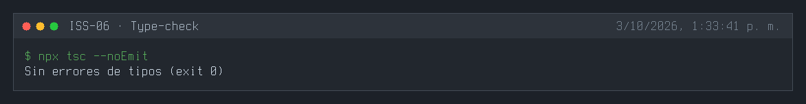
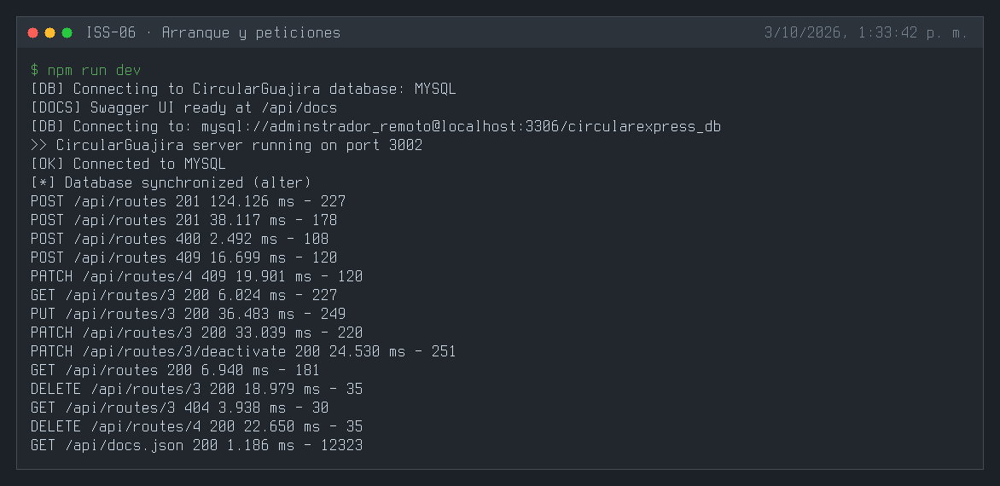
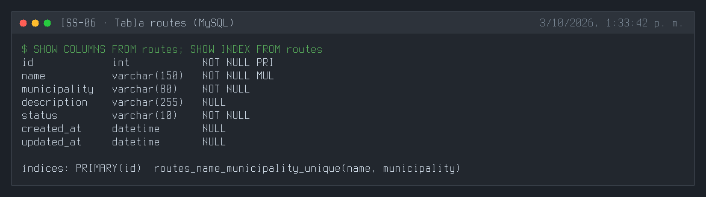
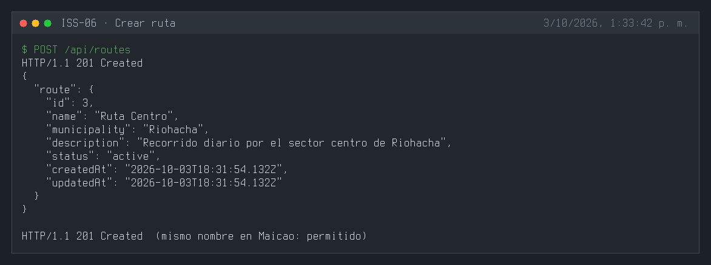
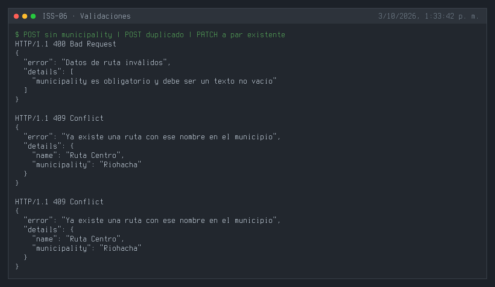
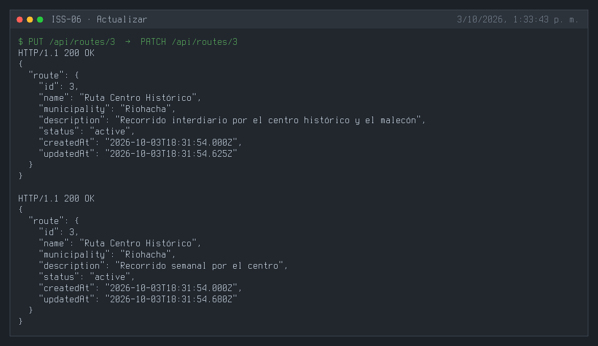
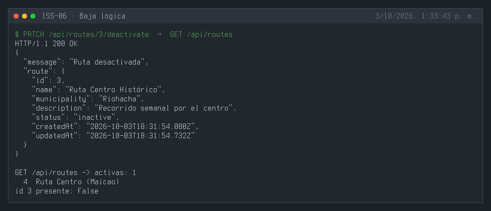
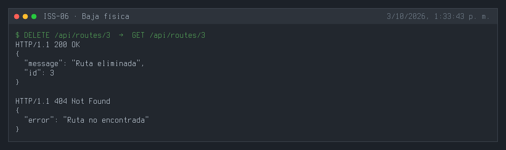
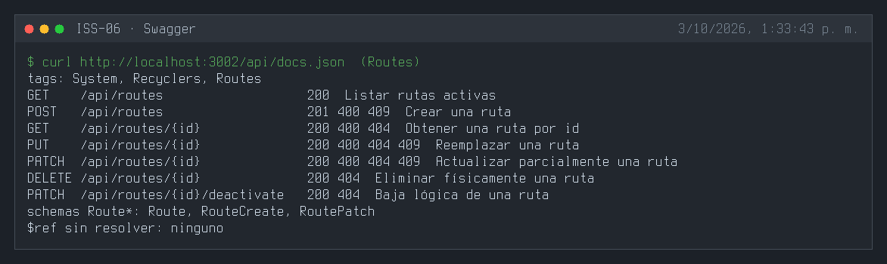
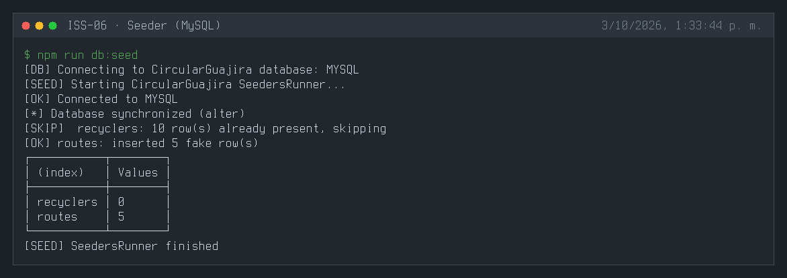
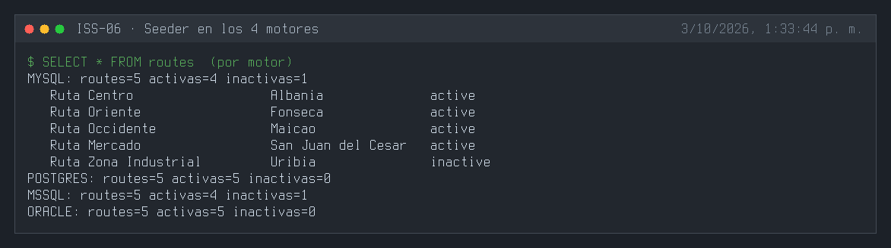

---

## 3. Definición de Done (DoD) y Verificación
Para marcar esta Issue como **Completada**, debes validar:
1. Compilación de TypeScript exitosa (`npm run build` o `npx tsc --noEmit`).
2. Arranque del servidor sin errores de sintaxis o de conexión a BD (`npm run dev`).
3. Ejecución y respuesta HTTP esperada en los endpoints del módulo (`.http` / REST Client).
4. Verificación de persistencia en la base de datos o interfaz Swagger `/api/docs`.

---

## 4. Cierre y trazabilidad
| Campo | Detalle |
| :--- | :--- |
| **Estado** | ✅ Completada |
| **Commit de implementación** | [`c5326dd`](https://github.com/DW-2026-IISem/dw-2026-Andreushin/commit/c5326dd7355ae6c4b15c5b4ae5fddc5055dffb88) |
| **Hash completo** | `c5326dd7355ae6c4b15c5b4ae5fddc5055dffb88` |
| **Issue GitHub** | [#19](https://github.com/DW-2026-IISem/dw-2026-Andreushin/issues/19) |
| **Fecha de cierre** | 2026-10-03 |

**Verificación realizada:** `npx tsc --noEmit` sin errores; la tabla `routes` se sincroniza en MySQL con columnas snake_case e índice único `(name, municipality)`; `POST` 201 (el mismo nombre en otro municipio también 201), sin `municipality` 400, par duplicado 409 tanto en `POST` como en `PATCH`, `GET`/`PUT`/`PATCH` 200, la baja lógica saca la ruta de `GET /api/routes`, `DELETE` 200 y luego 404; Swagger expone el tag `Routes` con sus 7 operaciones y todos los `$ref` resueltos; `npm run db:seed` inserta 5 rutas en MySQL, PostgreSQL, SQL Server y Oracle.

**Desviaciones respecto al ISS:**
- Campo `municipality` obligatorio con índice único `(name, municipality)`: el ISS se titula "por Municipio" y el prompt maestro define las rutas por municipio, pero el modelo de referencia no lo incluía.
- Controller con los 7 métodos de la convención (el ISS trae 5: faltaban `updatePatch` y `deletePhysical`).
- Estructura por capas en `features/business/routes/`, ruta `/api/routes` (no `/api/rutas`), `status` como STRING + `isIn` y código en inglés (`docs/prompt.MD` §3.4).
- Además del ISS: seeder (`routes.seeder.ts`), documentación Swagger (`routes.swagger.ts`) y archivos `.http`; se agregó `src/swagger/swagger.helpers.ts` y `recyclers.swagger.ts` pasó a usarlo sin cambiar el documento.
