# ISS-07 — Feature CollectionPoint y Relación 1:N con Route

| Campo | Detalle |
| :--- | :--- |
| **Identificador** | `ISS-07` |
| **Módulo / Feature** | `src/features/business/feature-collection-point` |
| **Prerrequisitos (DoR)** | ISS-06 |
| **Sistema Objetivo** | CircularGuajira Backend API (Express 5 + TS + Sequelize) |

---

## 1. Definición de Ready (DoR)
Antes de iniciar el desarrollo de esta Issue, verifica que:
1. Las Issues de prerrequisito (**ISS-06**) hayan sido completadas y verificadas.
2. El entorno de desarrollo y la base de datos estén operativos.

---

## 2. Descripción y Objetivos
### 8. ISS-07 — Feature CollectionPoint + Relación Route 1:N

### Detalle de Implementación
**Objetivo:** Implementar los Puntos de Recolección (`collection_points`) relacionados con `routes` (`route_id`).
**Bloqueado por:** ISS-06.

#### 8.1 Modelo y Asociaciones (`collection-point/`)
```bash
mkdir -p src/features/business/collection-point/http
: > src/features/business/collection-point/collection-point.model.ts
cat >> src/features/business/collection-point/collection-point.model.ts << 'EOF'
import { DataTypes, Model } from "sequelize";
import { sequelize } from "../../../database/db";

export interface CollectionPointI {
  id?: number;
  name: string;
  description?: string;
  address?: string;
  route_id: number;
  status: "active" | "inactive";
}

export class CollectionPoint extends Model {
  public id!: number;
  public name!: string;
  public description!: string;
  public address!: string;
  public route_id!: number;
  public status!: "active" | "inactive";
}

CollectionPoint.init(
  {
    name: { type: DataTypes.STRING, allowNull: false },
    description: { type: DataTypes.STRING, allowNull: true },
    address: { type: DataTypes.STRING, allowNull: true },
    route_id: { type: DataTypes.INTEGER, allowNull: false },
    status: { type: DataTypes.ENUM("active", "inactive"), defaultValue: "active", allowNull: false },
  },
  { sequelize, modelName: "CollectionPoint", tableName: "collection_points", timestamps: true }
);
EOF
```

```bash
: > src/features/business/collection-point/collection-point.associations.ts
cat >> src/features/business/collection-point/collection-point.associations.ts << 'EOF'
import { CollectionPoint } from "./collection-point.model";
import { Route } from "../route/route.model";

CollectionPoint.belongsTo(Route, { foreignKey: "route_id", as: "route" });
Route.hasMany(CollectionPoint, { foreignKey: "route_id", as: "collection_points" });
EOF
```

---

---

**Evidencias:**

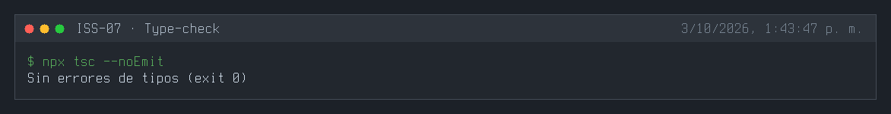
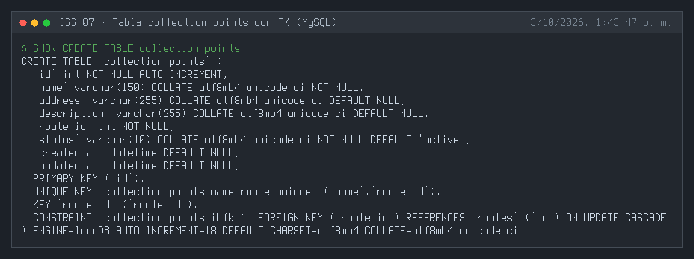
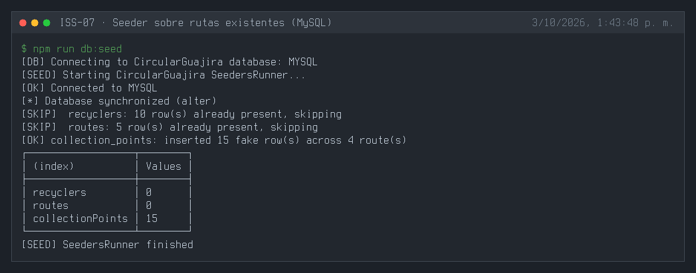
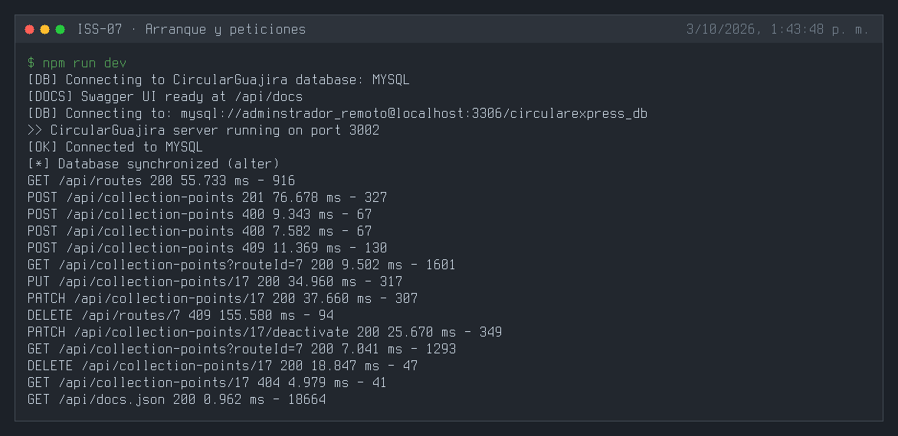
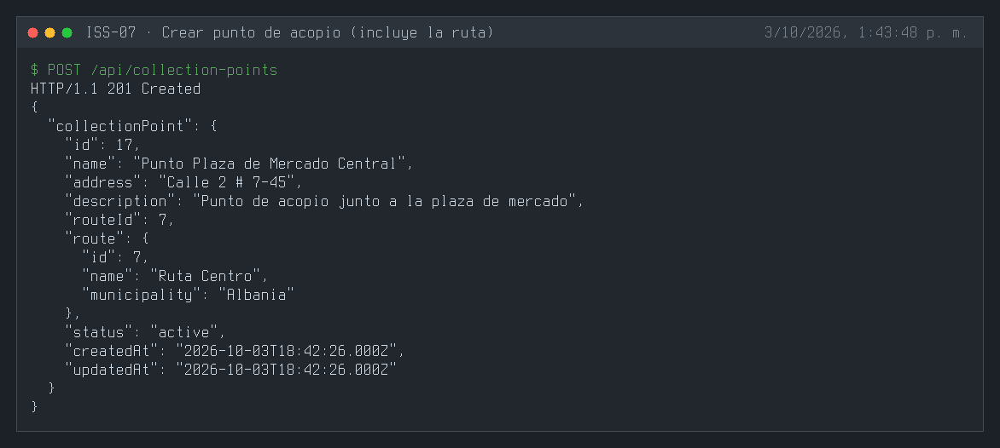
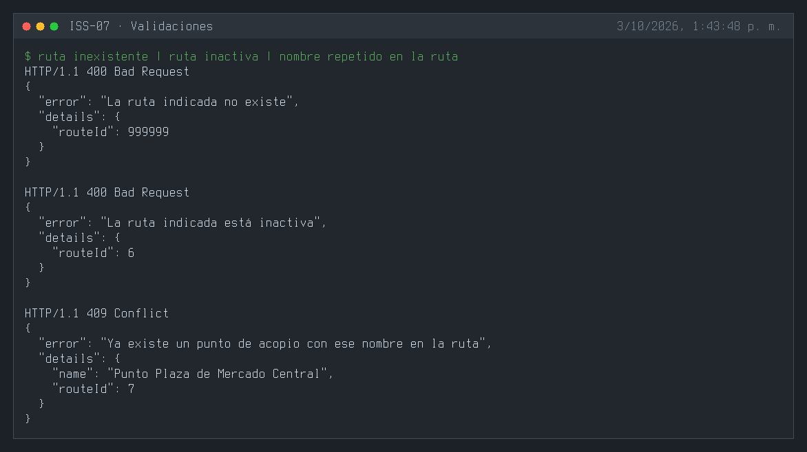
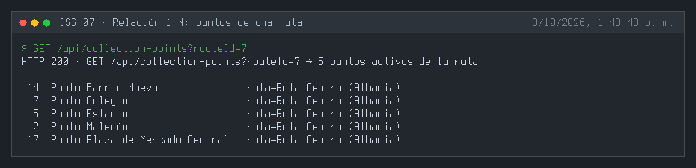
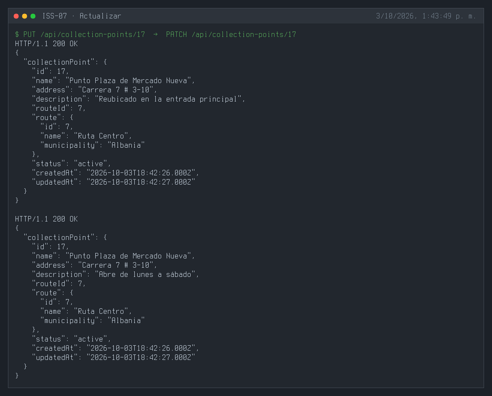
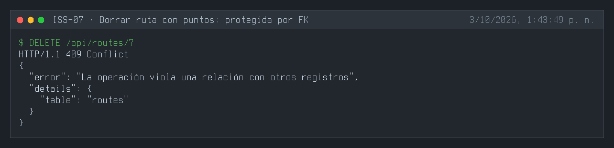
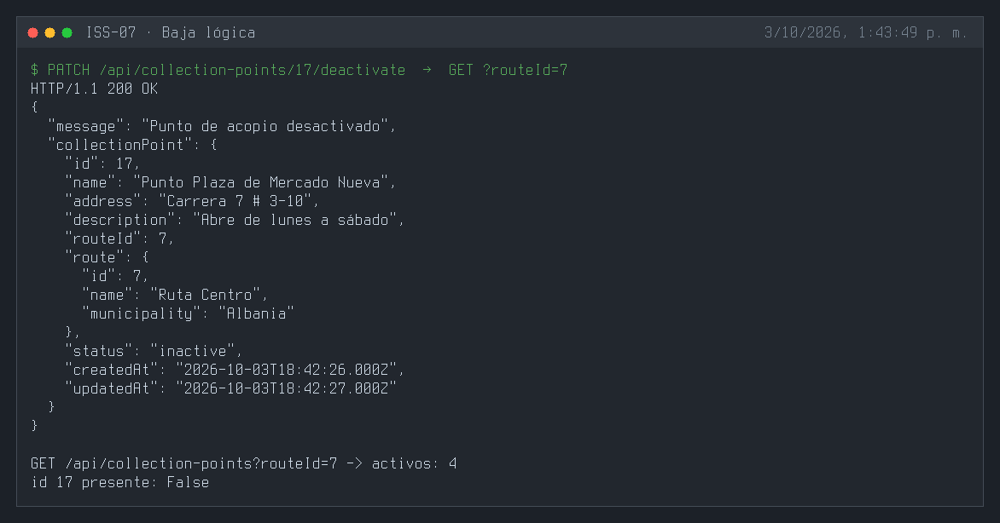
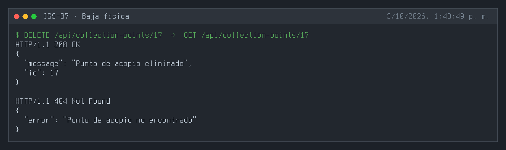
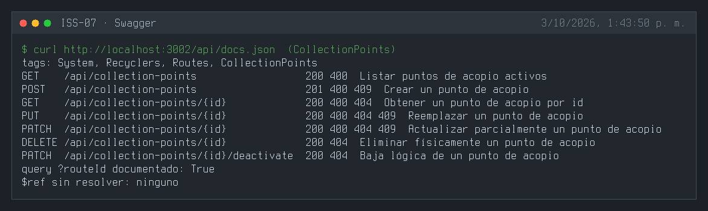
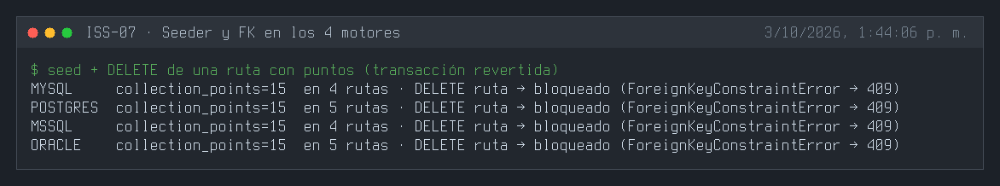

---

## 3. Definición de Done (DoD) y Verificación
Para marcar esta Issue como **Completada**, debes validar:
1. Compilación de TypeScript exitosa (`npm run build` o `npx tsc --noEmit`).
2. Arranque del servidor sin errores de sintaxis o de conexión a BD (`npm run dev`).
3. Ejecución y respuesta HTTP esperada en los endpoints del módulo (`.http` / REST Client).
4. Verificación de persistencia en la base de datos o interfaz Swagger `/api/docs`.

---

## 4. Cierre y trazabilidad
| Campo | Detalle |
| :--- | :--- |
| **Estado** | ✅ Completada |
| **Commit de implementación** | [`431ba1b`](https://github.com/DW-2026-IISem/dw-2026-Andreushin/commit/431ba1b961b05169185e5f5c3025fa1571db0daf) |
| **Hash completo** | `431ba1b961b05169185e5f5c3025fa1571db0daf` |
| **Issue GitHub** | [#20](https://github.com/DW-2026-IISem/dw-2026-Andreushin/issues/20) |
| **Fecha de cierre** | 2026-10-03 |

**Verificación realizada:** `npx tsc --noEmit` sin errores; tres `sync` consecutivos dejan una sola FK `route_id → routes.id` en MySQL, PostgreSQL, SQL Server y Oracle; `POST` 201 con la ruta incluida en la respuesta; ruta inexistente o inactiva 400; nombre repetido en la misma ruta 409; `GET ?routeId=` devuelve los puntos de la ruta (relación 1:N); `PUT`/`PATCH` 200; `DELETE /api/routes/:id` de una ruta con puntos responde 409; baja lógica y física correctas; el seeder inserta 15 puntos sobre rutas activas en los 4 motores y en todos la FK bloquea el borrado de una ruta con puntos (`ForeignKeyConstraintError`).

**Desviaciones respecto al ISS:**
- Feature completo por capas (model, `dto/`, repository, service, controller, routes, seeder, swagger, `.http`); el ISS solo definía modelo y asociaciones.
- FK `routeId` en camelCase (columna `route_id`), alias `collectionPoints` (el ISS usa `collection_points`), ruta `/api/collection-points` y `status` STRING + `isIn` (`docs/prompt.MD` §3.4).
- `onDelete: "NO ACTION"` y `onUpdate: "CASCADE"` explícitos: `RESTRICT` no existe en SQL Server ni Oracle, y sin opción Sequelize aplica `CASCADE` a una FK obligatoria.
- `BaseController` traduce `ForeignKeyConstraintError` y `UniqueConstraintError` a 409 para todos los features.
