# ISS-08 — Feature Collection (Jornadas de Recolección)

| Campo | Detalle |
| :--- | :--- |
| **Identificador** | `ISS-08` |
| **Módulo / Feature** | `src/features/business/feature-collection` |
| **Prerrequisitos (DoR)** | ISS-07, ISS-03 |
| **Sistema Objetivo** | CircularGuajira Backend API (Express 5 + TS + Sequelize) |

---

## 1. Definición de Ready (DoR)
Antes de iniciar el desarrollo de esta Issue, verifica que:
1. Las Issues de prerrequisito (**ISS-07, ISS-03**) hayan sido completadas y verificadas.
2. El entorno de desarrollo y la base de datos estén operativos.

---

## 2. Descripción y Objetivos
### 9. ISS-08 — Feature Collection + Relaciones Reciclador / Ruta 1:N

### Detalle de Implementación
**Objetivo:** Registro de jornadas de recolección (`collections`), asociando `recycler_id` y `route_id`.
**Bloqueado por:** ISS-07.

#### 9.1 Modelo y Asociaciones
```bash
mkdir -p src/features/business/collection/http
: > src/features/business/collection/collection.model.ts
cat >> src/features/business/collection/collection.model.ts << 'EOF'
import { DataTypes, Model } from "sequelize";
import { sequelize } from "../../../database/db";

export interface CollectionI {
  id?: number;
  name: string;
  description?: string;
  collection_date?: Date;
  recycler_id: number;
  route_id: number;
  status: "active" | "inactive";
}

export class Collection extends Model {
  public id!: number;
  public name!: string;
  public description!: string;
  public collection_date!: Date;
  public recycler_id!: number;
  public route_id!: number;
  public status!: "active" | "inactive";
}

Collection.init(
  {
    name: { type: DataTypes.STRING, allowNull: false },
    description: { type: DataTypes.STRING, allowNull: true },
    collection_date: { type: DataTypes.DATE, defaultValue: DataTypes.NOW },
    recycler_id: { type: DataTypes.INTEGER, allowNull: false },
    route_id: { type: DataTypes.INTEGER, allowNull: false },
    status: { type: DataTypes.ENUM("active", "inactive"), defaultValue: "active", allowNull: false },
  },
  { sequelize, modelName: "Collection", tableName: "collections", timestamps: true }
);
EOF
```

```bash
: > src/features/business/collection/collection.associations.ts
cat >> src/features/business/collection/collection.associations.ts << 'EOF'
import { Collection } from "./collection.model";
import { Recycler } from "../recycler/recycler.model";
import { Route } from "../route/route.model";

Collection.belongsTo(Recycler, { foreignKey: "recycler_id", as: "recycler" });
Collection.belongsTo(Route, { foreignKey: "route_id", as: "route" });
Recycler.hasMany(Collection, { foreignKey: "recycler_id", as: "collections" });
Route.hasMany(Collection, { foreignKey: "route_id", as: "collections" });
EOF
```

---

---

**Evidencias:**

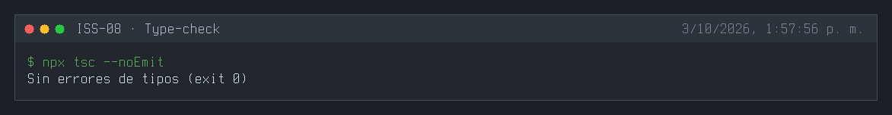
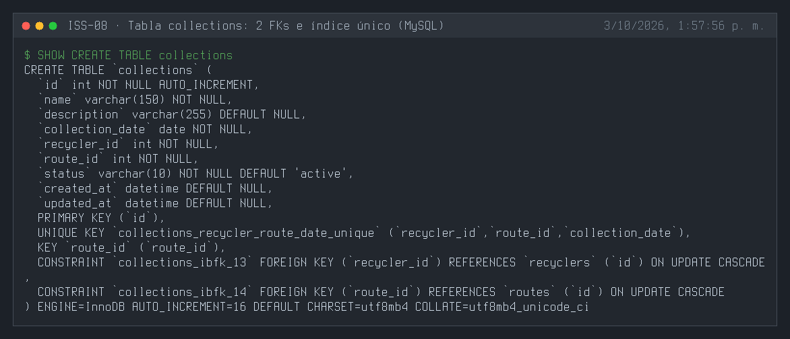
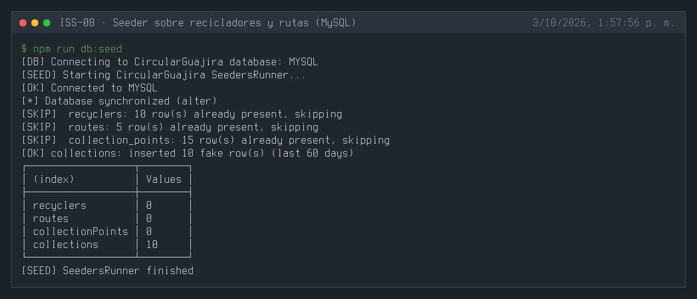
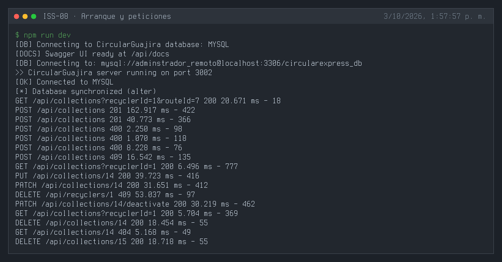
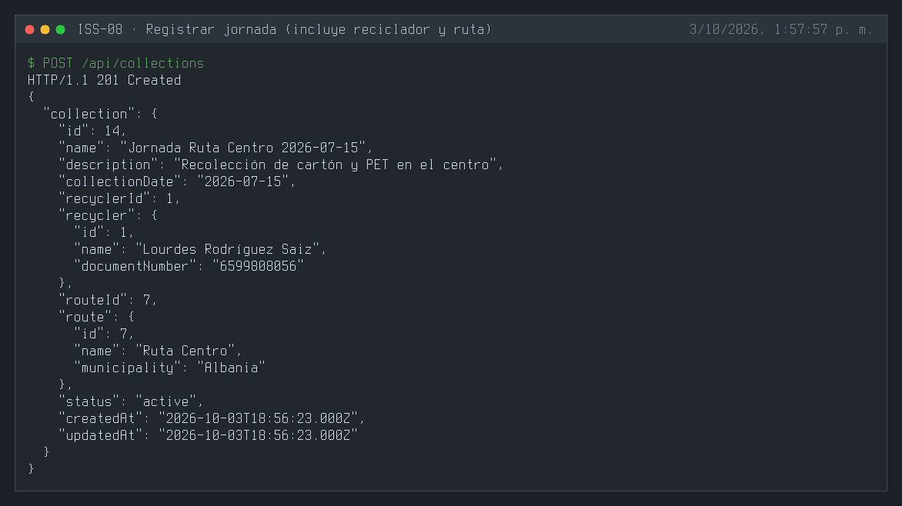
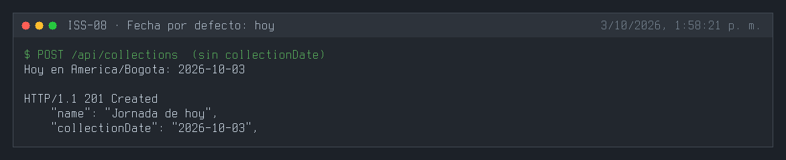
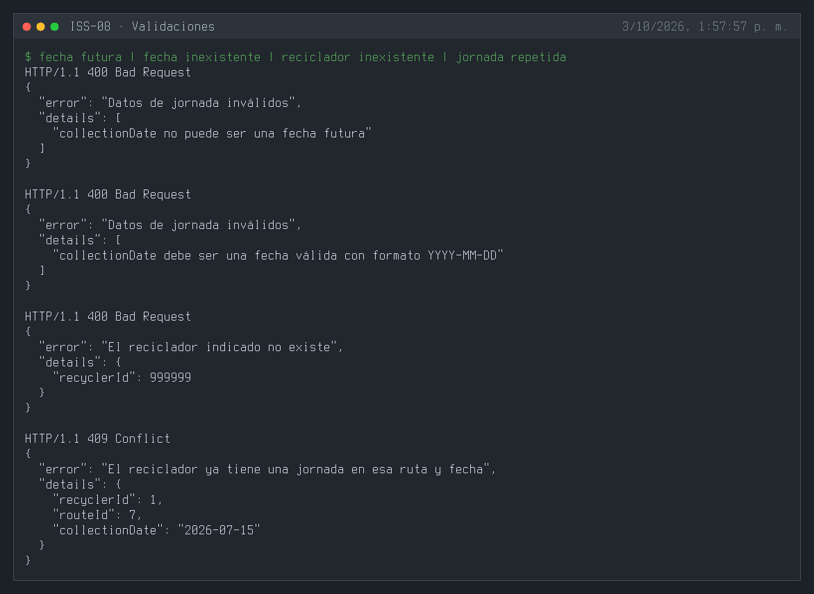
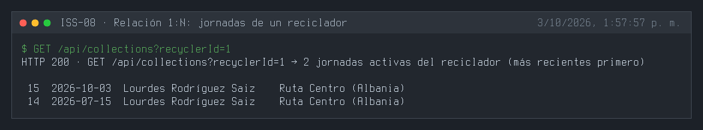
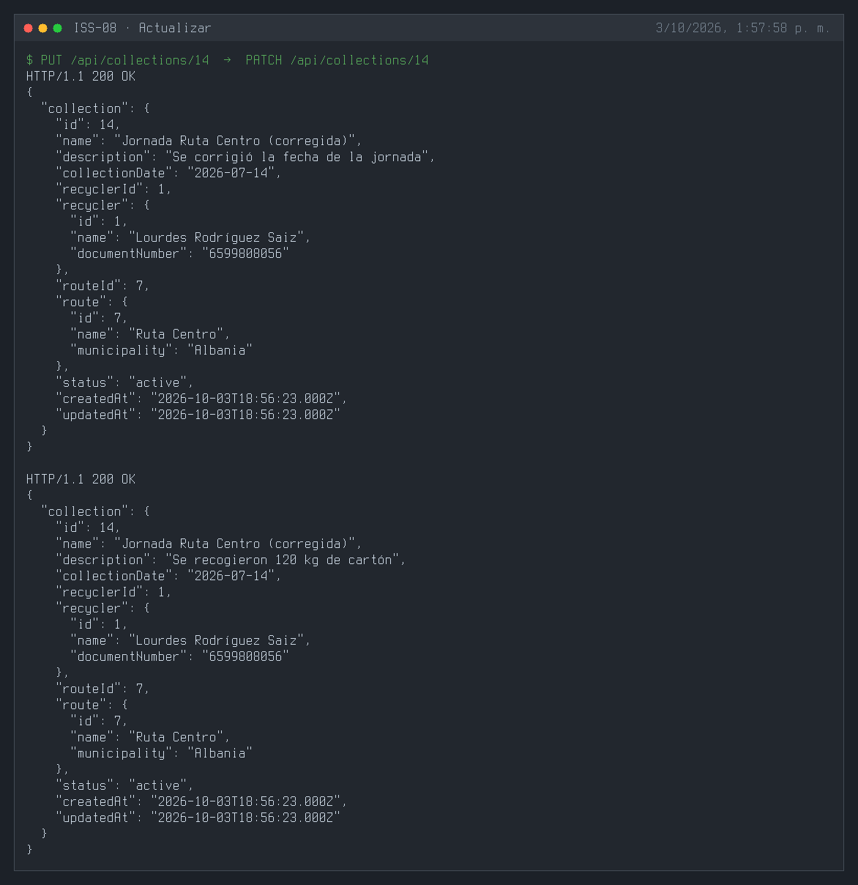
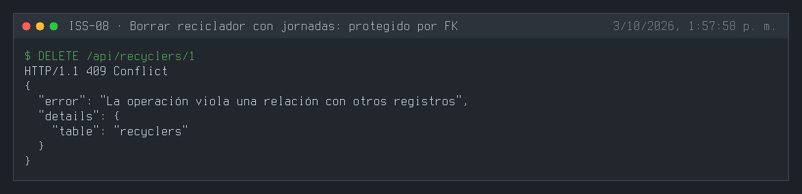
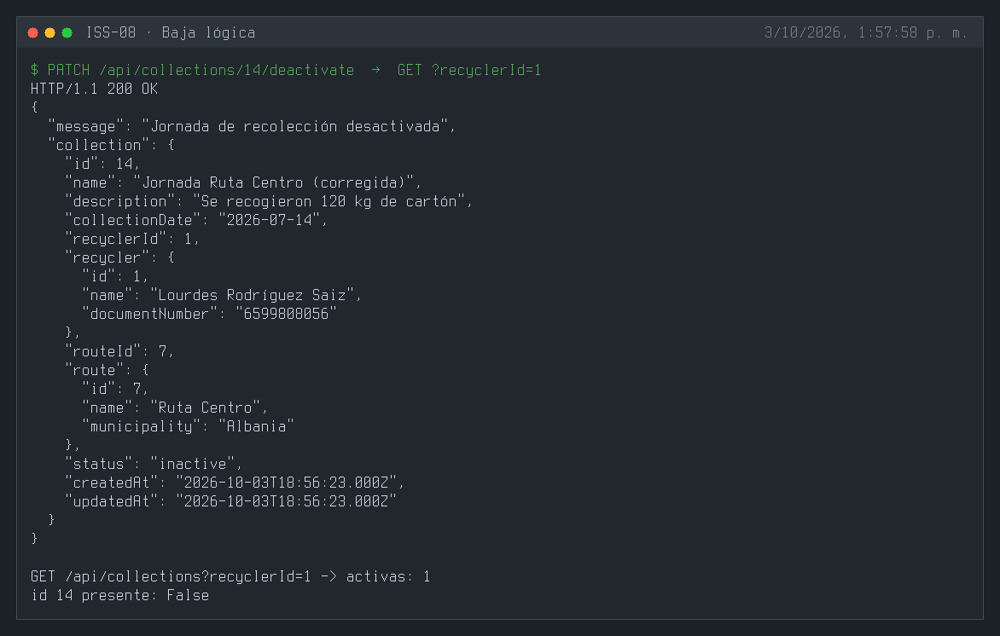
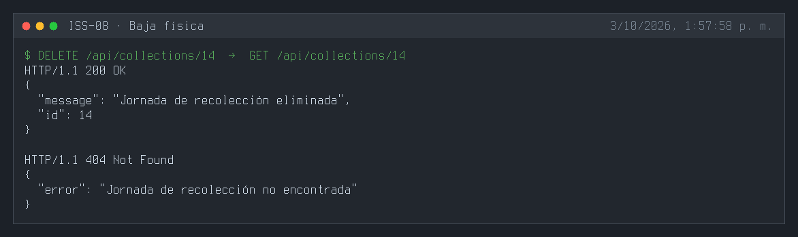
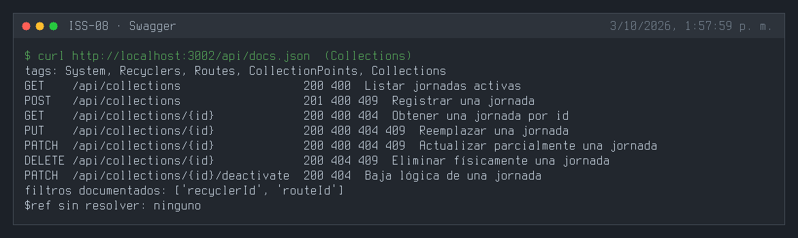
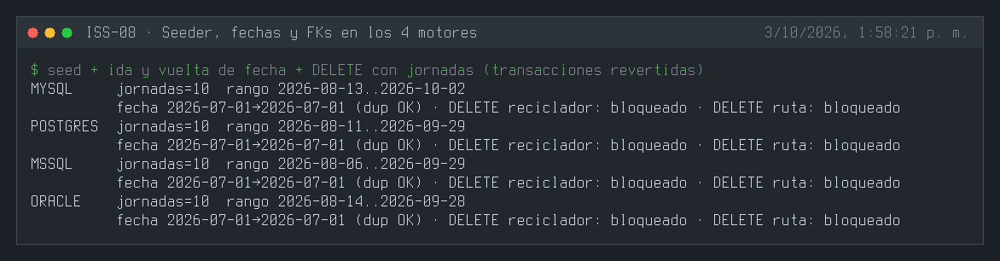

---

## 3. Definición de Done (DoD) y Verificación
Para marcar esta Issue como **Completada**, debes validar:
1. Compilación de TypeScript exitosa (`npm run build` o `npx tsc --noEmit`).
2. Arranque del servidor sin errores de sintaxis o de conexión a BD (`npm run dev`).
3. Ejecución y respuesta HTTP esperada en los endpoints del módulo (`.http` / REST Client).
4. Verificación de persistencia en la base de datos o interfaz Swagger `/api/docs`.

---

## 4. Cierre y trazabilidad
| Campo | Detalle |
| :--- | :--- |
| **Estado** | ✅ Completada |
| **Commit de implementación** | [`6899c25`](https://github.com/DW-2026-IISem/dw-2026-Andreushin/commit/6899c2502727eb7fd8126fc27a1738d83be6e25d) |
| **Hash completo** | `6899c2502727eb7fd8126fc27a1738d83be6e25d` |
| **Commit relacionado** | [`3209239`](https://github.com/DW-2026-IISem/dw-2026-Andreushin/commit/3209239) `fix(iss-02)`: proceso en UTC para que las fechas sin hora no se corran en SQL Server y Oracle (detectado al implementar este issue) |
| **Issue GitHub** | [#21](https://github.com/DW-2026-IISem/dw-2026-Andreushin/issues/21) |
| **Fecha de cierre** | 2026-10-03 |

**Verificación realizada:** `npx tsc --noEmit` sin errores; tres `sync` consecutivos dejan las 2 FKs (`recycler_id → recyclers`, `route_id → routes`) y `collection_date` tipo `DATE` en los 4 motores; `POST` 201 con reciclador y ruta incluidos; sin `collectionDate` toma la fecha de hoy en America/Bogota; fecha futura, fecha inexistente (`2026-02-30`) o reciclador inexistente 400; jornada repetida (reciclador, ruta y día) 409; `GET ?recyclerId=` lista las jornadas del reciclador; `PUT`/`PATCH` 200; `DELETE` de un reciclador con jornadas 409; baja lógica y física correctas; el seeder inserta 10 jornadas por motor y en MySQL, PostgreSQL, SQL Server y Oracle una fecha se guarda y se lee igual, la búsqueda por fecha exacta funciona y las FKs bloquean el borrado de recicladores y rutas con jornadas.

**Desviaciones respecto al ISS:**
- Feature completo por capas con seeder, swagger y `.http` (el ISS solo definía modelo y asociaciones).
- `collectionDate` como fecha sin hora (`DATEONLY`), validada (formato, fecha real, no futura) y por defecto hoy en America/Bogota; el ISS usaba `DATE` con `NOW` sin validación.
- Índice único `(recycler_id, route_id, collection_date)`: una jornada por reciclador, ruta y día.
- FKs `recyclerId`/`routeId` camelCase con `onDelete: "NO ACTION"`, ruta `/api/collections`, `status` STRING + `isIn` (`docs/prompt.MD` §3.4).
- Utilidades compartidas nuevas: `shared/utils/dates.ts` y `shared/validation/query-filters.ts`.
