# ISS-09 — Feature Material (Catálogo Base de Materiales)

| Campo | Detalle |
| :--- | :--- |
| **Identificador** | `ISS-09` |
| **Módulo / Feature** | `src/features/business/feature-material` |
| **Prerrequisitos (DoR)** | ISS-03 |
| **Sistema Objetivo** | CircularGuajira Backend API (Express 5 + TS + Sequelize) |

---

## 1. Definición de Ready (DoR)
Antes de iniciar el desarrollo de esta Issue, verifica que:
1. Las Issues de prerrequisito (**ISS-03**) hayan sido completadas y verificadas.
2. El entorno de desarrollo y la base de datos estén operativos.

---

## 2. Descripción y Objetivos
### 10. ISS-09 — Feature Material

### Detalle de Implementación
**Objetivo:** Catálogo de materiales reciclables (`materials`: Plástico PET, Cartón, Vidrio, Chatarra, etc.).
**Bloqueado por:** ISS-08.

```bash
mkdir -p src/features/business/material/http
: > src/features/business/material/material.model.ts
cat >> src/features/business/material/material.model.ts << 'EOF'
import { DataTypes, Model } from "sequelize";
import { sequelize } from "../../../database/db";

export class Material extends Model {
  public id!: number;
  public name!: string;
  public description!: string;
  public status!: "active" | "inactive";
}

Material.init(
  {
    name: { type: DataTypes.STRING, allowNull: false },
    description: { type: DataTypes.STRING, allowNull: true },
    status: { type: DataTypes.ENUM("active", "inactive"), defaultValue: "active", allowNull: false },
  },
  { sequelize, modelName: "Material", tableName: "materials", timestamps: true }
);
EOF
```

---

---

**Evidencias:**

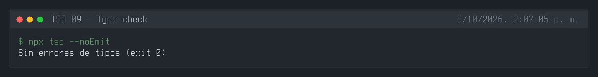
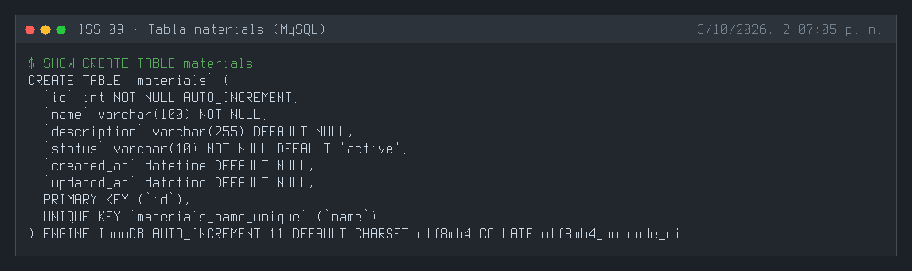
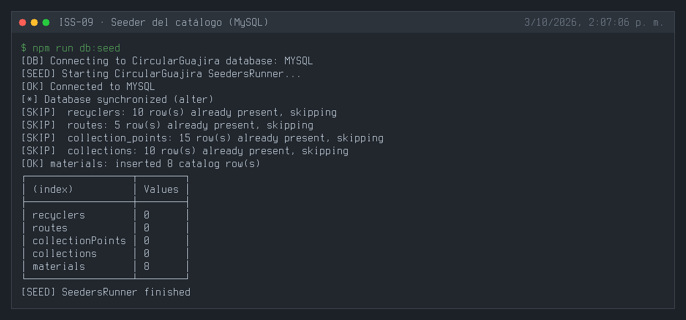
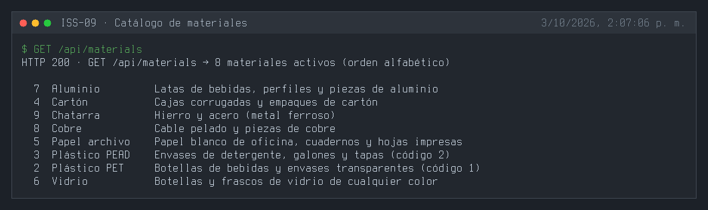
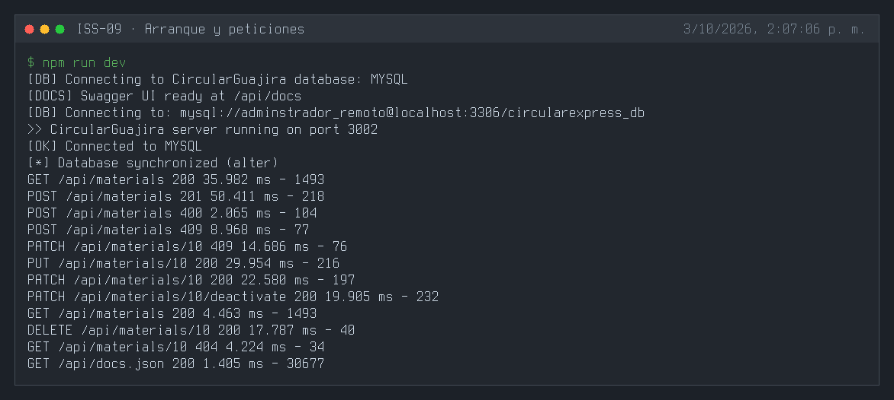
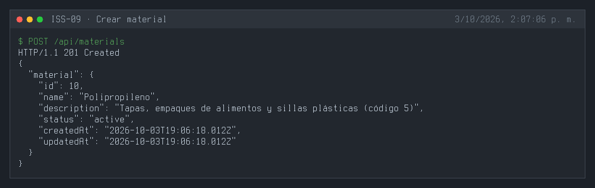
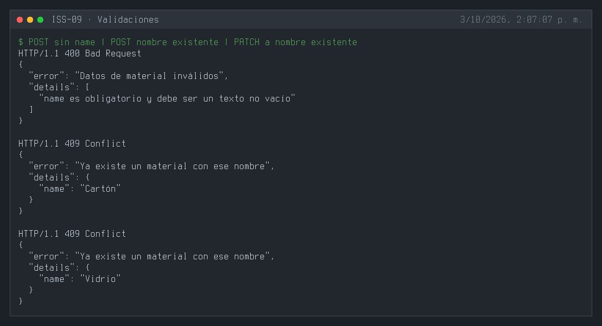
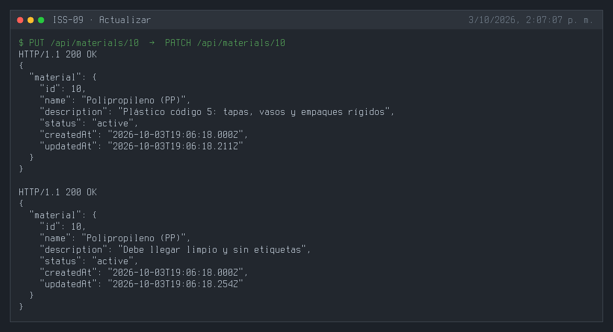
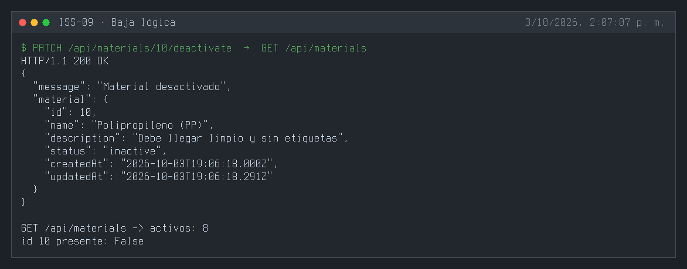
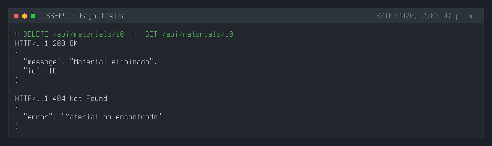
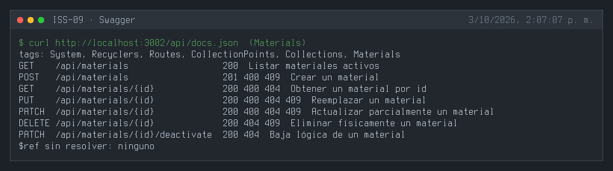
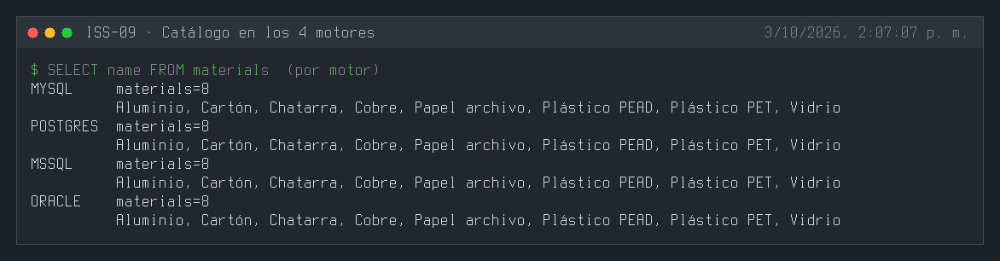

---

## 3. Definición de Done (DoD) y Verificación
Para marcar esta Issue como **Completada**, debes validar:
1. Compilación de TypeScript exitosa (`npm run build` o `npx tsc --noEmit`).
2. Arranque del servidor sin errores de sintaxis o de conexión a BD (`npm run dev`).
3. Ejecución y respuesta HTTP esperada en los endpoints del módulo (`.http` / REST Client).
4. Verificación de persistencia en la base de datos o interfaz Swagger `/api/docs`.

---

## 4. Cierre y trazabilidad
| Campo | Detalle |
| :--- | :--- |
| **Estado** | ✅ Completada |
| **Commit de implementación** | [`168799b`](https://github.com/DW-2026-IISem/dw-2026-Andreushin/commit/168799b7ad1a1c07f985ee97f21f2a5c7e6b1b23) |
| **Hash completo** | `168799b7ad1a1c07f985ee97f21f2a5c7e6b1b23` |
| **Issue GitHub** | [#22](https://github.com/DW-2026-IISem/dw-2026-Andreushin/issues/22) |
| **Fecha de cierre** | 2026-10-03 |

**Verificación realizada:** `npx tsc --noEmit` sin errores; tres `sync` consecutivos sin errores y con un único índice `materials_name_unique` en los 4 motores; `npm run db:seed` inserta 8 materiales del catálogo (una segunda ejecución los omite); `GET /api/materials` los lista en orden alfabético; `POST` 201, sin `name` 400, nombre existente 409 en `POST` y en `PATCH`, `PUT`/`PATCH` 200, la baja lógica saca el material del listado, `DELETE` 200 y luego 404; Swagger expone el tag `Materials` con sus 7 operaciones; el catálogo queda idéntico en MySQL, PostgreSQL, SQL Server y Oracle.

**Desviaciones respecto al ISS:**
- Feature completo por capas con seeder, swagger y `.http` (el ISS solo definía el modelo).
- Índice único en `name` y controller con los 7 métodos de la convención.
- Seeder con un catálogo fijo de 10 materiales reales (PET, PEAD, cartón, papel archivo, vidrio, aluminio, cobre, chatarra, plegadiza, Tetra Pak) en lugar de datos aleatorios.
- Carpeta `materials/`, ruta `/api/materials`, `status` STRING + `isIn` y código en inglés (`docs/prompt.MD` §3.4).
