# ISS-10 — Feature MaterialRate (Tarifas de Materiales por Kilo)

| Campo | Detalle |
| :--- | :--- |
| **Identificador** | `ISS-10` |
| **Módulo / Feature** | `src/features/business/feature-material-rate` |
| **Prerrequisitos (DoR)** | ISS-09 |
| **Sistema Objetivo** | CircularGuajira Backend API (Express 5 + TS + Sequelize) |

---

## 1. Definición de Ready (DoR)
Antes de iniciar el desarrollo de esta Issue, verifica que:
1. Las Issues de prerrequisito (**ISS-09**) hayan sido completadas y verificadas.
2. El entorno de desarrollo y la base de datos estén operativos.

---

## 2. Descripción y Objetivos
### 11. ISS-10 — Feature MaterialRate (Tarifas de Materiales)

### Detalle de Implementación
**Objetivo:** Gestión de precios vigentes por kilo para cada material (`material_rates`, FK `material_id`).
**Bloqueado por:** ISS-09.

```bash
mkdir -p src/features/business/material-rate/http
: > src/features/business/material-rate/material-rate.model.ts
cat >> src/features/business/material-rate/material-rate.model.ts << 'EOF'
import { DataTypes, Model } from "sequelize";
import { sequelize } from "../../../database/db";

export class MaterialRate extends Model {
  public id!: number;
  public name!: string;
  public description!: string;
  public price_per_kg!: number;
  public material_id!: number;
  public status!: "active" | "inactive";
}

MaterialRate.init(
  {
    name: { type: DataTypes.STRING, allowNull: false },
    description: { type: DataTypes.STRING, allowNull: true },
    price_per_kg: { type: DataTypes.DECIMAL(10, 2), allowNull: false },
    material_id: { type: DataTypes.INTEGER, allowNull: false },
    status: { type: DataTypes.ENUM("active", "inactive"), defaultValue: "active", allowNull: false },
  },
  { sequelize, modelName: "MaterialRate", tableName: "material_rates", timestamps: true }
);
EOF
```

```bash
: > src/features/business/material-rate/material-rate.associations.ts
cat >> src/features/business/material-rate/material-rate.associations.ts << 'EOF'
import { MaterialRate } from "./material-rate.model";
import { Material } from "../material/material.model";

MaterialRate.belongsTo(Material, { foreignKey: "material_id", as: "material" });
Material.hasMany(MaterialRate, { foreignKey: "material_id", as: "rates" });
EOF
```

---

---

**Evidencias:**

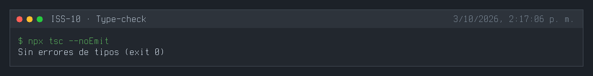
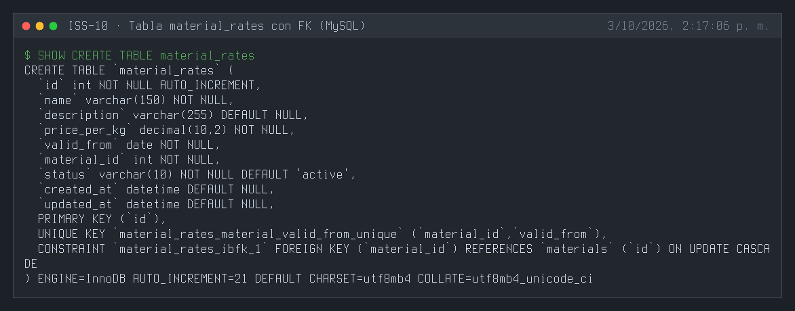
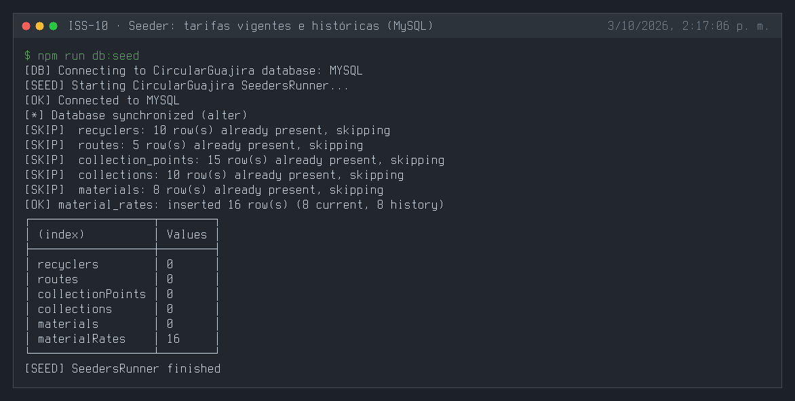
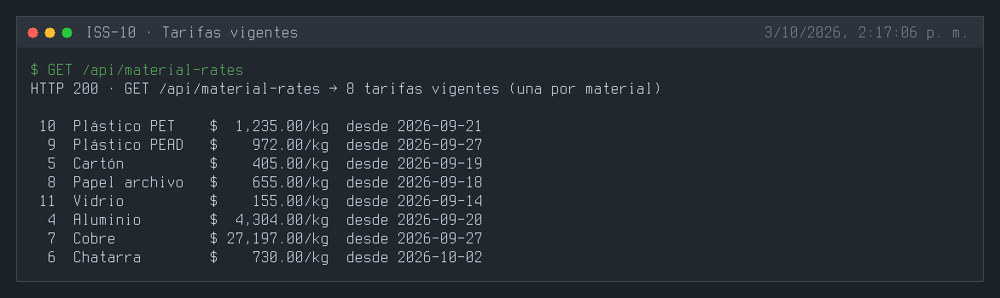
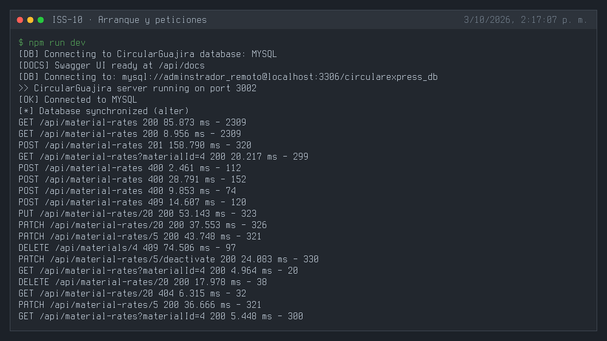
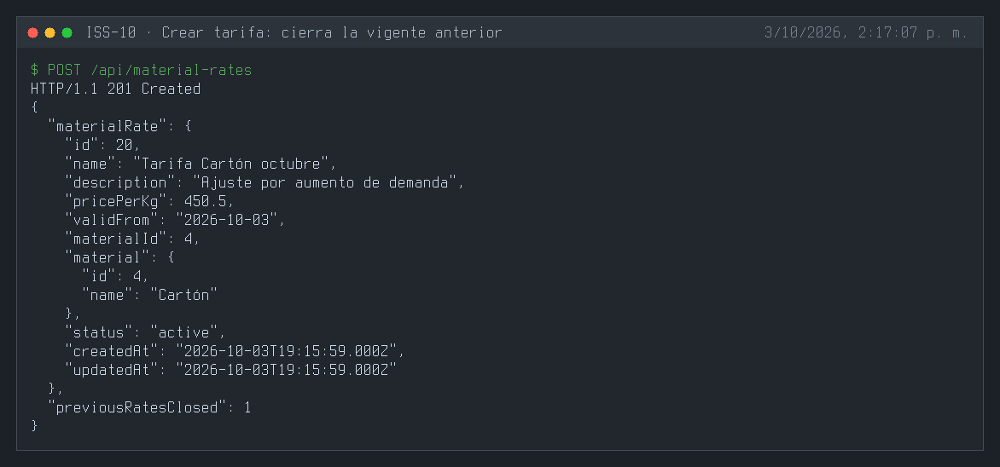
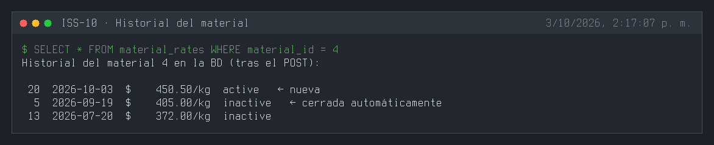
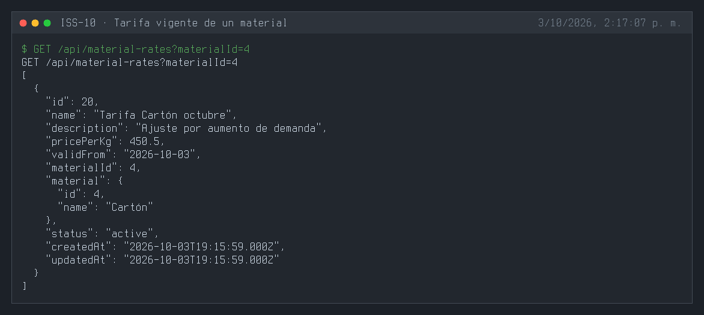
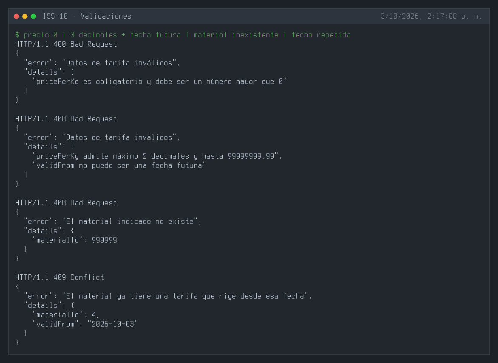
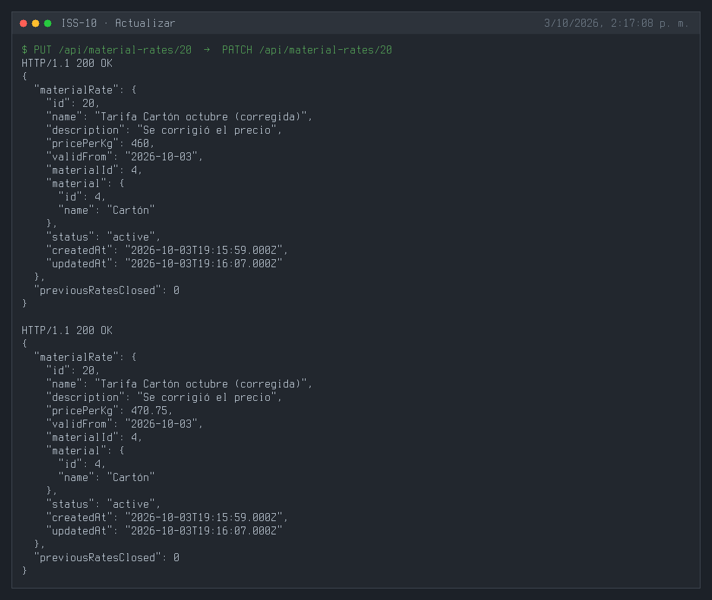
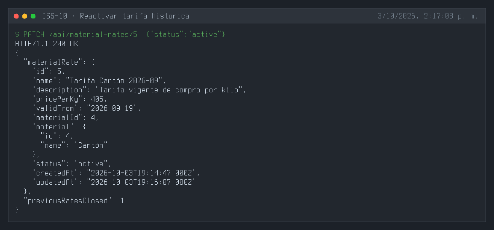
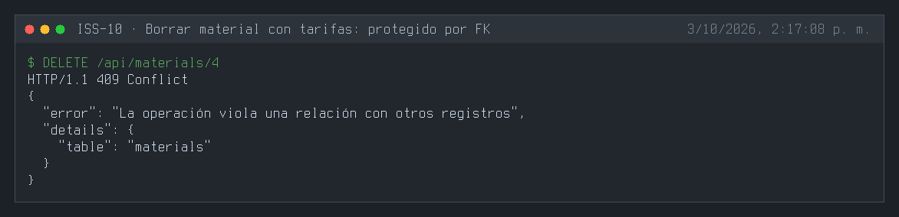
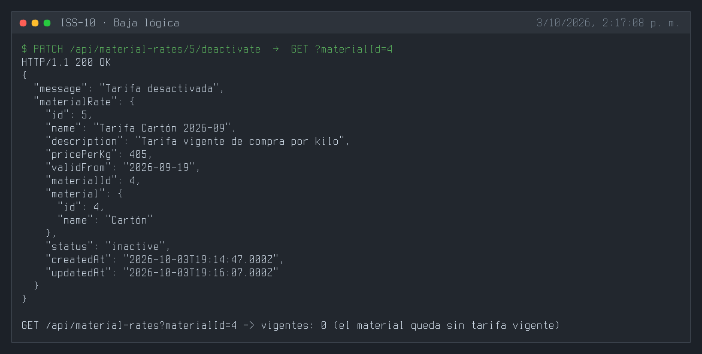
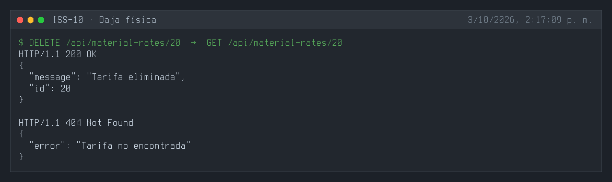
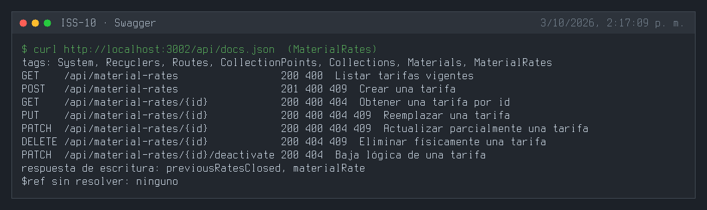
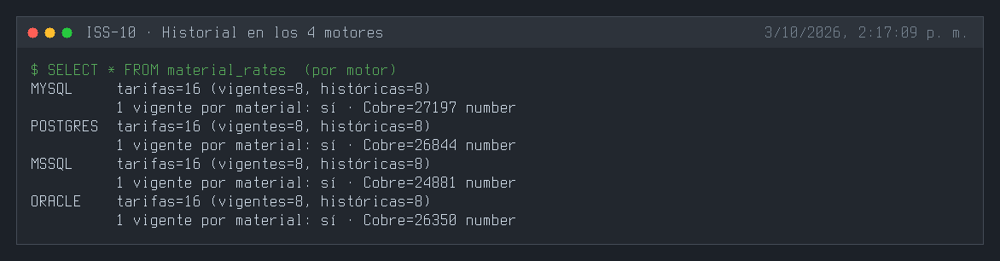

---

## 3. Definición de Done (DoD) y Verificación
Para marcar esta Issue como **Completada**, debes validar:
1. Compilación de TypeScript exitosa (`npm run build` o `npx tsc --noEmit`).
2. Arranque del servidor sin errores de sintaxis o de conexión a BD (`npm run dev`).
3. Ejecución y respuesta HTTP esperada en los endpoints del módulo (`.http` / REST Client).
4. Verificación de persistencia en la base de datos o interfaz Swagger `/api/docs`.

---

## 4. Cierre y trazabilidad
| Campo | Detalle |
| :--- | :--- |
| **Estado** | ✅ Completada |
| **Commit de implementación** | [`08116d8`](https://github.com/DW-2026-IISem/dw-2026-Andreushin/commit/08116d8f7399be3f1ee117e116fe8c3d15daac67) |
| **Hash completo** | `08116d8f7399be3f1ee117e116fe8c3d15daac67` |
| **Issue GitHub** | [#23](https://github.com/DW-2026-IISem/dw-2026-Andreushin/issues/23) |
| **Fecha de cierre** | 2026-10-03 |

**Verificación realizada:** `npx tsc --noEmit` sin errores; tres `sync` consecutivos dejan una sola FK `material_id → materials.id` en los 4 motores y un precio `1250.5` se guarda y se lee como número; el seeder inserta 16 tarifas (8 vigentes y 8 históricas) y deja exactamente una vigente por material en MySQL, PostgreSQL, SQL Server y Oracle; `POST` 201 crea la tarifa nueva y cierra automáticamente la vigente anterior (`previousRatesClosed: 1`, visible en el historial del material); `GET ?materialId=` devuelve solo la vigente; reactivar una tarifa histórica cierra la actual; precio 0, precio con 3 decimales, fecha futura o material inexistente 400; fecha de inicio repetida 409; `PUT`/`PATCH` 200; borrar un material con tarifas 409; baja lógica (el material queda sin tarifa vigente) y física correctas. La tarifa sembrada se restauró al terminar.

**Desviaciones respecto al ISS:**
- Campo `validFrom` (fecha desde la que rige) y regla de **una sola tarifa vigente por material**: el prompt maestro define `material_rates` como historial de tarifas vigentes; el ISS solo traía `price_per_kg`.
- `pricePerKg` expuesto siempre como número (getter del modelo), porque MySQL y PostgreSQL devuelven `DECIMAL` como texto.
- Respuestas de escritura con `previousRatesClosed`; filtro `?materialId=`.
- Feature completo por capas con seeder (precios de referencia en COP), swagger y `.http`; FK `materialId` camelCase con `NO ACTION`, ruta `/api/material-rates`, `status` STRING + `isIn` (`docs/prompt.MD` §3.4). Conteo por defecto del seeder: 16.
