# ISS-11 — Feature Plant (Plantas de Clasificación y Acopio)

| Campo | Detalle |
| :--- | :--- |
| **Identificador** | `ISS-11` |
| **Módulo / Feature** | `src/features/business/feature-plant` |
| **Prerrequisitos (DoR)** | ISS-03 |
| **Sistema Objetivo** | CircularGuajira Backend API (Express 5 + TS + Sequelize) |

---

## 1. Definición de Ready (DoR)
Antes de iniciar el desarrollo de esta Issue, verifica que:
1. Las Issues de prerrequisito (**ISS-03**) hayan sido completadas y verificadas.
2. El entorno de desarrollo y la base de datos estén operativos.

---

## 2. Descripción y Objetivos
### 12. ISS-11 — Feature Plant (Plantas de Clasificación)

### Detalle de Implementación
**Objetivo:** Registro de instalaciones físicas de recepción y transformación de residuos (`plants`).
**Bloqueado por:** ISS-10.

```bash
mkdir -p src/features/business/plant/http
: > src/features/business/plant/plant.model.ts
cat >> src/features/business/plant/plant.model.ts << 'EOF'
import { DataTypes, Model } from "sequelize";
import { sequelize } from "../../../database/db";

export class Plant extends Model {
  public id!: number;
  public name!: string;
  public description!: string;
  public status!: "active" | "inactive";
}

Plant.init(
  {
    name: { type: DataTypes.STRING, allowNull: false },
    description: { type: DataTypes.STRING, allowNull: true },
    status: { type: DataTypes.ENUM("active", "inactive"), defaultValue: "active", allowNull: false },
  },
  { sequelize, modelName: "Plant", tableName: "plants", timestamps: true }
);
EOF
```

---

---

**Evidencias:**

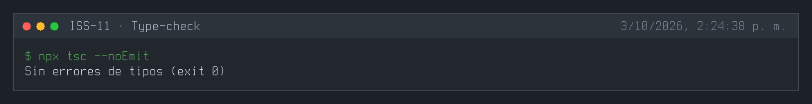
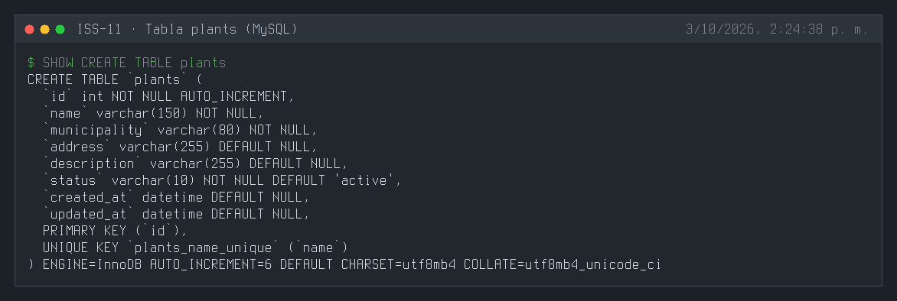
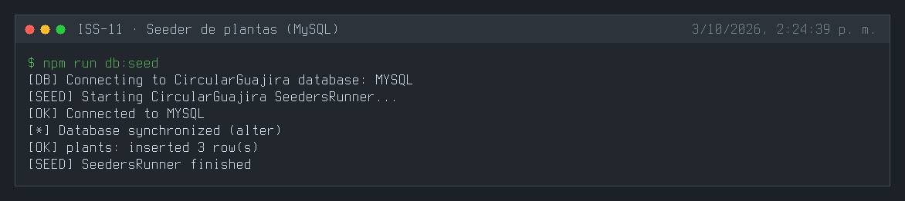
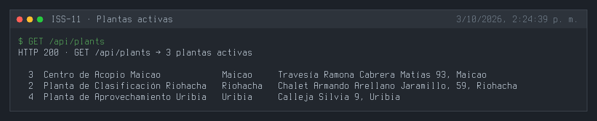
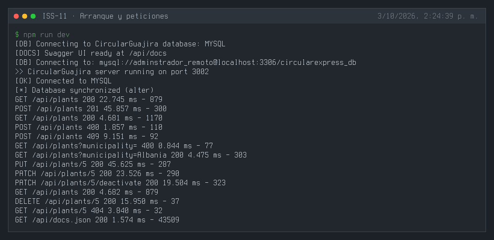
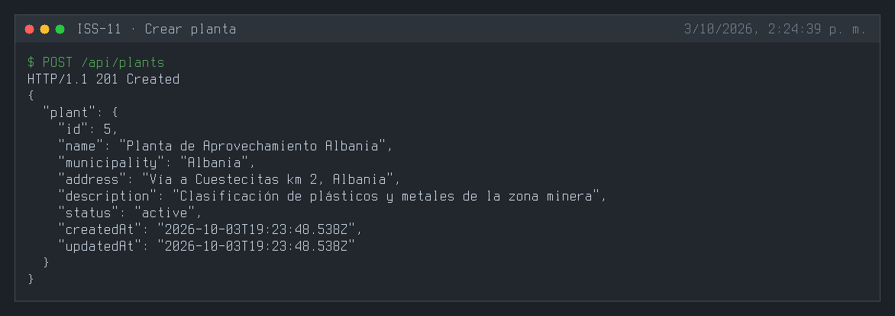
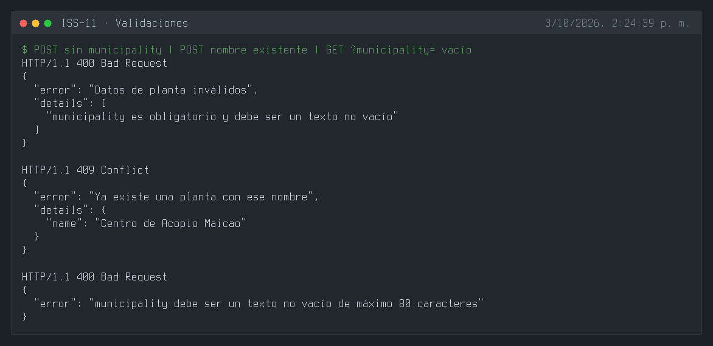
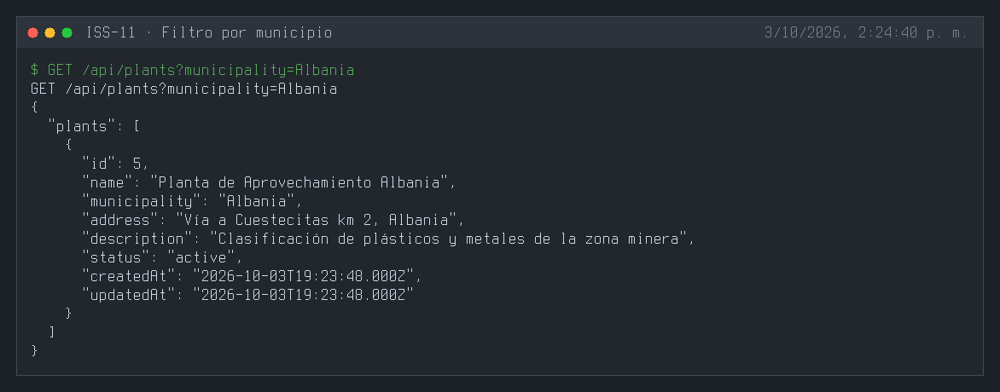
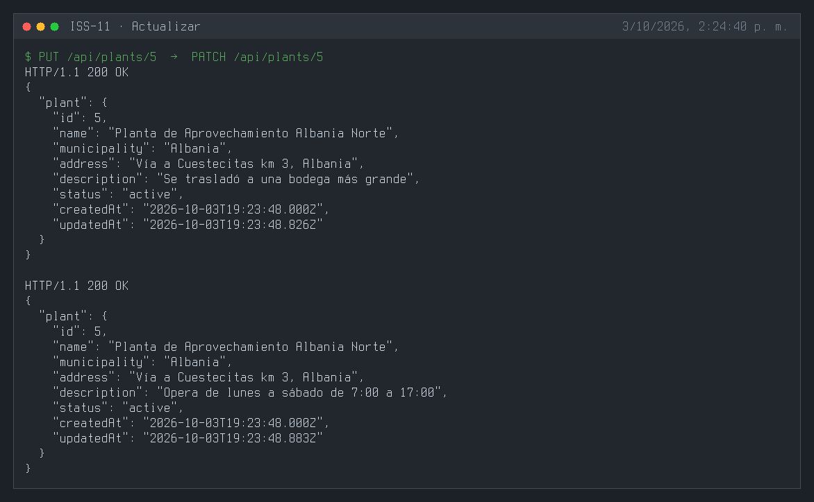
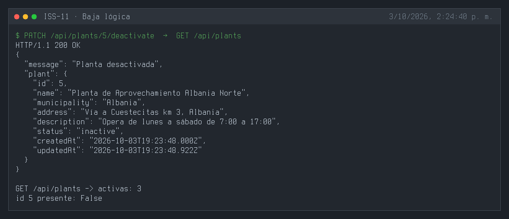
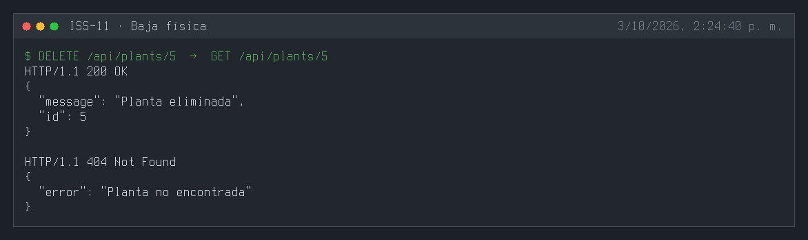
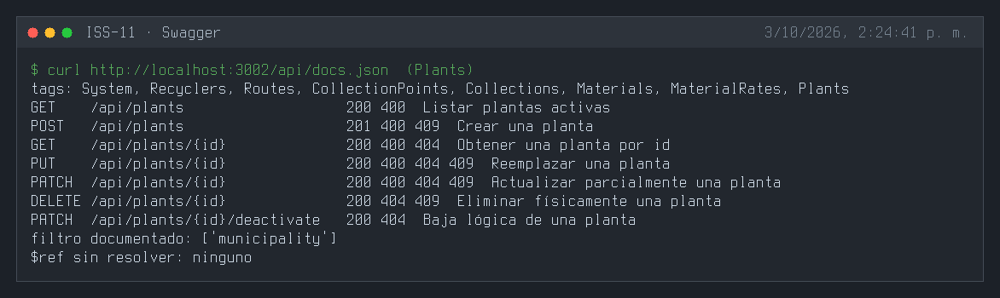
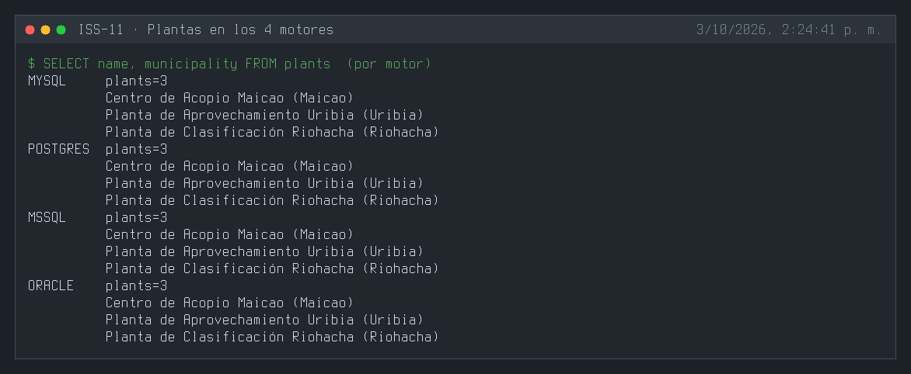

---

## 3. Definición de Done (DoD) y Verificación
Para marcar esta Issue como **Completada**, debes validar:
1. Compilación de TypeScript exitosa (`npm run build` o `npx tsc --noEmit`).
2. Arranque del servidor sin errores de sintaxis o de conexión a BD (`npm run dev`).
3. Ejecución y respuesta HTTP esperada en los endpoints del módulo (`.http` / REST Client).
4. Verificación de persistencia en la base de datos o interfaz Swagger `/api/docs`.

---

## 4. Cierre y trazabilidad
| Campo | Detalle |
| :--- | :--- |
| **Estado** | ✅ Completada |
| **Commit de implementación** | [`211432c`](https://github.com/DW-2026-IISem/dw-2026-Andreushin/commit/211432c92da96f5bd38a26e2939398312b591f93) |
| **Hash completo** | `211432c92da96f5bd38a26e2939398312b591f93` |
| **Issue GitHub** | [#24](https://github.com/DW-2026-IISem/dw-2026-Andreushin/issues/24) |
| **Fecha de cierre** | 2026-10-03 |

**Verificación realizada:** `npx tsc --noEmit` sin errores; tres `sync` consecutivos sin errores y con un único índice `plants_name_unique` en los 4 motores; `npm run db:seed` inserta 3 plantas (una segunda ejecución las omite) y quedan idénticas en MySQL, PostgreSQL, SQL Server y Oracle; `POST` 201, sin `municipality` 400, nombre existente 409, `GET ?municipality=` filtra y un filtro vacío responde 400; `PUT`/`PATCH` 200; la baja lógica saca la planta del listado; `DELETE` 200 y luego 404; Swagger expone el tag `Plants` con el filtro documentado.

**Desviaciones respecto al ISS:**
- Campos `municipality` (obligatorio) y `address` para ubicar la instalación física; el ISS solo traía nombre y descripción.
- Índice único en `name`, controller con los 7 métodos de la convención y filtro `?municipality=` (nuevo `parseTextFilter` compartido).
- Feature completo por capas con seeder, swagger y `.http` (el ISS solo definía el modelo); carpeta `plants/`, ruta `/api/plants`, `status` STRING + `isIn` (`docs/prompt.MD` §3.4).
