# ISS-12 — Feature MaterialLot (Inventario de Lotes en Planta)

| Campo | Detalle |
| :--- | :--- |
| **Identificador** | `ISS-12` |
| **Módulo / Feature** | `src/features/business/feature-material-lot` |
| **Prerrequisitos (DoR)** | ISS-11, ISS-09 |
| **Sistema Objetivo** | CircularGuajira Backend API (Express 5 + TS + Sequelize) |

---

## 1. Definición de Ready (DoR)
Antes de iniciar el desarrollo de esta Issue, verifica que:
1. Las Issues de prerrequisito (**ISS-11, ISS-09**) hayan sido completadas y verificadas.
2. El entorno de desarrollo y la base de datos estén operativos.

---

## 2. Descripción y Objetivos
### 13. ISS-12 — Feature MaterialLot (Lotes de Planta)

### Detalle de Implementación
**Objetivo:** Lotes clasificados y procesados en cada planta (`material_lots`, FK `plant_id`).
**Bloqueado por:** ISS-11.

```bash
mkdir -p src/features/business/material-lot/http
: > src/features/business/material-lot/material-lot.model.ts
cat >> src/features/business/material-lot/material-lot.model.ts << 'EOF'
import { DataTypes, Model } from "sequelize";
import { sequelize } from "../../../database/db";

export class MaterialLot extends Model {
  public id!: number;
  public name!: string;
  public description!: string;
  public plant_id!: number;
  public status!: "active" | "inactive";
}

MaterialLot.init(
  {
    name: { type: DataTypes.STRING, allowNull: false },
    description: { type: DataTypes.STRING, allowNull: true },
    plant_id: { type: DataTypes.INTEGER, allowNull: false },
    status: { type: DataTypes.ENUM("active", "inactive"), defaultValue: "active", allowNull: false },
  },
  { sequelize, modelName: "MaterialLot", tableName: "material_lots", timestamps: true }
);
EOF
```

```bash
: > src/features/business/material-lot/material-lot.associations.ts
cat >> src/features/business/material-lot/material-lot.associations.ts << 'EOF'
import { MaterialLot } from "./material-lot.model";
import { Plant } from "../plant/plant.model";

MaterialLot.belongsTo(Plant, { foreignKey: "plant_id", as: "plant" });
Plant.hasMany(MaterialLot, { foreignKey: "plant_id", as: "lots" });
EOF
```

---

---

**Evidencias:**

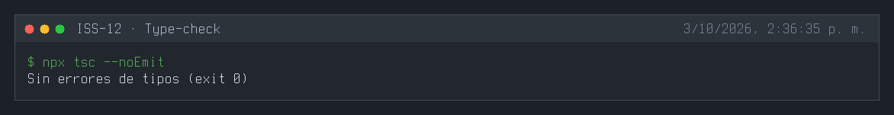
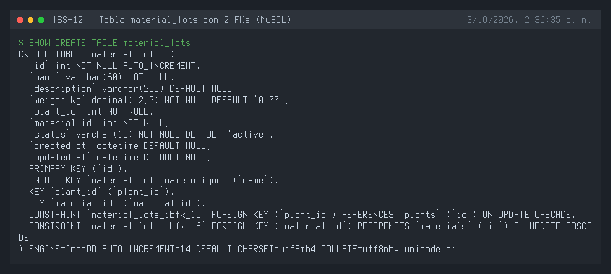
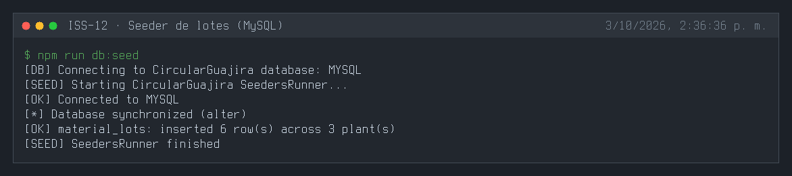
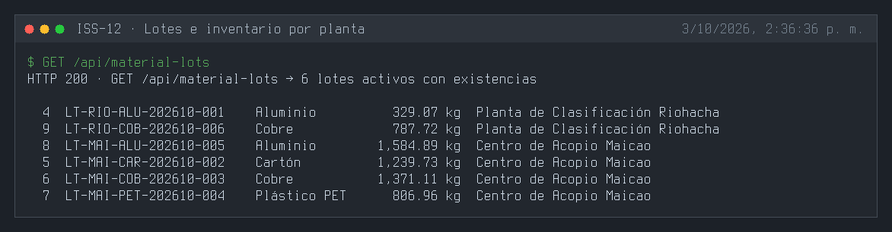
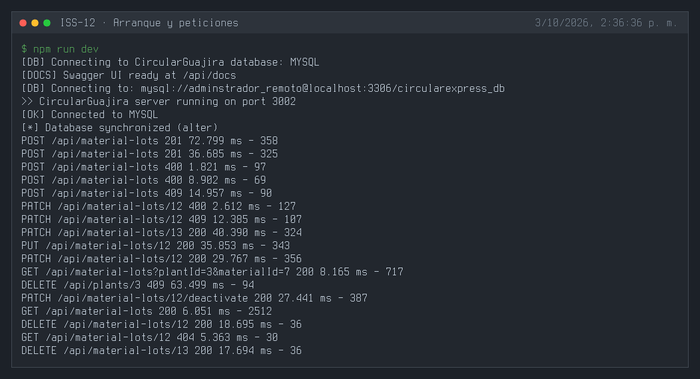
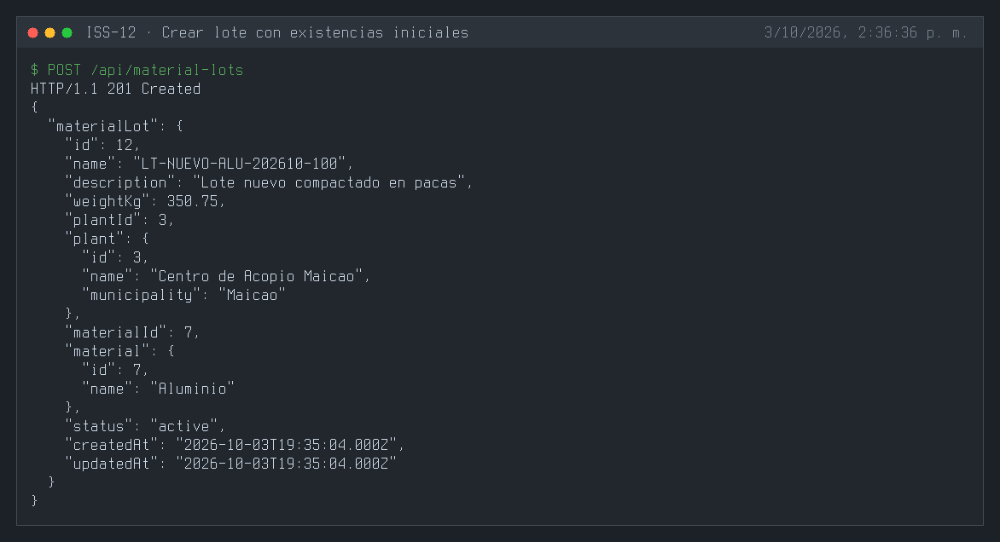
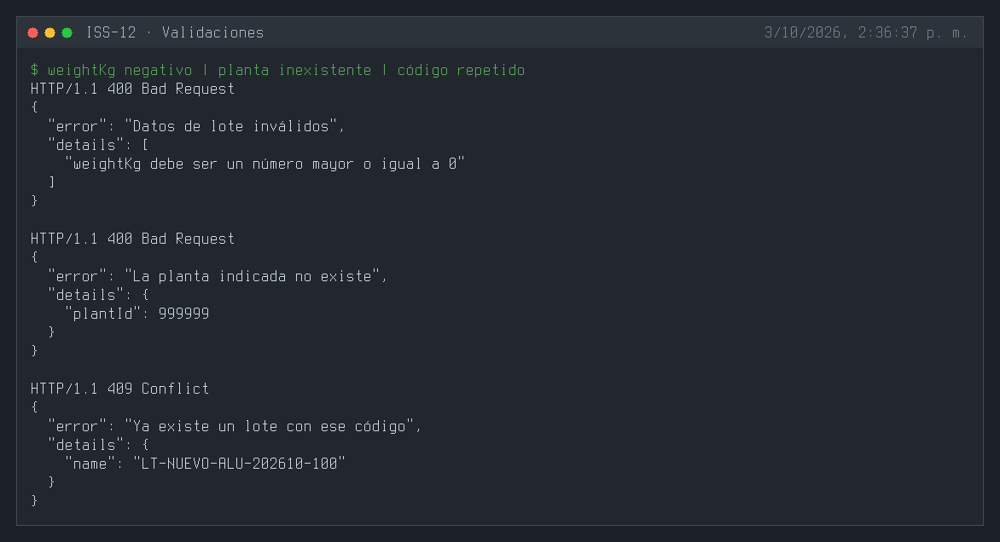
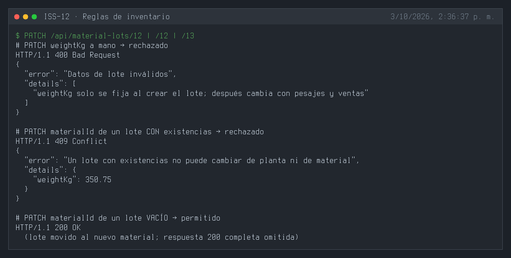
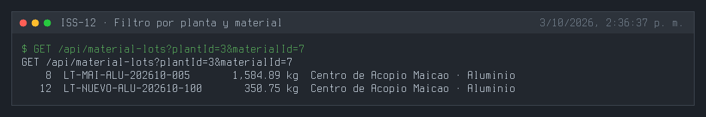
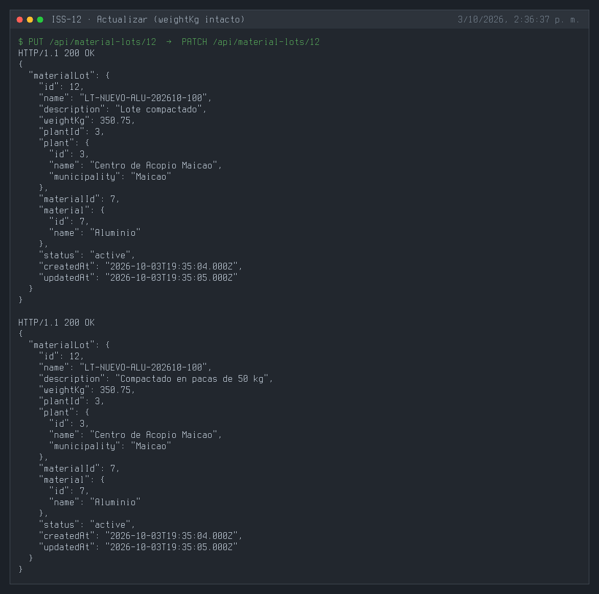
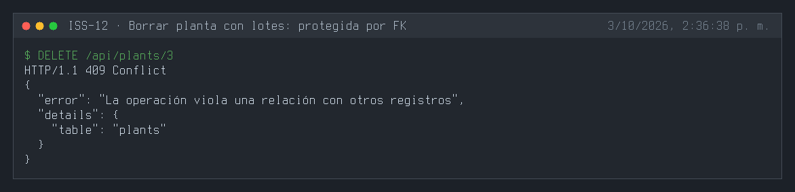
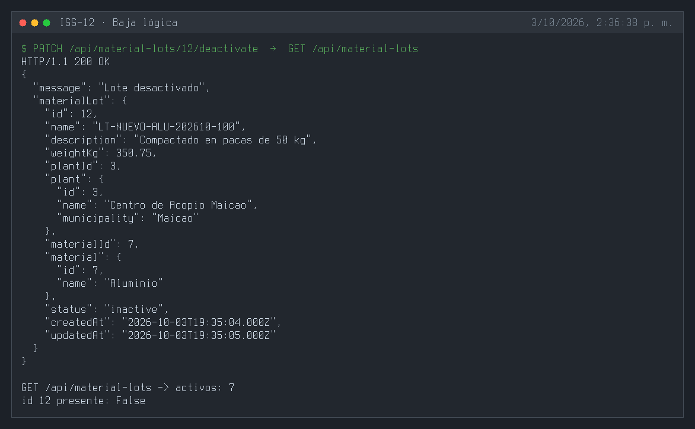
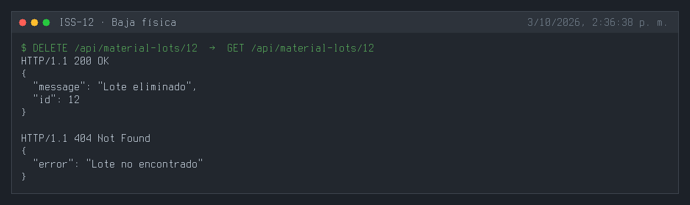
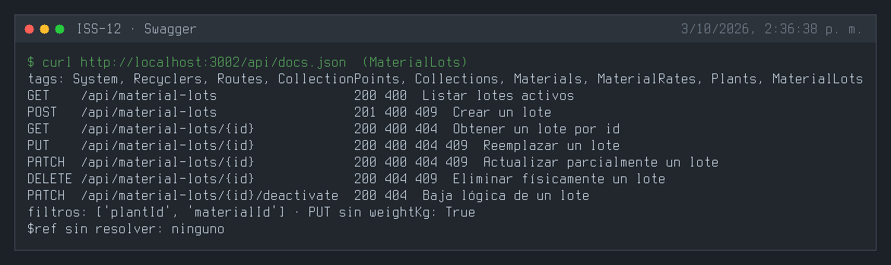
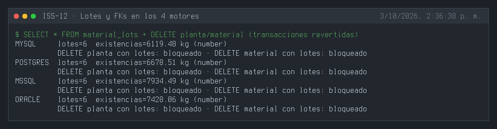

---

## 3. Definición de Done (DoD) y Verificación
Para marcar esta Issue como **Completada**, debes validar:
1. Compilación de TypeScript exitosa (`npm run build` o `npx tsc --noEmit`).
2. Arranque del servidor sin errores de sintaxis o de conexión a BD (`npm run dev`).
3. Ejecución y respuesta HTTP esperada en los endpoints del módulo (`.http` / REST Client).
4. Verificación de persistencia en la base de datos o interfaz Swagger `/api/docs`.

---

## 4. Cierre y trazabilidad
| Campo | Detalle |
| :--- | :--- |
| **Estado** | ✅ Completada |
| **Commit de implementación** | [`1bacb35`](https://github.com/DW-2026-IISem/dw-2026-Andreushin/commit/1bacb355752de8bbfa65f3d0f3d2682f699d940e) |
| **Hash completo** | `1bacb355752de8bbfa65f3d0f3d2682f699d940e` |
| **Issue GitHub** | [#25](https://github.com/DW-2026-IISem/dw-2026-Andreushin/issues/25) |
| **Fecha de cierre** | 2026-10-03 |

**Verificación realizada:** `npx tsc --noEmit` sin errores; tres `sync` consecutivos dejan 2 FKs (`plant_id → plants`, `material_id → materials`) en los 4 motores y un peso `1234.56` se lee como número; el seeder inserta 6 lotes por motor con códigos `LT-<MUN>-<MAT>-<AAAAMM>-NNN`; `POST` 201 con existencias iniciales y planta/material incluidos; peso negativo o planta inexistente 400; código repetido 409; `weightKg` en `PATCH`/`PUT` 400; cambiar el material de un lote con existencias 409 y de un lote vacío 200; `PUT` válido deja `weightKg` intacto; `GET ?plantId=&materialId=` filtra; borrar una planta con lotes 409; baja lógica y física correctas; en MySQL, PostgreSQL, SQL Server y Oracle la FK bloquea el borrado de plantas con lotes (en materiales el bloqueo también puede venir de sus tarifas).

**Desviaciones respecto al ISS:**
- FK `materialId` además de `plantId`: el prompt maestro define los lotes por planta **y** material (el ISS solo traía la planta).
- Campo `weightKg` (existencias del lote, DECIMAL(12,2)) con reglas de inventario: solo se fija al crear, no se edita por PUT/PATCH (lo moverán los pesajes de ISS-13 y las ventas de ISS-14) y bloquea el cambio de planta/material mientras haya existencias.
- `name` como código de lote único; filtros `?plantId=` y `?materialId=`.
- Feature completo por capas con seeder, swagger y `.http`; FKs camelCase con `NO ACTION`, alias `lots` en Plant y Material, ruta `/api/material-lots`, `status` STRING + `isIn` (`docs/prompt.MD` §3.4). Nuevo helper compartido `shared/database/decimal.ts`.
