# ISS-13 — Feature Weighing (Pesajes en Balanza con Tara y Peso Neto)

| Campo | Detalle |
| :--- | :--- |
| **Identificador** | `ISS-13` |
| **Módulo / Feature** | `src/features/business/feature-weighing` |
| **Prerrequisitos (DoR)** | ISS-08, ISS-09 |
| **Sistema Objetivo** | CircularGuajira Backend API (Express 5 + TS + Sequelize) |

---

## 1. Definición de Ready (DoR)
Antes de iniciar el desarrollo de esta Issue, verifica que:
1. Las Issues de prerrequisito (**ISS-08, ISS-09**) hayan sido completadas y verificadas.
2. El entorno de desarrollo y la base de datos estén operativos.

---

## 2. Descripción y Objetivos
### 14. ISS-13 — Feature Weighing (Pesajes y Tara)

### Detalle de Implementación
**Objetivo:** Captura de peso bruto, tara y cálculo de peso neto por material (`weighings`, FK `collection_id`, `material_id`, `material_lot_id`).
**Bloqueado por:** ISS-12.

```bash
mkdir -p src/features/business/weighing/http
: > src/features/business/weighing/weighing.model.ts
cat >> src/features/business/weighing/weighing.model.ts << 'EOF'
import { DataTypes, Model } from "sequelize";
import { sequelize } from "../../../database/db";

export class Weighing extends Model {
  public id!: number;
  public name!: string;
  public description!: string;
  public gross_weight!: number;
  public tare_weight!: number;
  public net_weight!: number;
  public collection_id!: number;
  public material_id!: number;
  public material_lot_id!: number;
  public status!: "active" | "inactive";
}

Weighing.init(
  {
    name: { type: DataTypes.STRING, allowNull: false },
    description: { type: DataTypes.STRING, allowNull: true },
    gross_weight: { type: DataTypes.DECIMAL(10, 2), allowNull: false },
    tare_weight: { type: DataTypes.DECIMAL(10, 2), defaultValue: 0 },
    net_weight: { type: DataTypes.DECIMAL(10, 2), allowNull: false },
    collection_id: { type: DataTypes.INTEGER, allowNull: false },
    material_id: { type: DataTypes.INTEGER, allowNull: false },
    material_lot_id: { type: DataTypes.INTEGER, allowNull: true },
    status: { type: DataTypes.ENUM("active", "inactive"), defaultValue: "active", allowNull: false },
  },
  { sequelize, modelName: "Weighing", tableName: "weighings", timestamps: true }
);
EOF
```

```bash
: > src/features/business/weighing/weighing.associations.ts
cat >> src/features/business/weighing/weighing.associations.ts << 'EOF'
import { Weighing } from "./weighing.model";
import { Collection } from "../collection/collection.model";
import { Material } from "../material/material.model";
import { MaterialLot } from "../material-lot/material-lot.model";

Weighing.belongsTo(Collection, { foreignKey: "collection_id", as: "collection" });
Weighing.belongsTo(Material, { foreignKey: "material_id", as: "material" });
Weighing.belongsTo(MaterialLot, { foreignKey: "material_lot_id", as: "material_lot" });

Collection.hasMany(Weighing, { foreignKey: "collection_id", as: "weighings" });
Material.hasMany(Weighing, { foreignKey: "material_id", as: "weighings" });
MaterialLot.hasMany(Weighing, { foreignKey: "material_lot_id", as: "weighings" });
EOF
```

---

---

**Evidencias:**

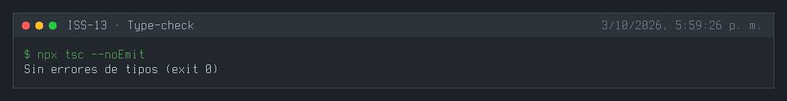
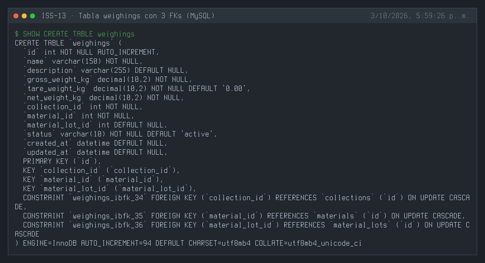
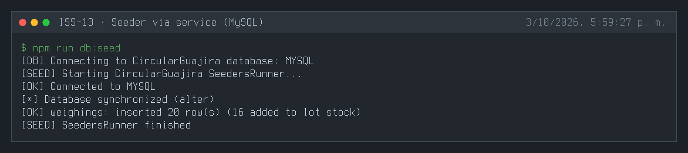
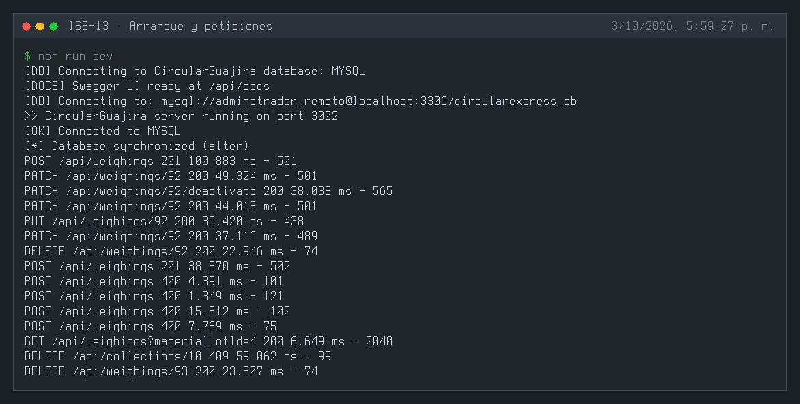
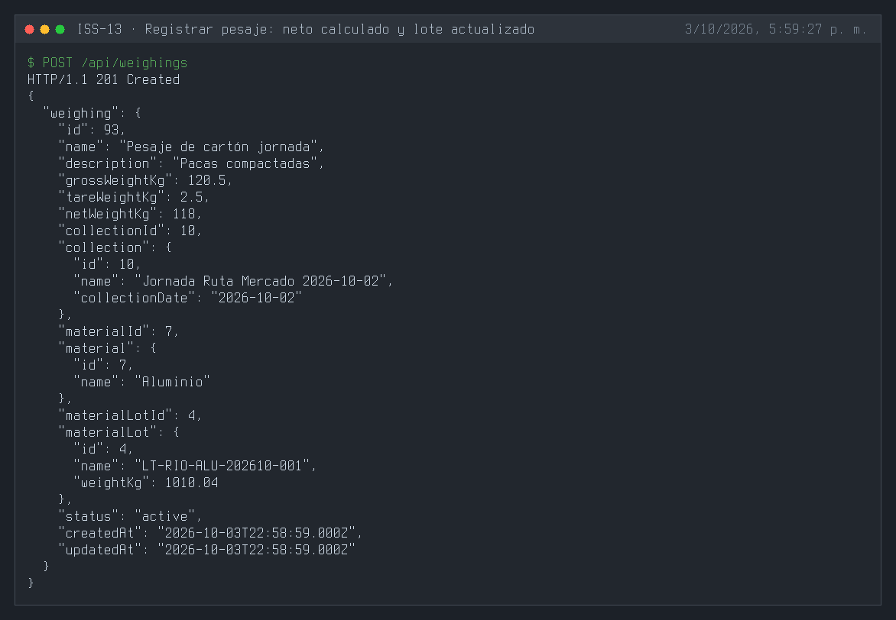
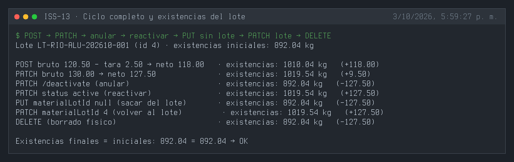
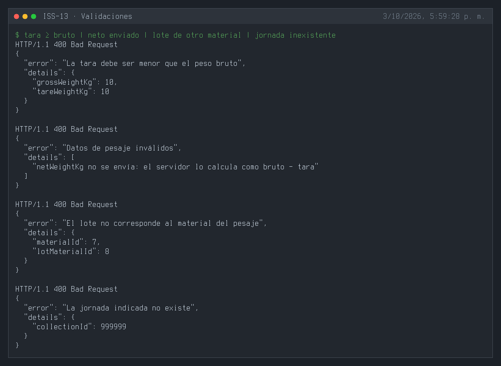
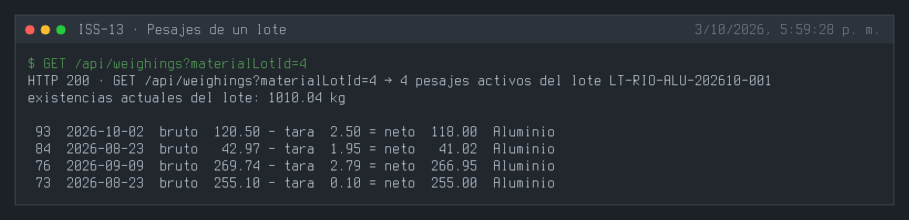
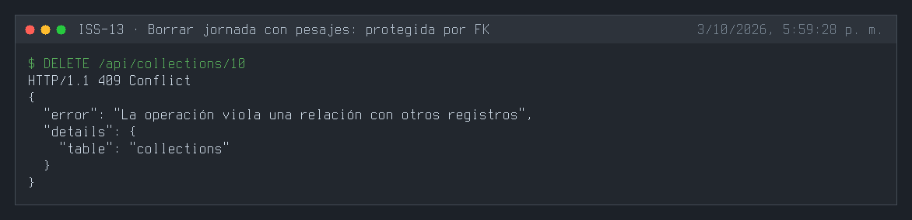
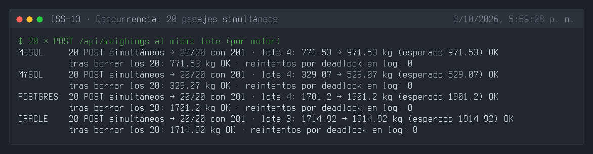
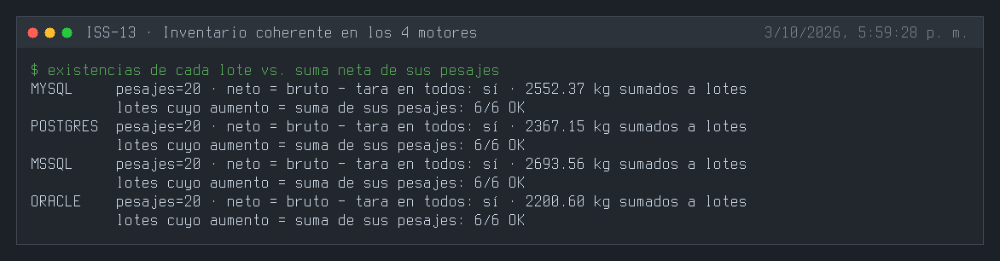
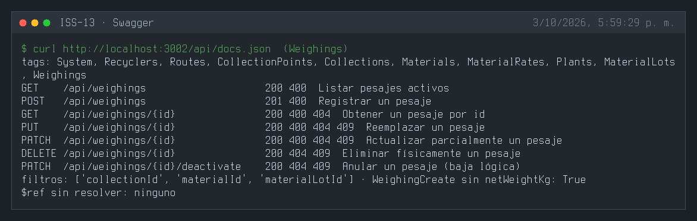

---

## 3. Definición de Done (DoD) y Verificación
Para marcar esta Issue como **Completada**, debes validar:
1. Compilación de TypeScript exitosa (`npm run build` o `npx tsc --noEmit`).
2. Arranque del servidor sin errores de sintaxis o de conexión a BD (`npm run dev`).
3. Ejecución y respuesta HTTP esperada en los endpoints del módulo (`.http` / REST Client).
4. Verificación de persistencia en la base de datos o interfaz Swagger `/api/docs`.

---

## 4. Cierre y trazabilidad
| Campo | Detalle |
| :--- | :--- |
| **Estado** | ✅ Completada |
| **Commit de implementación** | [`ab239f8`](https://github.com/DW-2026-IISem/dw-2026-Andreushin/commit/ab239f8e8a4a6ffdb899106634bf1027f3fcc794) |
| **Hash completo** | `ab239f8e8a4a6ffdb899106634bf1027f3fcc794` |
| **Issue GitHub** | [#26](https://github.com/DW-2026-IISem/dw-2026-Andreushin/issues/26) |
| **Fecha de cierre** | 2026-10-03 |

**Verificación realizada:** `npx tsc --noEmit` sin errores; tres `sync` consecutivos dejan 3 FKs (`collection_id`, `material_id`, `material_lot_id` opcional) en los 4 motores; `POST` calcula el neto (120,50 − 2,50 = 118,00) y lo suma al lote; el ciclo `PATCH` bruto → anular → reactivar → `PUT` sin lote → `PATCH` al lote → `DELETE` mueve las existencias exactamente lo esperado y el lote termina en su valor inicial; tara ≥ bruto, neto enviado por el cliente, lote de otro material y jornada inexistente 400; borrar una jornada con pesajes 409; **20 pesajes simultáneos** sobre el mismo lote responden 20/20 con 201 y dejan las existencias exactas (+200 kg) en MySQL, PostgreSQL, SQL Server y Oracle, y al borrarlos el lote vuelve a su valor; tras el seeder (que usa el service) cada lote aumentó exactamente la suma neta de sus pesajes activos en los 4 motores.

**Problemas encontrados y corregidos durante la verificación:**
- *Deadlock en MySQL* con pesajes simultáneos (6 de 10 fallaban con 500): el `INSERT` del pesaje toma un lock compartido sobre el lote por la FK y el ajuste posterior pedía un lock exclusivo. Ahora el lote se ajusta antes de insertar y `withTransaction` reintenta las víctimas de deadlock.
- *Actualizaciones perdidas en SQL Server* (20 pesajes → solo +100 kg): `SELECT ... FOR UPDATE` no bloqueaba en ese motor. Se reemplazó por un `UPDATE` atómico `weight_kg = weight_kg + Δ` con guarda `>= 0`, válido en los 4 motores; el lote afectado se restauró a su valor previo a la prueba.

**Desviaciones respecto al ISS:**
- `netWeightKg` calculado por el servidor (bruto − tara) y efecto de los pesajes sobre las existencias (`weightKg`) del lote, con reversión al editar, anular o borrar.
- Validación de coherencia lote ↔ material y de tara menor que el bruto; filtros `?collectionId=`, `?materialId=`, `?materialLotId=`.
- Feature completo por capas con seeder (vía service), swagger y `.http`; FKs camelCase con `NO ACTION` (también en la FK opcional, para evitar el `SET NULL` por defecto), ruta `/api/weighings`, `status` STRING + `isIn` (`docs/prompt.MD` §3.4).
- Nota: el 409 por existencias insuficientes al revertir un pesaje solo se alcanza cuando haya ventas (ISS-14) que descuenten el lote.
