# ISS-14 — Feature MaterialSale (Ventas de Lotes Procesados)

| Campo | Detalle |
| :--- | :--- |
| **Identificador** | `ISS-14` |
| **Módulo / Feature** | `src/features/business/feature-material-sale` |
| **Prerrequisitos (DoR)** | ISS-12 |
| **Sistema Objetivo** | CircularGuajira Backend API (Express 5 + TS + Sequelize) |

---

## 1. Definición de Ready (DoR)
Antes de iniciar el desarrollo de esta Issue, verifica que:
1. Las Issues de prerrequisito (**ISS-12**) hayan sido completadas y verificadas.
2. El entorno de desarrollo y la base de datos estén operativos.

---

## 2. Descripción y Objetivos
### 15. ISS-14 — Feature MaterialSale (Venta de Materiales Procesados)

### Detalle de Implementación
**Objetivo:** Registro de comercialización de lotes a transformadores finales (`material_sales`, FK `material_lot_id`).
**Bloqueado por:** ISS-13.

```bash
mkdir -p src/features/business/material-sale/http
: > src/features/business/material-sale/material-sale.model.ts
cat >> src/features/business/material-sale/material-sale.model.ts << 'EOF'
import { DataTypes, Model } from "sequelize";
import { sequelize } from "../../../database/db";

export class MaterialSale extends Model {
  public id!: number;
  public name!: string;
  public description!: string;
  public quantity!: number;
  public unit_price!: number;
  public total_amount!: number;
  public material_lot_id!: number;
  public status!: "active" | "inactive";
}

MaterialSale.init(
  {
    name: { type: DataTypes.STRING, allowNull: false },
    description: { type: DataTypes.STRING, allowNull: true },
    quantity: { type: DataTypes.DECIMAL(10, 2), allowNull: false },
    unit_price: { type: DataTypes.DECIMAL(10, 2), allowNull: false },
    total_amount: { type: DataTypes.DECIMAL(12, 2), allowNull: false },
    material_lot_id: { type: DataTypes.INTEGER, allowNull: false },
    status: { type: DataTypes.ENUM("active", "inactive"), defaultValue: "active", allowNull: false },
  },
  { sequelize, modelName: "MaterialSale", tableName: "material_sales", timestamps: true }
);
EOF
```

---

---

**Evidencias:**

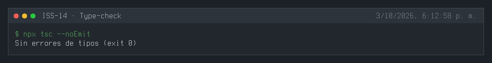
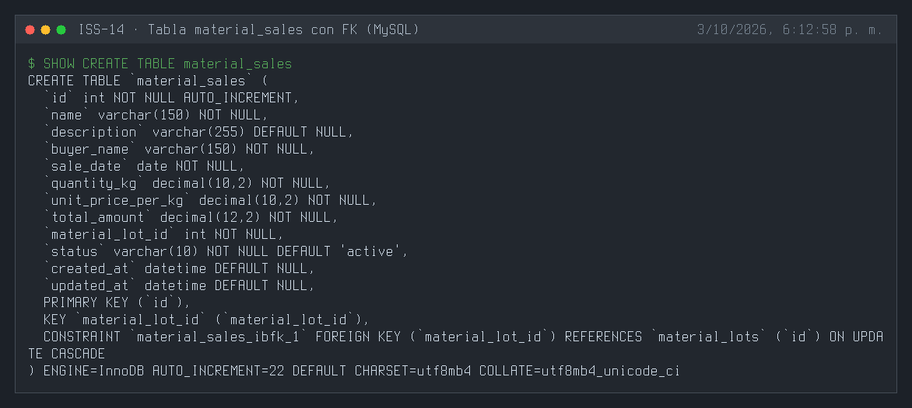
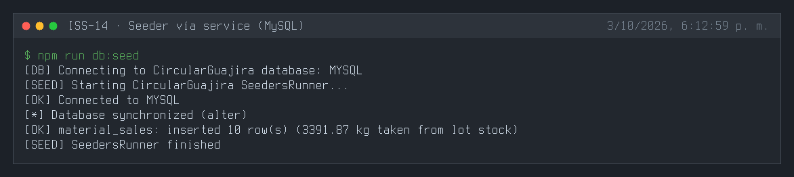
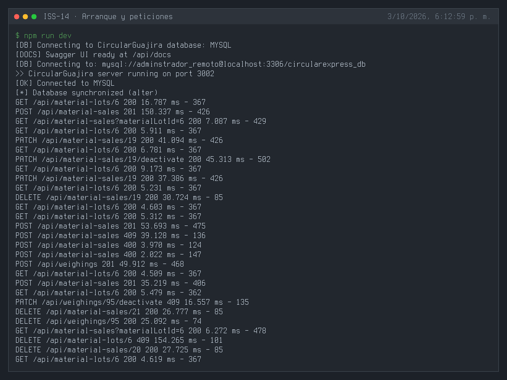
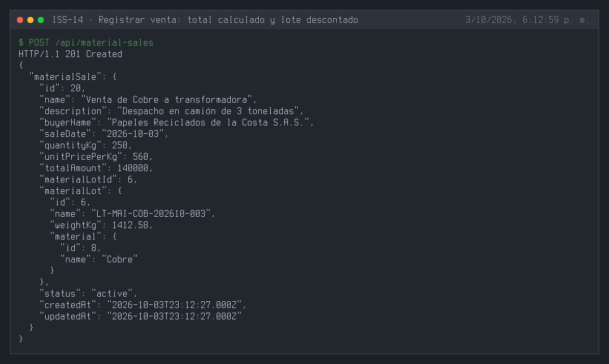
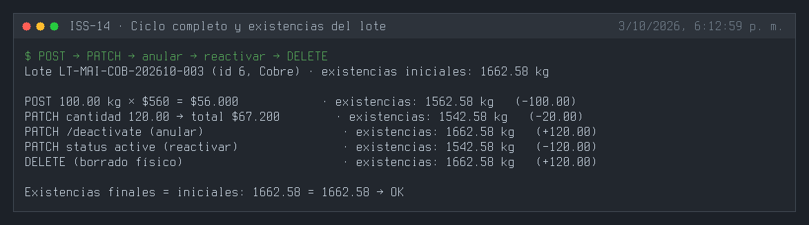
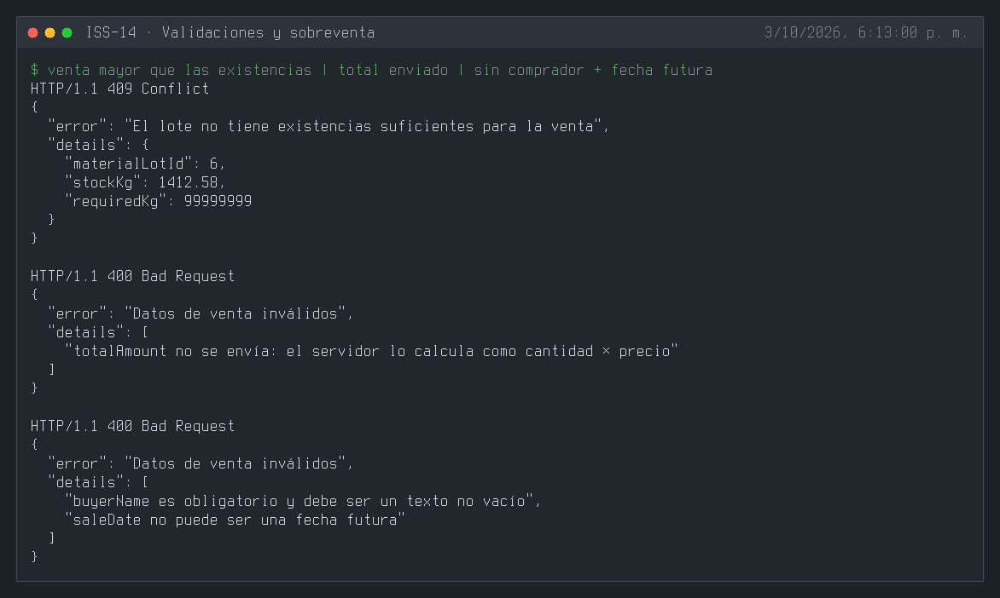
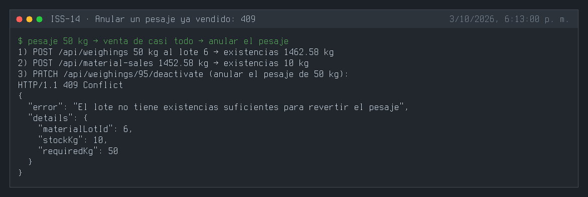
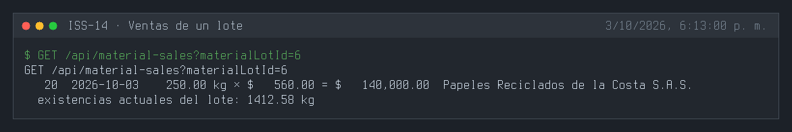
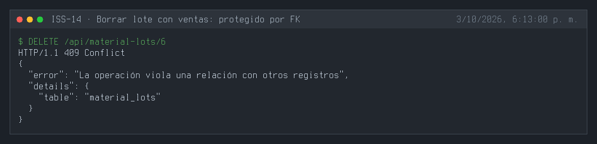
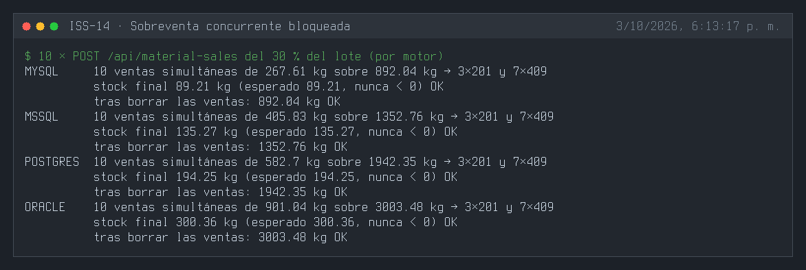
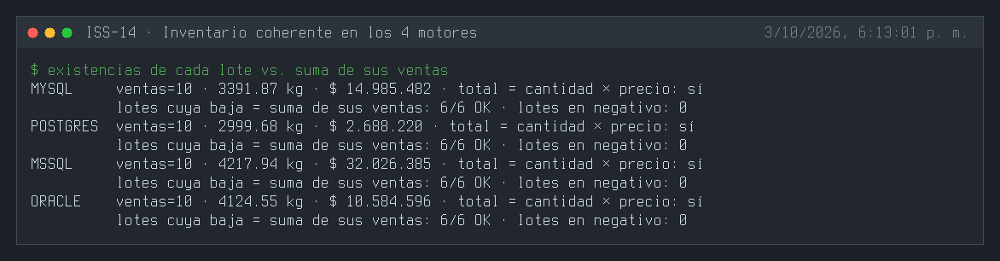
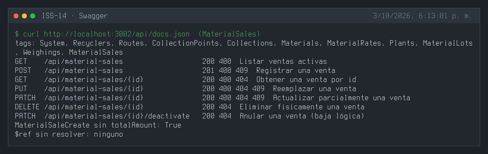

---

## 3. Definición de Done (DoD) y Verificación
Para marcar esta Issue como **Completada**, debes validar:
1. Compilación de TypeScript exitosa (`npm run build` o `npx tsc --noEmit`).
2. Arranque del servidor sin errores de sintaxis o de conexión a BD (`npm run dev`).
3. Ejecución y respuesta HTTP esperada en los endpoints del módulo (`.http` / REST Client).
4. Verificación de persistencia en la base de datos o interfaz Swagger `/api/docs`.

---

## 4. Cierre y trazabilidad
| Campo | Detalle |
| :--- | :--- |
| **Estado** | ✅ Completada |
| **Commit de implementación** | [`daac1a0`](https://github.com/DW-2026-IISem/dw-2026-Andreushin/commit/daac1a0dc9234bd39d41996900bb35f0d4ab9b86) |
| **Hash completo** | `daac1a0dc9234bd39d41996900bb35f0d4ab9b86` |
| **Issue GitHub** | [#27](https://github.com/DW-2026-IISem/dw-2026-Andreushin/issues/27) |
| **Fecha de cierre** | 2026-10-03 |

**Verificación realizada:** `npx tsc --noEmit` sin errores; tres `sync` consecutivos dejan una FK `material_lot_id → material_lots` en los 4 motores; una venta de 100 kg × $560 calcula el total ($56.000) y descuenta 100 kg del lote; el ciclo `PATCH` cantidad → anular → reactivar → `DELETE` deja el lote en su valor inicial; una venta mayor que las existencias responde 409; enviar `totalAmount`, omitir el comprador o usar una fecha futura 400; anular un pesaje cuyo material ya se vendió 409; borrar un lote con ventas 409; **10 ventas simultáneas** del 30 % del lote producen exactamente 3×201 y 7×409 y el lote nunca queda en negativo en MySQL, PostgreSQL, SQL Server y Oracle; tras el seeder (que usa el service) cada lote bajó exactamente la suma de sus ventas activas en los 4 motores.

**Desviaciones respecto al ISS:**
- Campos `buyerName` (cliente transformador, prompt maestro §2.2) y `saleDate` (no futura, por defecto hoy).
- `totalAmount` calculado por el servidor (cantidad × precio) y efecto de las ventas sobre las existencias (`weightKg`) del lote, con reversión al editar, anular o borrar; 409 ante sobreventa.
- Nuevo helper compartido `material-lots/material-lots.stock.ts` (usado por pesajes y ventas).
- Feature completo por capas con seeder (vía service), swagger y `.http`; campos camelCase (`quantityKg`, `unitPricePerKg`, `totalAmount` en vez de `quantity`, `unit_price`, `total_amount`), FK con `NO ACTION`, ruta `/api/material-sales`, `status` STRING + `isIn` (`docs/prompt.MD` §3.4).
