# ISS-15 — Feature Settlement (Liquidaciones de Pago a Recicladores)

| Campo | Detalle |
| :--- | :--- |
| **Identificador** | `ISS-15` |
| **Módulo / Feature** | `src/features/business/feature-settlement` |
| **Prerrequisitos (DoR)** | ISS-13 |
| **Sistema Objetivo** | CircularGuajira Backend API (Express 5 + TS + Sequelize) |

---

## 1. Definición de Ready (DoR)
Antes de iniciar el desarrollo de esta Issue, verifica que:
1. Las Issues de prerrequisito (**ISS-13**) hayan sido completadas y verificadas.
2. El entorno de desarrollo y la base de datos estén operativos.

---

## 2. Descripción y Objetivos
### 16. ISS-15 — Feature Settlement (Liquidaciones a Recicladores)

### Detalle de Implementación
**Objetivo:** Emisión y cálculo de liquidaciones financieras a recicladores (`settlements`, FK `recycler_id`).
**Bloqueado por:** ISS-14.

```bash
mkdir -p src/features/business/settlement/http
: > src/features/business/settlement/settlement.model.ts
cat >> src/features/business/settlement/settlement.model.ts << 'EOF'
import { DataTypes, Model } from "sequelize";
import { sequelize } from "../../../database/db";

export class Settlement extends Model {
  public id!: number;
  public reference_code!: string;
  public date!: Date;
  public amount!: number;
  public state!: "pending" | "approved" | "paid" | "rejected";
  public observations!: string;
  public recycler_id!: number;
  public status!: "active" | "inactive";
}

Settlement.init(
  {
    reference_code: { type: DataTypes.STRING, allowNull: false, unique: true },
    date: { type: DataTypes.DATE, defaultValue: DataTypes.NOW },
    amount: { type: DataTypes.DECIMAL(12, 2), allowNull: false },
    state: { type: DataTypes.ENUM("pending", "approved", "paid", "rejected"), defaultValue: "pending" },
    observations: { type: DataTypes.STRING, allowNull: true },
    recycler_id: { type: DataTypes.INTEGER, allowNull: false },
    status: { type: DataTypes.ENUM("active", "inactive"), defaultValue: "active", allowNull: false },
  },
  { sequelize, modelName: "Settlement", tableName: "settlements", timestamps: true }
);
EOF
```

```bash
: > src/features/business/settlement/settlement.associations.ts
cat >> src/features/business/settlement/settlement.associations.ts << 'EOF'
import { Settlement } from "./settlement.model";
import { Recycler } from "../recycler/recycler.model";

Settlement.belongsTo(Recycler, { foreignKey: "recycler_id", as: "recycler" });
Recycler.hasMany(Settlement, { foreignKey: "recycler_id", as: "settlements" });
EOF
```

---

---

**Evidencias:**

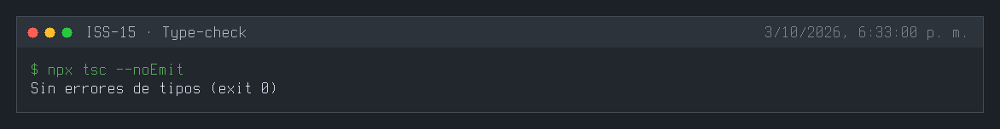
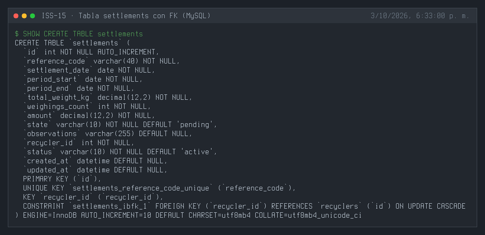
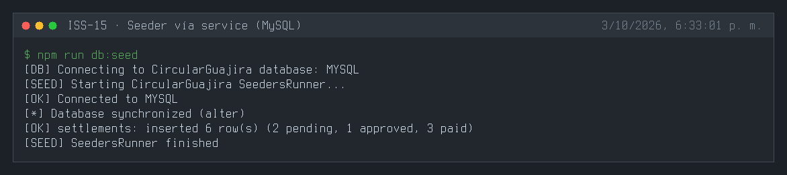
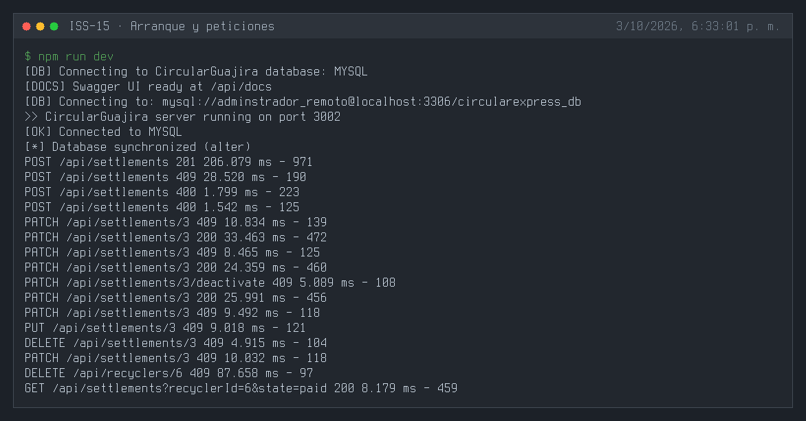
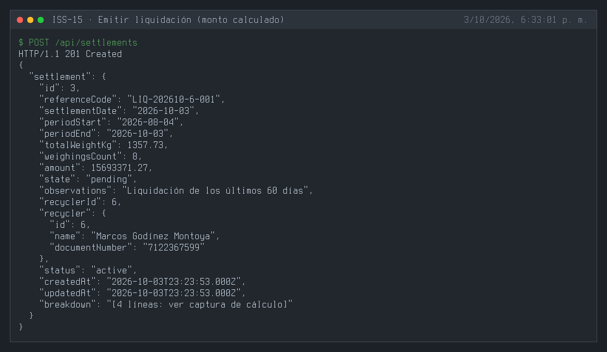
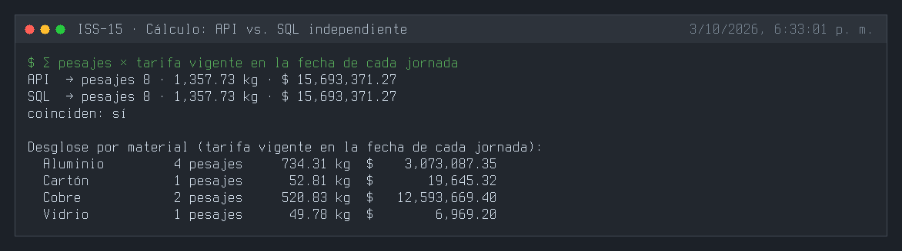
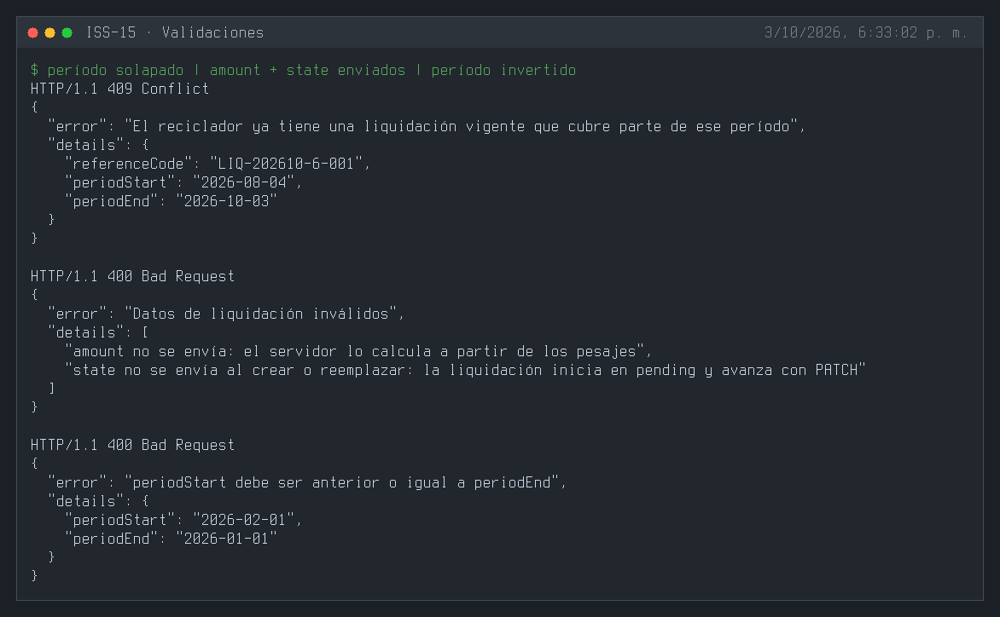
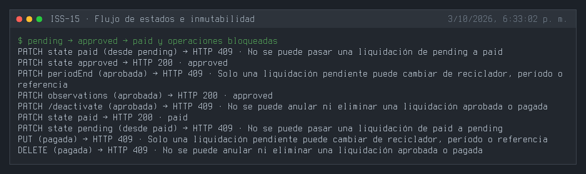
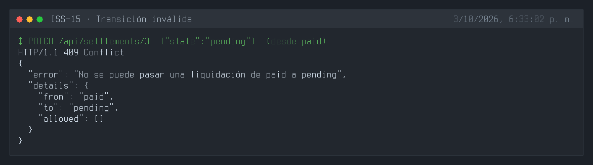
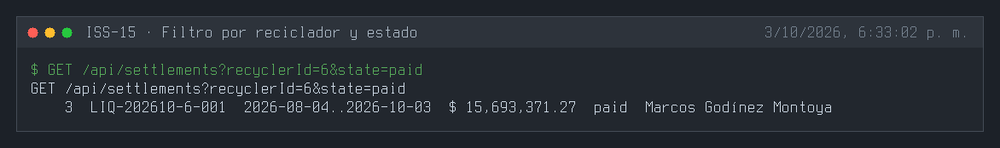
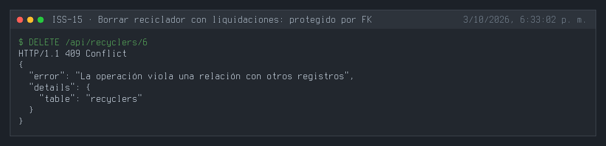
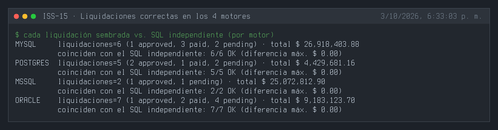
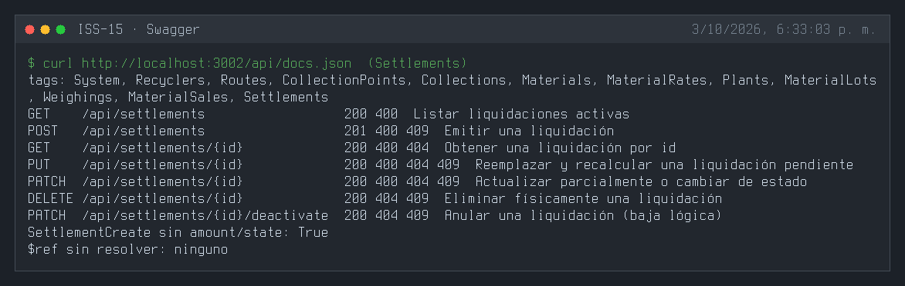

---

## 3. Definición de Done (DoD) y Verificación
Para marcar esta Issue como **Completada**, debes validar:
1. Compilación de TypeScript exitosa (`npm run build` o `npx tsc --noEmit`).
2. Arranque del servidor sin errores de sintaxis o de conexión a BD (`npm run dev`).
3. Ejecución y respuesta HTTP esperada en los endpoints del módulo (`.http` / REST Client).
4. Verificación de persistencia en la base de datos o interfaz Swagger `/api/docs`.

---

## 4. Cierre y trazabilidad
| Campo | Detalle |
| :--- | :--- |
| **Estado** | ✅ Completada |
| **Commit de implementación** | [`83c4992`](https://github.com/DW-2026-IISem/dw-2026-Andreushin/commit/83c4992e397b11f063897013ec3547018565600e) |
| **Hash completo** | `83c4992e397b11f063897013ec3547018565600e` |
| **Issue GitHub** | [#28](https://github.com/DW-2026-IISem/dw-2026-Andreushin/issues/28) |
| **Fecha de cierre** | 2026-10-03 |

**Verificación realizada:** `npx tsc --noEmit` sin errores; tres `sync` consecutivos dejan la FK `recycler_id → recyclers` y el índice único de `reference_code` en los 4 motores; una liquidación emitida por la API para los últimos 60 días coincide exactamente con un cálculo SQL independiente (8 pesajes, 1.357,73 kg, $15.693.371,27) y trae el desglose por material; período solapado 409; `amount`/`state` enviados y período invertido 400; `pending → paid` 409, `pending → approved → paid` 200, `paid → pending` 409; una liquidación aprobada o pagada no cambia de período, no se anula, no se reemplaza ni se borra (409), pero sí admite `observations`; borrar un reciclador con liquidaciones 409; las 20 liquidaciones sembradas (vía service, con estados pending/approved/paid) coinciden con el SQL independiente en MySQL, PostgreSQL, SQL Server y Oracle con diferencia de $0,00.

**Desviaciones respecto al ISS:**
- `amount` **calculado** por el servidor (el ISS lo recibía del cliente): Σ pesajes activos del reciclador en el período × tarifa vigente en la fecha de cada jornada (usa el historial de tarifas de ISS-10). Campos nuevos `periodStart`, `periodEnd`, `totalWeightKg`, `weighingsCount`; `date` pasa a `settlementDate` (DATEONLY).
- Reglas de flujo de `state` (pending → approved | rejected, approved → paid | rejected), inmutabilidad de liquidaciones aprobadas/pagadas y prohibición de períodos solapados vigentes por reciclador.
- `referenceCode` único con índice nombrado (no `unique: true` en columna) y generado si se omite; `state`/`status` STRING + `isIn`; camelCase; ruta `/api/settlements`; feature completo con seeder (vía service), swagger y `.http`.
