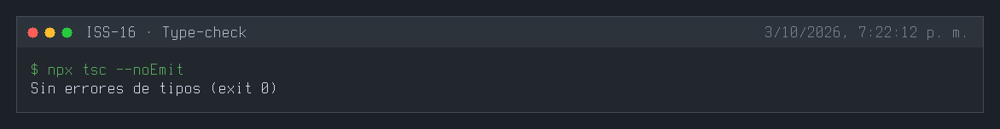
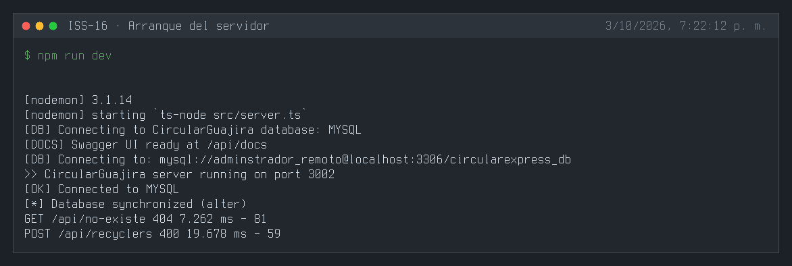
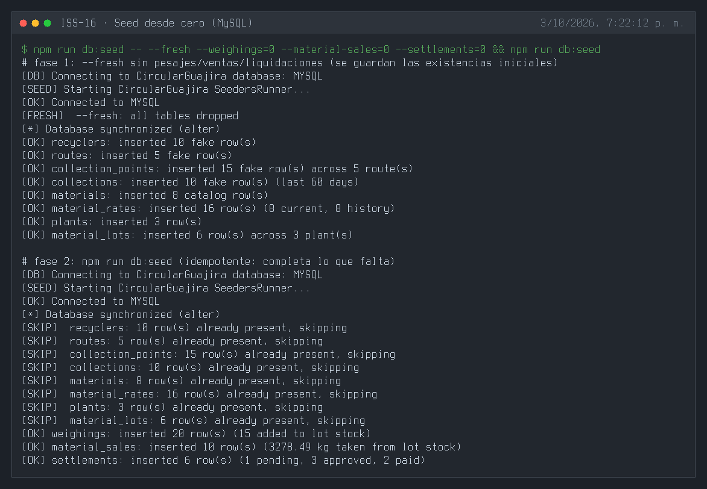
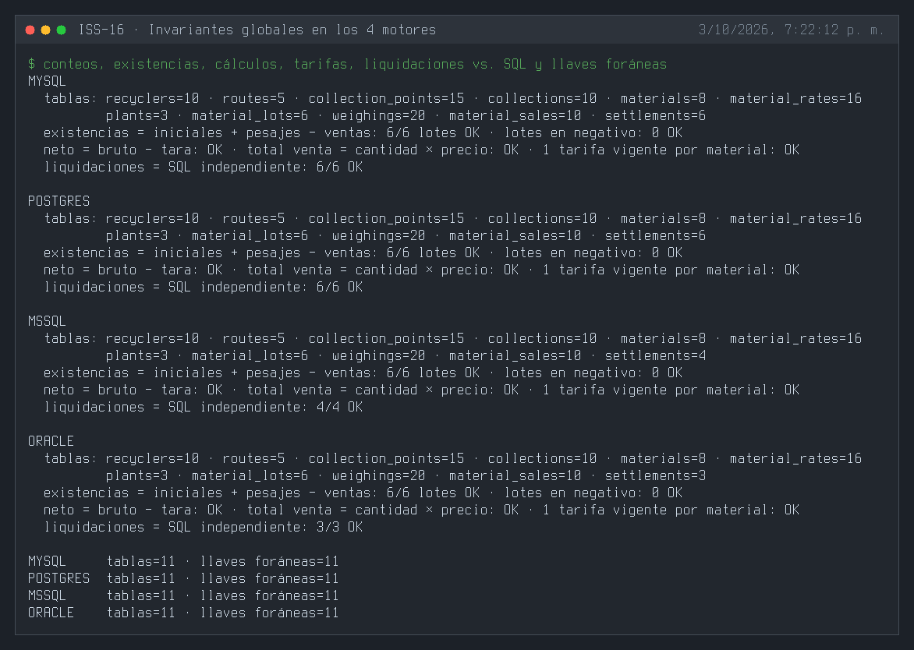
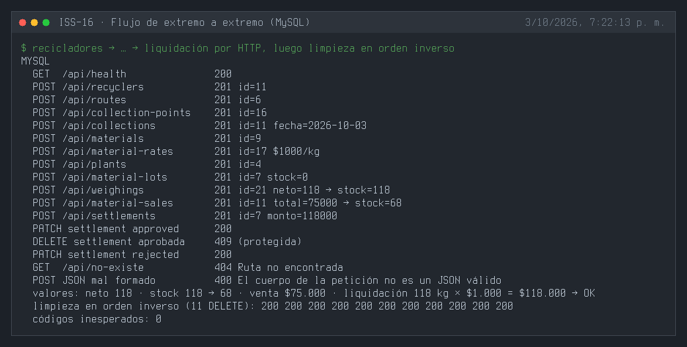
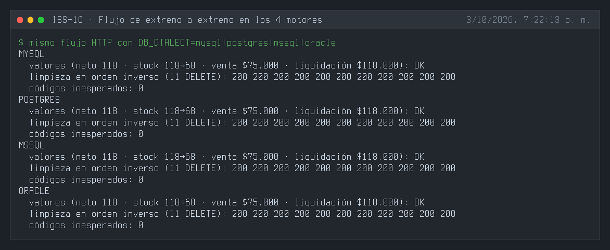
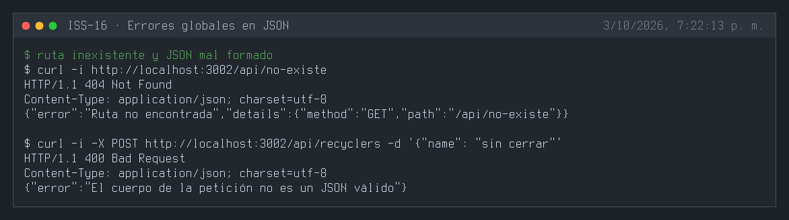
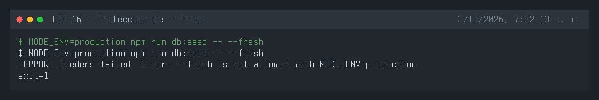
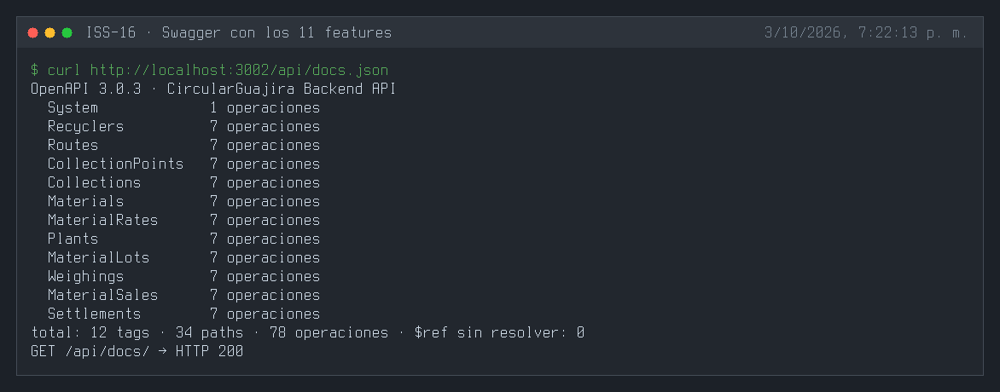

# ISS-16 — Verificación Global de Integridad y Sincronización Final

| Campo | Detalle |
| :--- | :--- |
| **Identificador** | `ISS-16` |
| **Módulo / Feature** | `src/features/business/core` |
| **Prerrequisitos (DoR)** | ISS-00 a ISS-15 |
| **Sistema Objetivo** | CircularGuajira Backend API (Express 5 + TS + Sequelize) |

---

## 1. Definición de Ready (DoR)
Antes de iniciar el desarrollo de esta Issue, verifica que:
1. Las Issues de prerrequisito (**ISS-00 a ISS-15**) hayan sido completadas y verificadas.
2. El entorno de desarrollo y la base de datos estén operativos.

---

## 2. Descripción y Objetivos
### 17. ISS-16 — Estado Final y Verificación Global

### Detalle de Implementación
**Objetivo:** Consolidar todos los módulos, asociaciones, agregador de rutas y servidor central en `src/config/index.ts`.
**Bloqueado por:** ISS-15.

##### Archivo Consolidado `src/config/index.ts`
```bash
: > src/config/index.ts
cat >> src/config/index.ts << 'EOF'
import dotenv from "dotenv";
import express, { Application } from "express";
import morgan from "morgan";
var cors = require("cors");
import { sequelize, getDatabaseInfo, testConnection } from "../database/db";

// Modelos
import "../features/business/recycler/recycler.model";
import "../features/business/route/route.model";
import "../features/business/collection-point/collection-point.model";
import "../features/business/collection/collection.model";
import "../features/business/material/material.model";
import "../features/business/material-rate/material-rate.model";
import "../features/business/plant/plant.model";
import "../features/business/material-lot/material-lot.model";
import "../features/business/weighing/weighing.model";
import "../features/business/material-sale/material-sale.model";
import "../features/business/settlement/settlement.model";

// Asociaciones
import "../features/business/collection-point/collection-point.associations";
import "../features/business/collection/collection.associations";
import "../features/business/material-rate/material-rate.associations";
import "../features/business/material-lot/material-lot.associations";
import "../features/business/weighing/weighing.associations";
import "../features/business/settlement/settlement.associations";

import { Routes } from "../routes/index";
import { setupSwagger } from "../swagger/index";

dotenv.config();

export class App {
  public app: Application;
  public routePrv: Routes = new Routes();

  constructor(private port?: number | string) {
    this.app = express();
    this.settings();
    this.middlewares();
    this.routes();
    this.docs();
    this.dbConnection();
  }

  private settings(): void {
    this.app.set('port', this.port || process.env.PORT || 4000);
  }

  private middlewares(): void {
    this.app.use(morgan('dev'));
    this.app.use(cors());
    this.app.use(express.json());
    this.app.use(express.urlencoded({ extended: false }));
  }

  private routes(): void {
    this.routePrv.recyclerRoutes.routes(this.app);
    this.routePrv.routeRoutes.routes(this.app);
  }

  private docs(): void {
    setupSwagger(this.app);
  }

  private async dbConnection(): Promise<void> {
    try {
      const dbInfo = getDatabaseInfo();
      console.log(`🔗 Conectando a BD CircularGuajira: ${dbInfo.engine.toUpperCase()}`);
      const isConnected = await testConnection();
      if (!isConnected) throw new Error("Fallo de conexión a la BD");

      await sequelize.sync({ force: false, alter: true });
      console.log("📦 Base de datos de CircularGuajira sincronizada exitosamente");
    } catch (error) {
      console.error("❌ Error en la base de datos:", error);
      process.exit(1);
    }
  }

  async listen() {
    await this.app.listen(this.app.get('port'));
    console.log(`🚀 Servidor CircularGuajira listo en el puerto ${this.app.get('port')}`);
  }
}
EOF
```

##### Comandos de Verificación Final
```bash
npx tsc --noEmit
npm run db:seed
npm run dev
```

---

### Referencia de paquetes npm instalados

```bash
npm install express@^5.2.1 cors@^2.8.6 dotenv@^17.4.2 morgan@^1.12.1   sequelize@^6.37.8 mysql2@^3.24.4 pg@^8.23.0 pg-hstore@^2.3.4   swagger-ui-express@^5.0.1

npm install -D typescript@~5.9.2 ts-node@^10.9.2 nodemon@^3.1.14   @types/node@^22.20.3 @types/express@^5.0.6   @types/cors@^2.8.19 @types/morgan@^1.9.10   @types/sequelize@^6.12.0 @types/swagger-ui-express@^4.1.8   @faker-js/faker@^10.6.0
```

---

**Evidencias:**











---

## 3. Definición de Done (DoD) y Verificación
Para marcar esta Issue como **Completada**, debes validar:
1. Compilación de TypeScript exitosa (`npm run build` o `npx tsc --noEmit`).
2. Arranque del servidor sin errores de sintaxis o de conexión a BD (`npm run dev`).
3. Ejecución y respuesta HTTP esperada en los endpoints del módulo (`.http` / REST Client).
4. Verificación de persistencia en la base de datos o interfaz Swagger `/api/docs`.

---

## 4. Cierre y trazabilidad
| Campo | Detalle |
| :--- | :--- |
| **Estado** | ✅ Completada |
| **Commit de implementación** | [`23733d6`](https://github.com/DW-2026-IISem/dw-2026-Andreushin/commit/23733d604db6d928911bd9a6c766bfe1398179f4) |
| **Hash completo** | `23733d604db6d928911bd9a6c766bfe1398179f4` |
| **Issue GitHub** | [#29](https://github.com/DW-2026-IISem/dw-2026-Andreushin/issues/29) |
| **Fecha de cierre** | 2026-10-03 |

**Verificación realizada:**
- DoD 1: `npx tsc --noEmit` y `npm run build` sin errores; `npm start` (código compilado) arranca y sincroniza.
- DoD 2: `npm run dev` conecta y sincroniza las 11 tablas.
- DoD 3: flujo de extremo a extremo por HTTP (`core/http/e2e.http`) en MySQL, PostgreSQL, SQL Server y Oracle: 17 pasos sin códigos inesperados (pesaje de 118 kg netos, existencias 0 → 118 → 68 tras vender 50 kg por $75.000, liquidación de 118 kg × $1.000 = $118.000, aprobada protegida contra borrado, 404 y 400 en JSON) y limpieza en orden inverso con 11 `DELETE` 200.
- DoD 4: `db:seed --fresh` desde cero en los 4 motores: 11 tablas y 11 llaves foráneas en cada uno; existencias = iniciales + pesajes − ventas en 6/6 lotes y ninguno en negativo; neto = bruto − tara, total de venta = cantidad × precio y una tarifa vigente por material; todas las liquidaciones sembradas coinciden con un cálculo SQL independiente. Swagger `/api/docs`: 12 tags (System + 11 features), 34 paths, 78 operaciones, sin `$ref` rotos.
- `NODE_ENV=production npm run db:seed -- --fresh` termina con error sin tocar la base.

**Desviaciones respecto al ISS:**
- No se reemplazó `src/config/index.ts` por el código de referencia (rutas `recycler/…` en singular, solo 2 rutas registradas): el archivo ya estaba consolidado con los 11 features y las convenciones de `docs/prompt.MD` §3.4. Se agregaron el método `docs()` del ISS y `errorHandlers()` (404/400 en JSON).
- Modelos y asociaciones en un registro único `src/database/models.ts` (lo comparten la App y el SeedersRunner).
- Extras: `db:seed -- --fresh` (bloqueado en producción), `core/http/e2e.http` y README actualizado con el estado real del proyecto.
