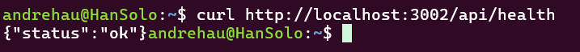
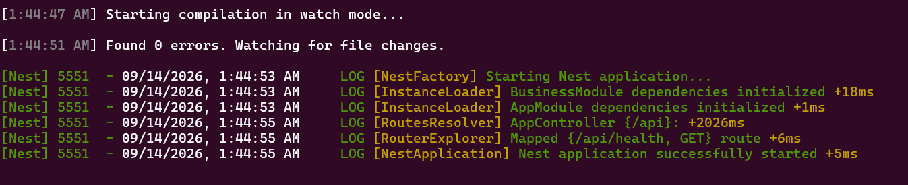

# ISS-01 — Esqueleto NestJS CA arrancable

Issue #: Issue GitHub: backend-nest-ia #2

## 1. Objetivo / Especificación
Disponer de la estructura base versionada en Git para el backend de CircularGuajira bajo Clean Architecture, **sin base de datos**.

**Estructura de carpetas:** `src/config/`, `src/common/`, `src/infrastructure/database/`, `src/features/business/`

**Regla dura:** prohibido incluir Sequelize, modelos o controladores de negocio en este issue.

## 2. Criterios de aceptación (AC)
| # | Criterio |
|---|---|
| AC1 | El proyecto arranca sin errores con `npm run start:dev` |
| AC2 | Existe exactamente la estructura: `src/config/`, `src/common/`, `src/infrastructure/database/`, `src/features/business/` |
| AC3 | `GET /api/health` → `200 {"status": "ok"}` |
| AC4 | No hay ningún modelo Sequelize, controlador de negocio ni dependencia de BD instalada/usada en este issue |
| AC5 | README inicial con instrucciones de instalación |

## 3. IA usada
CLAUDE CODE // Sonnet 5 Max

14/09/2026
Naturaleza: PRÁCTICO. Eres asistente SOLO de ISS-01, no del backend entero. Implementa los Criterios de Aceptación de trazabilidad/ISS-01.md siguiendo estrictamente el contrato de arquitectura en docs/Prompt.md (Clean Architecture, pista Business). Contexto del directorio: La raíz del workspace ya contiene .git/, docs/ (con Prompt.md) y trazabilidad/ (con ISS-01.md a ISS-07.md). NO borres ni modifiques estos directorios existentes. Requerimientos de implementación para ISS-01: 1\. Genera la estructura base de NestJS con npm en un directorio temporal y mueve su contenido a la raíz fusionando el .gitignore (el cual debe incluir node\_modules/, dist/, .env). 2\. Crea el árbol de carpetas de Clean Architecture: - src/config/ - src/common/ - src/infrastructure/database/ - src/features/business/ (con business.module.ts como stub/módulo vacío exportado). 3\. Configura src/main.ts: - Prefijo global: setGlobalPrefix('api') - CORS habilitado para origin: 'http://localhost:4200' con credentials: true. - ValidationPipe global: ValidationPipe({ whitelist: true, forbidNonWhitelisted: true, transform: true }). - Puerto de escucha: process.env.PORT ?? 3002\. 4\. Endpoint de Salud: - Implementa GET /api/health retornando código HTTP 200 con el payload JSON: { "status": "ok" }. 5\. Scripts y Herramientas: - Crea el script scripts/free-port.js para liberar el puerto 3002 si está ocupado. - En package.json incluye los scripts npm: "free:port": "node scripts/free-port.js" y "start:dev": "npm run free:port &amp;&amp; nest start --watch". Prohibiciones Duras: - PROHIBIDO incluir Sequelize, modelos, ORM, conexión a BD o variables de entorno de BD. - PROHIBIDO incluir Auth, Users, JWT, Login, Guards o RBAC. - PROHIBIDO adelantar lógica de ISS-02\. Al terminar, entrega: 1\. Lista de archivos creados y modificados. 2\. Comandos exactos para verificar cada Criterio de Aceptación en terminal. 3\. Lista explicativa de qué quedó fuera de alcance en este Issue.

## 4. Evidencias (EVI)

## 5. Revisión humana

14-09-2026
revisor: Carlos Martinez
revisión conforme: Todo se verificó y cumple al 100% los Criterios de Aceptación (AC)

Esqueleto NestJS en Clean Architecture compilado y verificado. Servidor responde 200 OK en /api/health sin incluir librerías de BD ni Auth.
## 6. Gate
\- \*\*Estado:\*\* APROBADO - \*\*Conclusión:\*\* ISS-01 completado al 100%. Esqueleto base en Clean Architecture compilado y verificado con el endpoint /api/health. - \*\*Trazabilidad final:\*\* Commit \`39102a5\` (Refs #2)