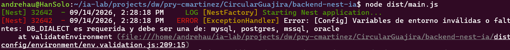
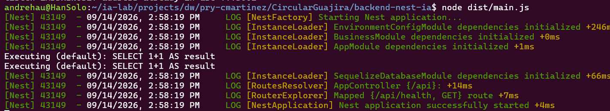
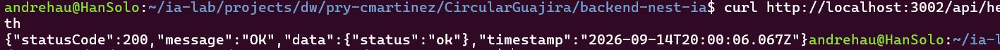
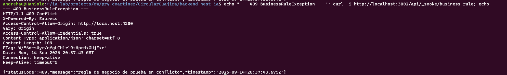
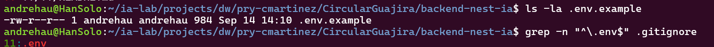
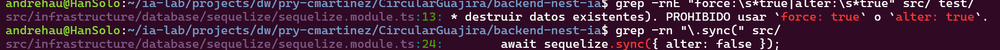
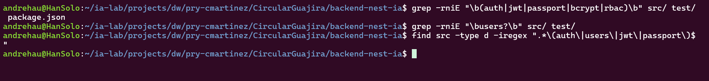

# ISS-02 — Entorno Sequelize y Módulo Common

Issue #: Issue GitHub: backend-nest-ia #3

## 1. Objetivo / Especificación
Validar variables de entorno para la base de datos `circularguajira_db`, fábrica Sequelize multi-dialecto, filtro global de excepciones e interceptores.

**Especificación:**
- Validar variables de entorno críticas del dialecto activo al arrancar (fail-fast).
- Configurar Sequelize con `sync({ alter: false })`.
- `ResponseInterceptor` envuelve toda respuesta exitosa en `{ statusCode, message, data, timestamp }`.
- Excepciones base: `ApplicationException`, `EntityNotFoundException` (404), `DomainException` (400), `BusinessRuleException` (409).

## 2. Criterios de aceptación (AC)
| # | Criterio |
|---|---|
| AC1 | La app falla rápido y con mensaje claro si falta una variable de entorno crítica del dialecto activo |
| AC2 | Sequelize conecta con `sync({ alter: false })` según el dialecto configurado |
| AC3 | Toda respuesta exitosa pasa por `ResponseInterceptor` con forma `{ statusCode, message, data, timestamp }` |
| AC4 | `EntityNotFoundException`, `DomainException`, `BusinessRuleException` existen y mapean a 404/400/409 respectivamente vía filtro global |
| AC5 | `.env.example` en el repo; `.env` real en `.gitignore` |
| AC6 | La fábrica Sequelize usa exclusivamente `sync({ alter: false })`; no hay `force: true` ni `alter: true` en ningún archivo del proyecto |
| AC7 | No existen módulos, carpetas, dependencias ni endpoints de Auth/JWT/Users/Passport/bcrypt/RBAC |

## 3. IA usada
CLAUDE CODE // Sonnet 5

14/09/2026
Naturaleza: PRÁCTICO. Eres asistente SOLO de ISS-02, no del backend entero. Implementa los Criterios de Aceptación de trazabilidad/ISS-02.md siguiendo estrictamente el contrato de arquitectura en docs/Prompt.md (Clean Architecture, pista Business). Contexto del directorio: El proyecto ya tiene el esqueleto funcional NestJS (ISS-01) en la raíz. NO borres ni modifiques docs/ ni trazabilidad/. Requerimientos de implementación para ISS-02: 1\. Modulo Config y Validación Fail-Fast de Entorno (src/config/environment/): - Crear interfaces y esquema de validación con class-validator / class-transformer para variables de entorno (PORT, NODE\_ENV, DB\_DIALECT, y bloques específicos por motor: DB\_MYSQL\_\*, DB\_POSTGRES\_\*, DB\_MSSQL\_\*, DB\_ORACLE\_\*). - El arranque debe fallar inmediatamente (Fail-Fast) si faltan variables críticas del dialecto seleccionado. - Crear archivo .env.example con la plantilla de variables. 2\. Conexión Multi-dialecto de Sequelize (src/infrastructure/database/sequelize/): - Implementar SequelizeFactory para soportar mysql, postgres, mssql y oracle según DB\_DIALECT. - Configurar SequelizeModule de forma global. - Usar estrictamente sync({ alter: false }). Queda PROHIBIDO use sync({ force: true }) o sync({ alter: true }). 3\. Jerarquía de Excepciones y Filtro Global (src/common/exceptions/ y src/common/filters/): - Crear las excepciones base: \* ApplicationException (base) \* EntityNotFoundException (404) \* DomainException (400) \* BusinessRuleException (409) - Crear GlobalExceptionFilter para capturar todas las excepciones y formatear la salida JSON estándar: { "statusCode": <code>, "message": "..." } (prompt recibido truncado en el origen a partir de este punto; el resto de requerimientos —ResponseInterceptor, prohibiciones de Auth/JWT/Users/Passport/bcrypt/RBAC— se tomó de docs/Prompt.md y del encabezado de este mismo issue, secciones 1 y 2).

## 4. Evidencias (EVI)

Verificación ejecutada en caliente contra los 4 motores Docker (mysql-server, ia-postgres, sqlserver-container, oracle-xe) ya provisionados en la máquina (ver `../../motores/Instalacion Motores.md`).

**EVI-1 (AC1 — Fail-Fast):** 
arranque sin `DB_DIALECT` en el entorno.

**EVI-2 (AC2 — Sequelize conecta y sincroniza según el dialecto):** 
con `.env` apuntando a `DB_DIALECT=mysql` 

**EVI-3 (AC3 — `ResponseInterceptor`):** 
con el servidor arriba

**EVI-4 (AC4 — jerarquía de excepciones + filtro global):** 
agregar temporalmente un endpoint

**EVI-5 (AC5 — `.env.example` / `.gitignore`):** 
captura del explorador de archivos o `ls`/`cat .gitignore` mostrando `.env.example` versionado y la línea `.env` dentro de `.gitignore`

**EVI-6 (AC6 — sin `force`/`alter: true`):** captura de `grep -rnE "force:\s*true|alter:\s*true" src/ test/` (sin resultados en código) y de `grep -rn "\.sync(" src/` mostrando la única línea `sequelize.sync({ alter: false })`.

**EVI-7 (AC7 — sin Auth/JWT/Users/Passport/bcrypt/RBAC):** captura de `grep -rniE "\b(auth|jwt|passport|bcrypt|rbac)\b" src/ test/ package.json` y `grep -rniE "\busers?\b" src/ test/` mostrando ambos sin resultados.

Build y lint limpios: `npm run build` y `npm run lint` sin errores. Commit: `49265e8` (push a `origin/main`).

## 5. Revisión humana

14-09-2026
revisor: Carlos Martinez
revisión conforme: Se verificaron las 7 evidencias (EVI-1 a EVI-7) contra los 7 Criterios de Aceptación y todo está en orden.

Validación fail-fast de entorno, conexión Sequelize multi-dialecto con `sync({alter:false})`, envelope de `ResponseInterceptor`, mapeo 404/400/409 de la jerarquía de excepciones vía `GlobalExceptionFilter`, `.env.example` versionado con `.env` ignorado, ausencia de `force:true`/`alter:true` y ausencia total de Auth/JWT/Users/Passport/bcrypt/RBAC confirmadas mediante pruebas en vivo contra los 4 motores Docker y capturas de pantalla en `trazabilidad/images/`.

## 6. Gate
- **Estado:** APROBADO
- **Conclusión:** ISS-02 completado al 100%. Entorno Sequelize multi-dialecto y módulo common (config, excepciones, filtro global, interceptor) verificados contra los 4 motores de base de datos y aprobados por revisión humana.
- **Trazabilidad final:** Commit `49265e8` (Refs #3)
