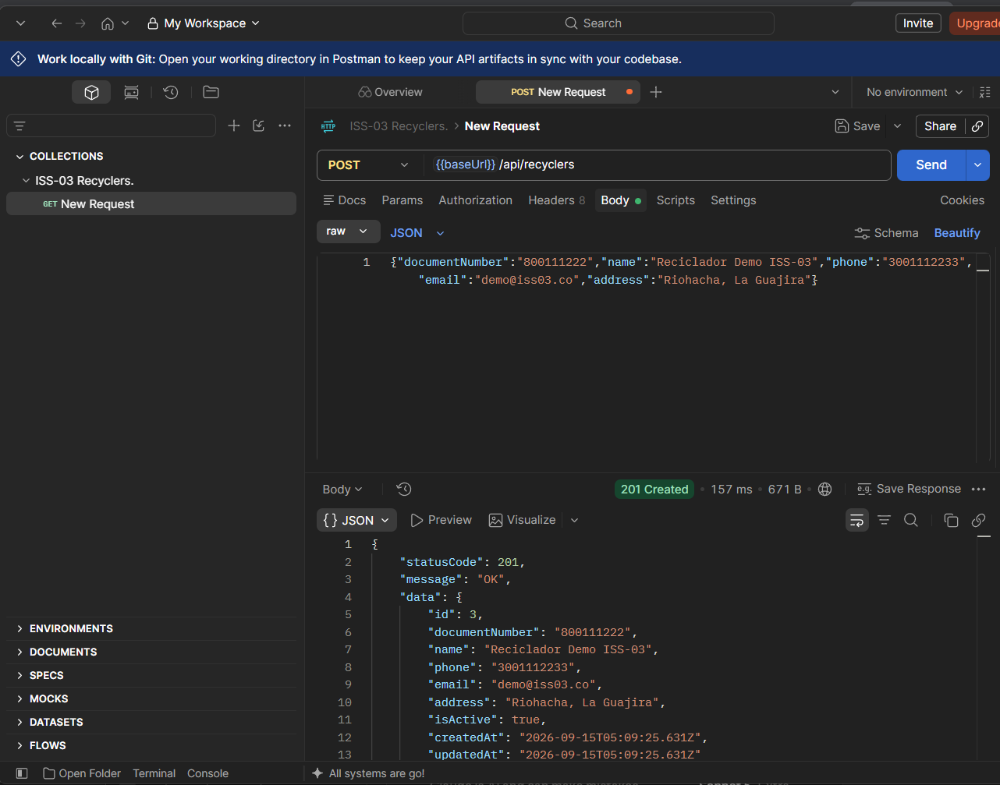
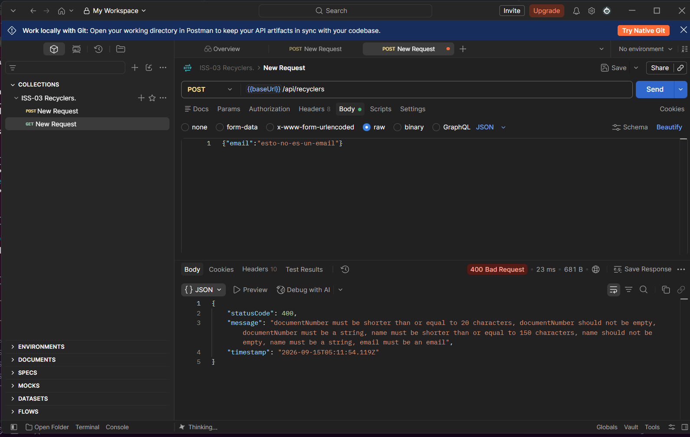
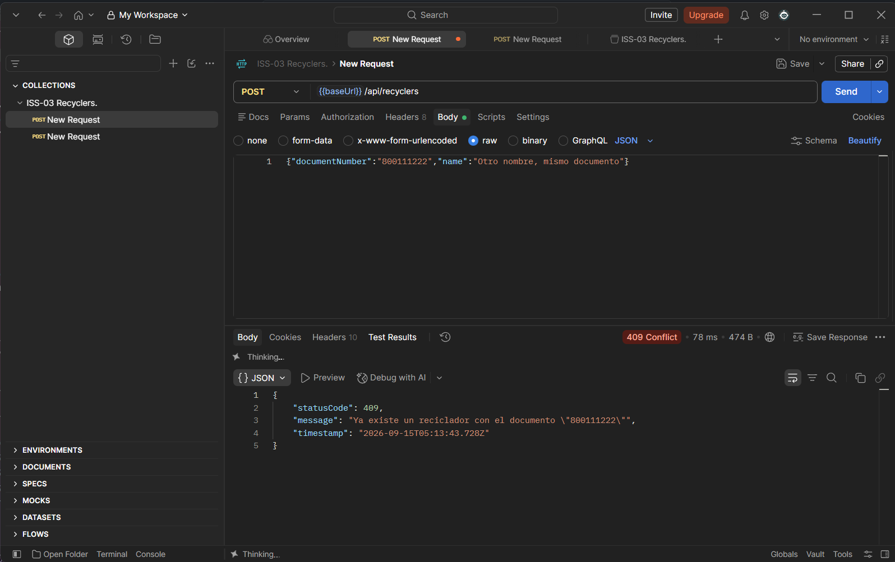
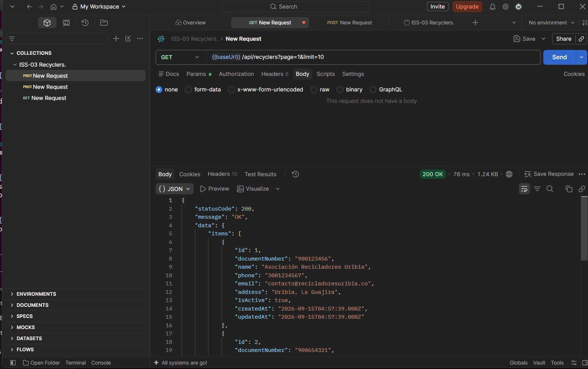
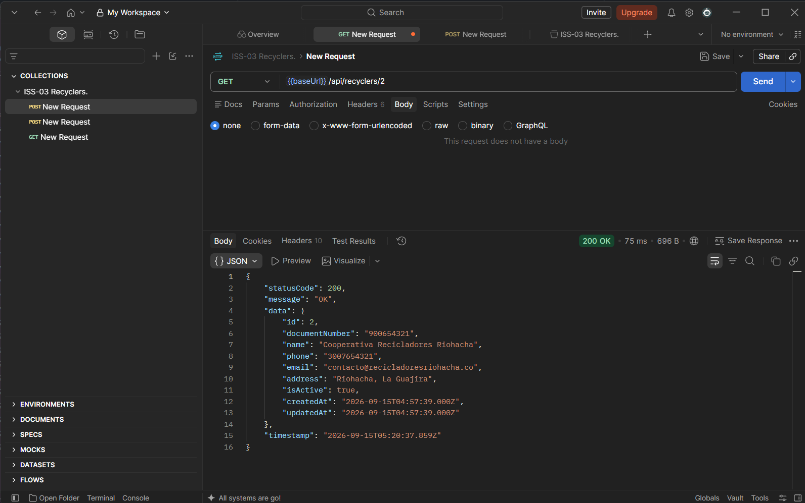
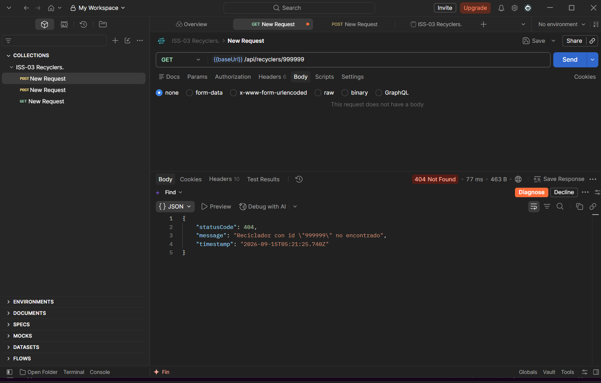
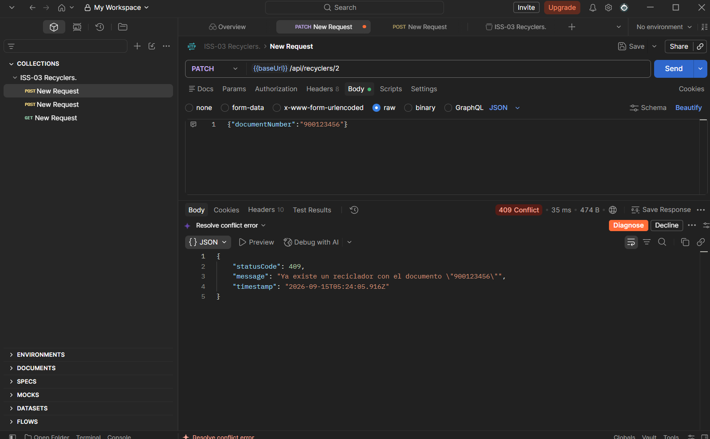
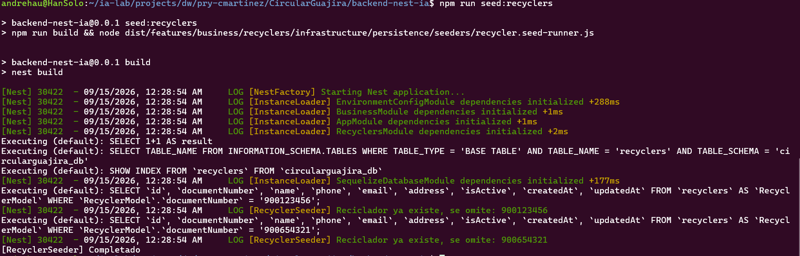

# ISS-03 — Feature `recyclers` (Recicladores — Maestro Base)

Issue #: Issue GitHub: backend-nest-ia #6

## 1. Objetivo / Especificación
Registrar y consultar los recicladores u organizaciones del sistema de abastecimiento de recolección.

- **Dominio:** entidad pura `RecyclerEntity` (`id`, `documentNumber`, `name`, `phone`, `email`, `address`, `isActive`, `createdAt`, `updatedAt`). Interfaz `IRecyclerRepository` (`create`, `findAll`, `findById`, `findByDocumentNumber`, `update`). Excepciones `RecyclerNotFoundException` (404) y `RecyclerAlreadyExistsException` (409).
- **Aplicación:** casos de uso `CreateRecyclerUseCase` (valida duplicidad de `documentNumber`), `FindAllRecyclersUseCase` (paginación `page`/`limit`), `FindRecyclerByIdUseCase` (lanza 404), `UpdateRecyclerUseCase`. DTOs `CreateRecyclerDto` (`documentNumber` y `name` requeridos; `phone`/`email`/`address` opcionales) y `UpdateRecyclerDto` (parcial + `isActive`), validados con `class-validator` y documentados con `@nestjs/swagger`.
- **Infraestructura:** `RecyclerModel` (tabla `recyclers`), `RecyclerRepository` (Sequelize), `RecyclerSeeder` idempotente por `documentNumber` (2 recicladores de prueba).

## 2. Criterios de aceptación (AC)
| # | Criterio |
|---|---|
| AC1 | `POST /api/recyclers` → `201` / `400` (DTO inválido) / `409` (`documentNumber` duplicado) |
| AC2 | `GET /api/recyclers` → `200`, lista paginada en `data.items` + `data.meta` (`page`, `limit`, `total`, `totalPages`) |
| AC3 | `GET /api/recyclers/:id` → `200` / `404` |
| AC4 | `documentNumber` es obligatorio y único a nivel de dominio |
| AC5 | `RecyclerSeeder` no duplica registros si ya existen (idempotente) |
| AC6 | `PATCH /api/recyclers/:id` → `200` / `404` / `409` (`documentNumber` duplicado al actualizar) |

> **Nota de ajuste:** el borrador inicial de AC4 decía "`document` opcional pero único cuando se proporciona". El detalle final de implementación (sección 3) lo definió como **obligatorio y único**, y agregó `PATCH` como cuarto endpoint del feature (AC6). Este archivo ya refleja lo realmente implementado para que la evidencia sea consistente con el comportamiento de la API.

## 3. IA usada
CLAUDE CODE // Sonnet 5

14/09/2026
Naturaleza: PRÁCTICO. Eres asistente SOLO de ISS-03, no del backend entero.

Implementa los Criterios de Aceptación de trazabilidad/ISS-03.md siguiendo estrictamente el contrato de arquitectura en docs/Prompt.md (Clean Architecture, pista Business para CircularGuajira).

Contexto del proyecto: El backend ya cuenta con el esqueleto funcional (ISS-01) e infraestructura de Sequelize con módulo Common (ISS-02). NO borres ni modifiques docs/ ni trazabilidad/.

Requerimientos de implementación para ISS-03 (Feature recyclers en src/features/business/recyclers/):

1. Capa 1 — Domain (src/features/business/recyclers/domain/): entities/recycler.entity.ts (clase pura sin decoradores de Sequelize ni imports de NestJS; campos id, documentNumber único, name, phone, email, address, isActive, createdAt, updatedAt); interfaces/recycler.repository.interface.ts (IRecyclerRepository: create, findAll, findById, findByDocumentNumber, update); exceptions/ (RecyclerNotFoundException, RecyclerAlreadyExistsException).

2. Capa 2 — Application (src/features/business/recyclers/application/): dto/ (CreateRecyclerDto y UpdateRecyclerDto con class-validator: @IsString, @IsNotEmpty, @IsEmail, @IsOptional); mappers/recycler.mapper.ts (mapeador bidireccional Entidad <-> DTOs/Modelos); use-cases/ con método execute(): CreateRecyclerUseCase (valida duplicidad de documentNumber), FindAllRecyclersUseCase (paginación básica), FindRecyclerByIdUseCase (404 si no existe), UpdateRecyclerUseCase.

3. Capa 3 — Infrastructure (src/features/business/recyclers/infrastructure/): persistence/models/recycler.model.ts (@Table({ tableName: 'recyclers' }), @Column); persistence/repositories/recycler.repository.ts (implementación concreta de IRecyclerRepository con Sequelize); persistence/seeders/recycler.seeder.ts (seeder idempotente con al menos 2 recicladores iniciales, ej. "Asociación Recicladores Uribia").

4. Capa 4 — Presentation (src/features/business/recyclers/presentation/): http/controllers/recyclers.controller.ts (prefijo /api/recyclers, @ApiTags('Recyclers'), @ApiOperation): POST /api/recyclers (201), GET /api/recyclers (200, paginado), GET /api/recyclers/:id (200), PATCH /api/recyclers/:id (200).

5. Registro de módulo: crear RecyclersModule exportando servicios y repositorios; registrarlo dentro de BusinessModule (src/features/business/business.module.ts).

Prohibiciones duras: PROHIBIDO incluir decoradores de Sequelize o NestJS dentro de domain/entities/. PROHIBIDO Auth, Users, JWT, Login, Guards o RBAC. PROHIBIDO usar sync({ force: true }) o alter: true.

**Ajustes hechos durante la ejecución (fuera del prompt original, necesarios para que compile/persista):**
- `@nestjs/swagger` no estaba instalado; se agregó como dependencia (requerido por `@ApiTags`/`@ApiOperation`/`@ApiProperty`).
- La fábrica Sequelize (`sequelize.factory.ts`, de ISS-02) construía `models: []` a propósito, dejando explícito que "cada feature los añade a su propio módulo", pero no existía el mecanismo para hacerlo. Se agregó `src/infrastructure/database/sequelize/sequelize-model.registry.ts`: un registro global al que cada `*.model.ts` se auto-registra al importarse; la fábrica ahora lee de ahí. Es genérico, sin lógica de `recyclers`, y lo reutilizarán ISS-04 a ISS-07 sin más cambios en `common`/`infrastructure`.
- El mapeo Modelo Sequelize ↔ Entidad de dominio se dejó dentro del repositorio de infraestructura (no en el mapper de `application/`) para no acoplar `infrastructure` a `application` (la flecha de dependencia del diagrama de `docs/Prompt.md` sección 2 va de `infrastructure` hacia `domain`, no hacia `application`). El mapper de aplicación mapea Entidad ↔ DTOs de presentación.
- Se agregó `npm run seed:recyclers` (compila y ejecuta `recycler.seed-runner.ts` con `NestFactory.createApplicationContext`) para poder demostrar la idempotencia de AC5 sin depender del orquestador global de seeders, que es alcance de ISS-07.

## 4. Evidencias (EVI)

Verificación ejecutada en caliente contra MySQL (`DB_DIALECT=mysql`, motor Docker ya provisionado, ver `../../motores/Instalacion Motores.md`), con la API arriba (`npm run start:dev`) y probada con una colección de Postman (`ISS-03 Recyclers.`), en vez de `curl`.

Antes de las pruebas manuales se corrió `npm run seed:recyclers` dos veces seguidas para sembrar los 2 recicladores base: `id 1` — `900123456` "Asociación Recicladores Uribia" — y `id 2` — `900654321` "Cooperativa Recicladores Riohacha". La segunda corrida es a la vez la evidencia de idempotencia del AC5 (EVI-8).

**EVI-1 (AC1 — `201 Created`):**
`POST {{baseUrl}}/api/recyclers` con un reciclador nuevo fuera de los sembrados (`documentNumber: "800111222"`, "Reciclador Demo ISS-03"). Respuesta `201` con el envelope `{ statusCode, message, data, timestamp }` y el reciclador creado con `id: 3`.

**EVI-2 (AC1 — `400 Bad Request`):**
Mismo endpoint con body inválido (`{"email":"esto-no-es-un-email"}`, sin `documentNumber` ni `name`). Respuesta `400` con los mensajes de `class-validator` listando los campos faltantes/incorrectos.

**EVI-3 (AC1/AC4 — `409 Conflict`, `documentNumber` duplicado):**
Repetir el `POST` con el mismo `documentNumber: "800111222"` del EVI-1. Respuesta `409`: `Ya existe un reciclador con el documento "800111222"`.

**EVI-4 (AC2 — listado paginado):**
`GET {{baseUrl}}/api/recyclers?page=1&limit=10`. Respuesta `200` con `data.items` (los recicladores sembrados más el creado en EVI-1) y `data.meta` (`page`, `limit`, `total`, `totalPages`).

**EVI-5 (AC3 — detalle `200`):**
`GET {{baseUrl}}/api/recyclers/2`. Respuesta `200` con el reciclador sembrado "Cooperativa Recicladores Riohacha" (`documentNumber: "900654321"`).

**EVI-6 (AC3 — detalle `404`):**
`GET {{baseUrl}}/api/recyclers/999999`. Respuesta `404`: `Reciclador con id "999999" no encontrado`.

**EVI-7 (AC6 — `PATCH` `200` y `409`):**
Sobre el reciclador `id 2`: primero `PATCH` con `{"phone":"3009998877","isActive":false}` → `200` con los campos actualizados.

Luego `PATCH` con `{"documentNumber":"900123456"}` (documento del reciclador `id 1`) → `409`: `Ya existe un reciclador con el documento "900123456"`.

**EVI-8 (AC5 — seeder idempotente):**
Salida de la segunda corrida de `npm run seed:recyclers`, mostrando `[RecyclerSeeder] Reciclador ya existe, se omite: 900123456` y `...900654321`, confirmando que no se duplicaron los registros sembrados.

Build y lint limpios: `npm run build` y `npm run lint` sin errores. Commit: `34f593f` (push a `origin/main`).

## 5. Revisión humana

15-09-2026
revisor: Carlos Martinez
revisión conforme: Se verificaron las 8 evidencias (EVI-1 a EVI-8) contra los 6 Criterios de Aceptación y todo está en orden, sin observaciones.

Creación, listado paginado, consulta por id, actualización parcial y control de duplicidad de `documentNumber` (`201`/`400`/`404`/`409`) confirmados mediante pruebas en vivo con Postman contra MySQL, y la idempotencia del `RecyclerSeeder` verificada con dos ejecuciones consecutivas del comando de siembra. Capturas de pantalla en `trazabilidad/images/`.

## 6. Gate
- **Estado:** APROBADO
- **Conclusión:** ISS-03 completado al 100%. Feature `recyclers` (alta, listado paginado, consulta por id y actualización parcial en Clean Architecture) verificado contra los 6 Criterios de Aceptación y aprobado por revisión humana.
- **Trazabilidad final:** Commit `34f593f` (Refs #6)
