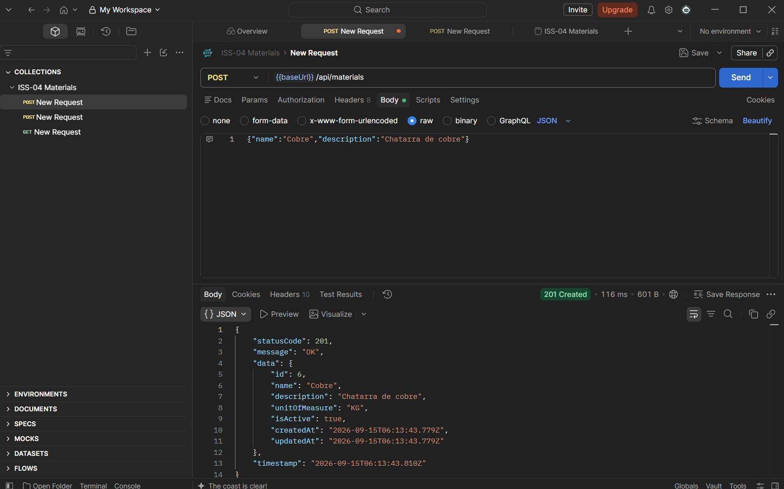
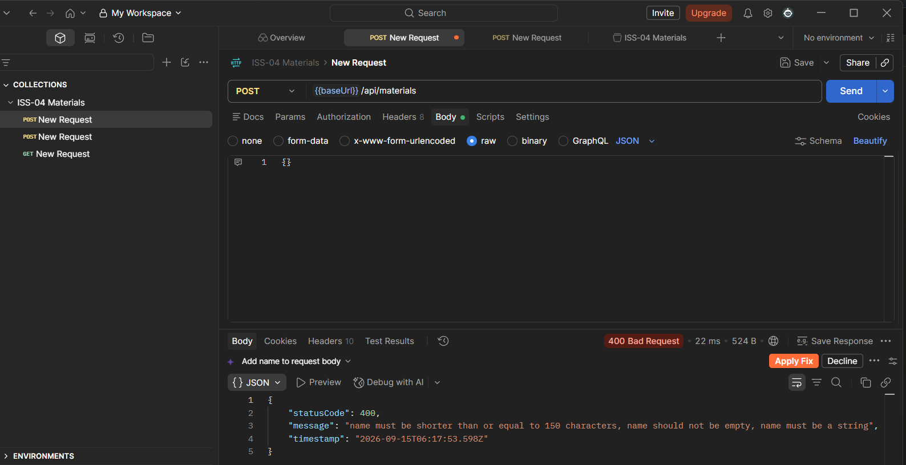
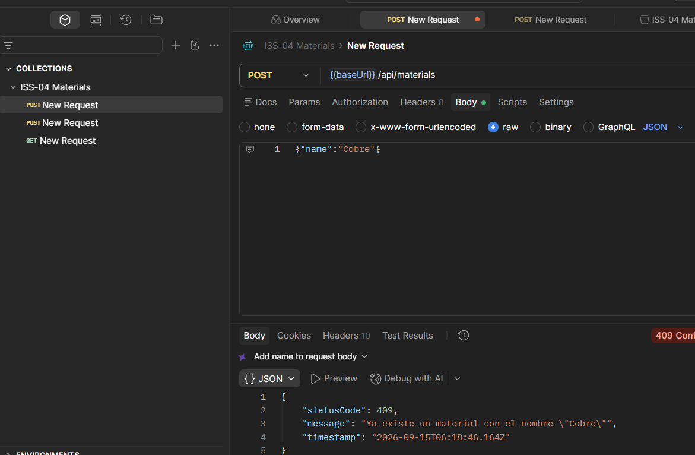
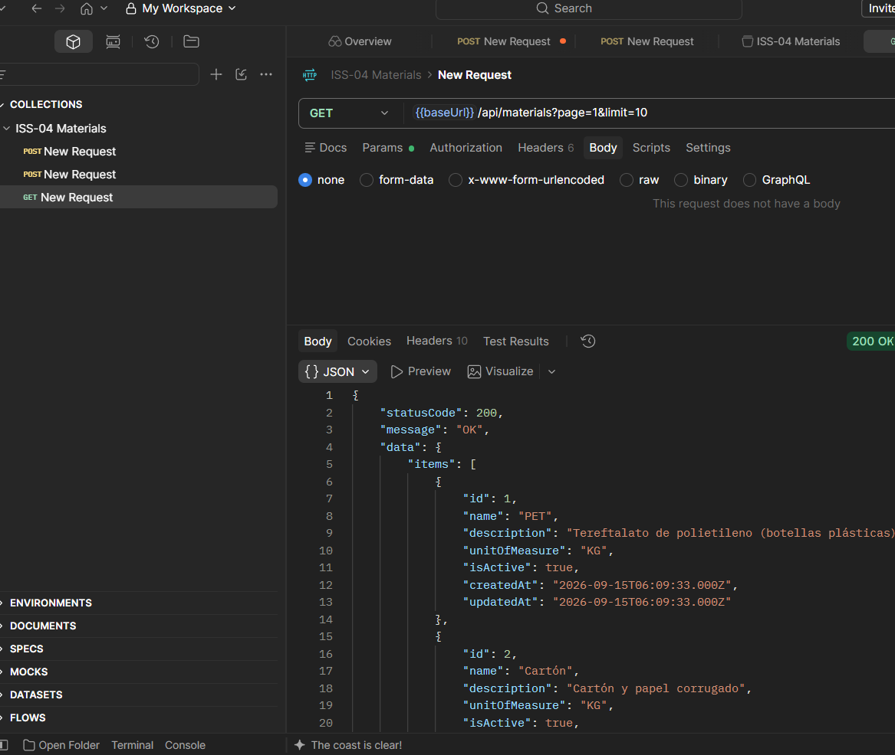
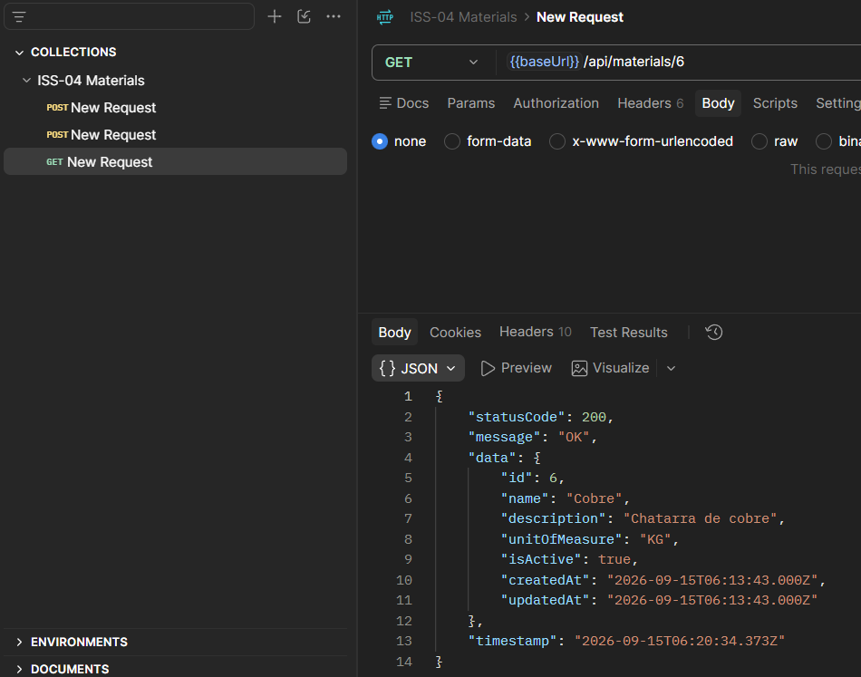
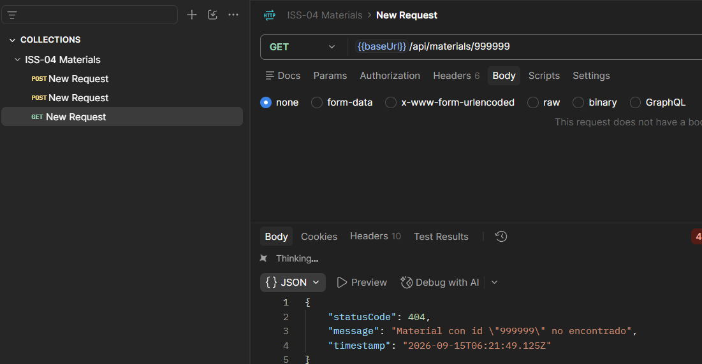
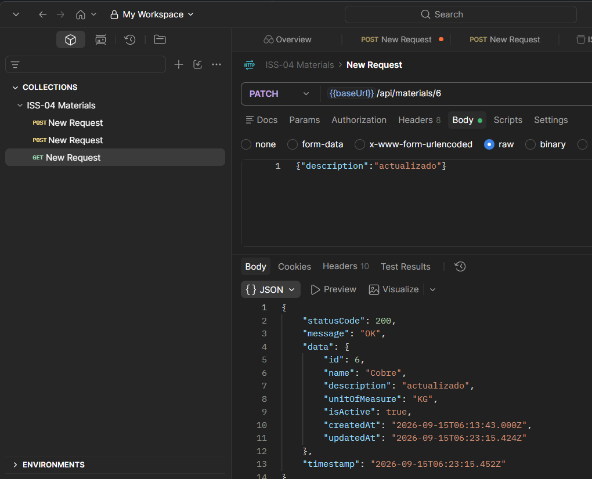
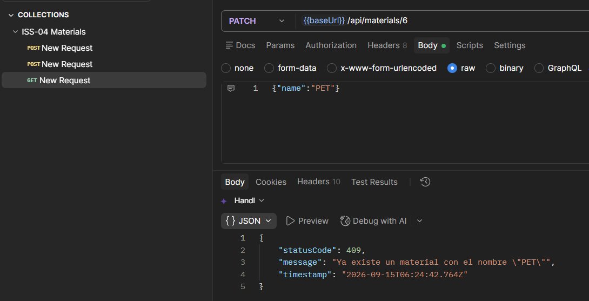
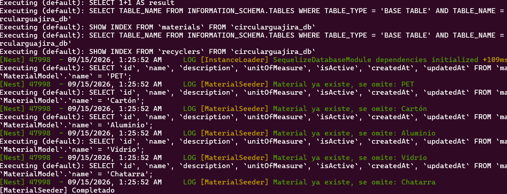

# ISS-04 — Feature `materials` (Clasificación de Materiales)

Issue #: Issue GitHub: backend-nest-ia #7

## 1. Objetivo / Especificación
Clasificar los tipos de material reciclable aceptados en planta (PET, Cartón, Aluminio, Vidrio, Chatarra, etc.). **Solo catálogo/clasificación — sin precio ni stock** (eso vive en ISS-05, `material-rates`).

- **Dominio:** entidad pura `MaterialEntity` (`id`, `name`, `description`, `unitOfMeasure`, `isActive`, `createdAt`, `updatedAt`). Interfaz `IMaterialRepository` (`create`, `findAll`, `findById`, `findByName`, `update`, `count`). Excepciones `MaterialNotFoundException` (404) y `MaterialAlreadyExistsException` (409).
- **Aplicación:** casos de uso `CreateMaterialUseCase` (valida duplicidad de `name`), `FindAllMaterialsUseCase` (paginación `page`/`limit`), `FindMaterialByIdUseCase` (lanza 404), `UpdateMaterialUseCase`. DTOs `CreateMaterialDto` (`name` requerido; `description`/`unitOfMeasure` opcionales, `unitOfMeasure` por defecto `"KG"`) y `UpdateMaterialDto` (parcial + `isActive`), validados con `class-validator` y documentados con `@nestjs/swagger`.
- **Infraestructura:** `MaterialModel` (tabla `materials`, `name` con índice único), `MaterialRepository` (Sequelize), `MaterialSeeder` idempotente por `name` (5 materiales base: PET, Cartón, Aluminio, Vidrio, Chatarra).

## 2. Criterios de aceptación (AC)
| # | Criterio |
|---|---|
| AC1 | `POST /api/materials` → `201` / `400` (DTO inválido) / `409` (`name` duplicado) |
| AC2 | `GET /api/materials` → `200`, lista paginada en `data.items` + `data.meta` (`page`, `limit`, `total`, `totalPages`) |
| AC3 | `GET /api/materials/:id` → `200` / `404` |
| AC4 | `name` es obligatorio y único a nivel de dominio |
| AC5 | `MaterialSeeder` no duplica registros si ya existen (idempotente) |
| AC6 | `PATCH /api/materials/:id` → `200` / `404` / `409` (`name` duplicado al actualizar) |
| AC7 | La entidad no expone ni almacena `pricePerKg` ni `stockKg` (alcance de ISS-05, `material-rates`) |

> **Nota de ajuste:** el borrador inicial de este archivo describía la entidad como `Material` con campos `code`/`status` y solo 3 endpoints (crear/listar/detalle). El prompt de ejecución (sección 3) la definió finalmente con `description`/`unitOfMeasure` (default `"KG"`)/`isActive`, agregó `PATCH` como cuarto endpoint (AC6) y un método `count()` en el repositorio. Este archivo ya refleja lo realmente implementado para que la evidencia sea consistente con el comportamiento de la API.

## 3. IA usada
CLAUDE CODE // Sonnet 5

15/09/2026
Naturaleza: PRÁCTICO. Eres asistente SOLO de ISS-04, no del backend entero.

Implementa los Criterios de Aceptación de trazabilidad/ISS-04.md siguiendo estrictamente el contrato de arquitectura en docs/Prompt.md (Clean Architecture, pista Business para CircularGuajira).

Contexto del proyecto: El backend ya cuenta con ISS-01 (esqueleto), ISS-02 (Sequelize y Common) e ISS-03 (recyclers). NO borres ni modifiques docs/ ni trazabilidad/.

Requerimientos de implementación para ISS-04 (Feature materials en src/features/business/materials/):

1. Capa 1 — Domain (src/features/business/materials/domain/): entities/material.entity.ts: Clase TypeScript PURA (sin Sequelize ni NestJS). Campos: id, name (requerido y único, ej: "PET", "Cartón"), description, unitOfMeasure (default: "KG"), isActive, createdAt, updatedAt. interfaces/material.repository.interface.ts: Interfaz IMaterialRepository (create, findAll, findById, findByName, update, count) y el token MATERIAL_REPOSITORY. exceptions/: MaterialNotFoundException (404) y MaterialAlreadyExistsException (409).

2. Capa 2 — Application (src/features/business/materials/application/): dto/: CreateMaterialDto (name requerido y no vacío, description opcional, unitOfMeasure opcional), UpdateMaterialDto y FindAllMaterialsQueryDto. mappers/material.mapper.ts: Mapeador bidireccional entre Entidad y DTOs/Modelos. use-cases/: CreateMaterialUseCase (valida duplicidad de name enviando 409 si ya existe), FindAllMaterialsUseCase (soporta paginación básica data.items / data.meta), FindMaterialByIdUseCase (lanza 404 si no existe), UpdateMaterialUseCase.

3. Capa 3 — Infrastructure (src/features/business/materials/infrastructure/): persistence/models/material.model.ts: Modelo Sequelize con @Table({ tableName: 'materials' }), name con índice único. Registrado en ModelRegistry / ALL_MODELS. persistence/repositories/material.repository.ts: Implementación concreta de IMaterialRepository usando Sequelize. persistence/seeders/material.seeder.ts: Seeder idempotente por name que inserte los materiales base: "PET", "Cartón", "Aluminio", "Vidrio", "Chatarra".

4. Capa 4 — Presentation (src/features/business/materials/presentation/): http/controllers/materials.controller.ts: Controlador NestJS en /api/materials con Swagger (@ApiTags('Materials'), @ApiOperation): POST /api/materials (201), GET /api/materials (200, paginado), GET /api/materials/:id (200 / 404), PATCH /api/materials/:id (200 / 404 / 409).

5. Registro de Módulo: Crear MaterialsModule exportando el repositorio y seeder. Registrar MaterialsModule en BusinessModule (src/features/business/business.module.ts).

Prohibiciones duras: PROHIBIDO incluir decoradores de Sequelize o NestJS dentro de domain/entities/. PROHIBIDO Auth, Users, JWT, Login, Guards o RBAC. PROHIBIDO usar sync({ force: true }) o alter: true. PROHIBIDO adelantar ISS-05 (material-rates / products).

**Ajustes hechos durante la ejecución (fuera del prompt original, necesarios para que compile/persista):**
- El registro de modelos ya existía desde ISS-03 como `src/infrastructure/database/sequelize/sequelize-model.registry.ts` (no `model-registry.ts` como sugería el prompt); `MaterialModel` se auto-registra ahí igual que `RecyclerModel`, sin tocar `common`/`infrastructure`.
- `count()` se implementó en `IMaterialRepository`/`MaterialRepository` tal como pide el prompt, aunque ningún caso de uso de este issue lo consume todavía; queda disponible para ISS-05/ISS-07.
- El valor por defecto de `unitOfMeasure` (`"KG"`) se resuelve en `MaterialMapper.toCreateData` (no a nivel de DTO), igual que el patrón de valores nulos opcionales usado en `RecyclerMapper` de ISS-03.
- Se agregó `npm run seed:materials` (mismo patrón que `seed:recyclers` de ISS-02/ISS-03) para poder demostrar la idempotencia de AC5 sin depender del orquestador global de seeders (alcance de ISS-07).
- Verificación funcional en caliente contra MySQL (`npm run start:prod` temporal): `POST` (201), `POST` duplicado (409), `GET` paginado (200), `GET` id inexistente (404) y `PATCH` (200) respondieron correctamente; `npm run seed:materials` ejecutado dos veces confirmó la idempotencia (segunda corrida = 5 "ya existe, se omite"). Build (`npm run build`) y lint (`npm run lint`) limpios. Esta verificación de humo no reemplaza las capturas formales de evidencia (sección 4), que quedan pendientes.

## 4. Evidencias (EVI)

Pruebas hechas con Postman contra la API local (`npm run start:dev`), colección `ISS-04 Materials`.

**EVI-1 (AC1 — `201 Created`):**
Método POST a `/api/materials` con un material nuevo llamado "Cobre". Da `201` y devuelve el material creado con `id 6`.

**EVI-2 (AC1 — `400 Bad Request`):**
Método POST a `/api/materials` enviando el body vacío (sin nombre). Da `400` porque falta el campo obligatorio `name`.

**EVI-3 (AC1/AC4 — `409 Conflict`):**
Método POST a `/api/materials` repitiendo el nombre "Cobre" que ya se había creado en EVI-1. Da `409` porque el nombre ya existe.

**EVI-4 (AC2 — listado paginado):**
Método GET a `/api/materials?page=1&limit=10`. Da `200` y devuelve la lista de materiales junto con la información de paginación.

**EVI-5 (AC3 y AC7 — detalle `200`):**
Método GET a `/api/materials/6`, el material creado en EVI-1. Da `200` y muestra el material completo; también sirve para confirmar que la respuesta no trae campos de precio ni stock.

**EVI-6 (AC3 — detalle `404`):**
Método GET a `/api/materials/999999`, un id que no existe. Da `404` con el mensaje de "no encontrado".

**EVI-7 (AC6 — `PATCH` `200`):**
Método PATCH a `/api/materials/6` cambiando solo la descripción. Da `200` y devuelve el material con el campo ya actualizado.

**EVI-7.1 (AC6 — `PATCH` `409`):**
Método PATCH a `/api/materials/6` intentando ponerle el nombre "PET", que ya es de otro material sembrado. Da `409` porque el nombre ya está en uso.

**EVI-8 (AC5 — seeder idempotente):**
Se corrió `npm run seed:materials` dos veces seguidas. La segunda vez el log muestra "ya existe, se omite" para los 5 materiales base (PET, Cartón, Aluminio, Vidrio, Chatarra), es decir que no se duplicaron.

Build y lint limpios: `npm run build` y `npm run lint` sin errores. Commit: `5bd8662` (push a `origin/main`).

## 5. Revisión humana

15-09-2026
revisor: Carlos Martinez
revisión conforme: Se ejecutaron todas las pruebas de las 7 evidencias (EVI-1 a EVI-8) y no hay observaciones, el issue se completó correctamente.

## 6. Gate
- **Estado:** APROBADO
- **Conclusión:** ISS-04 completado al 100%. Feature `materials` (alta, listado paginado, consulta por id y actualización parcial en Clean Architecture) verificado y aprobado por revisión humana.
- **Trazabilidad final:** Commit `5bd8662` (Refs #7)
