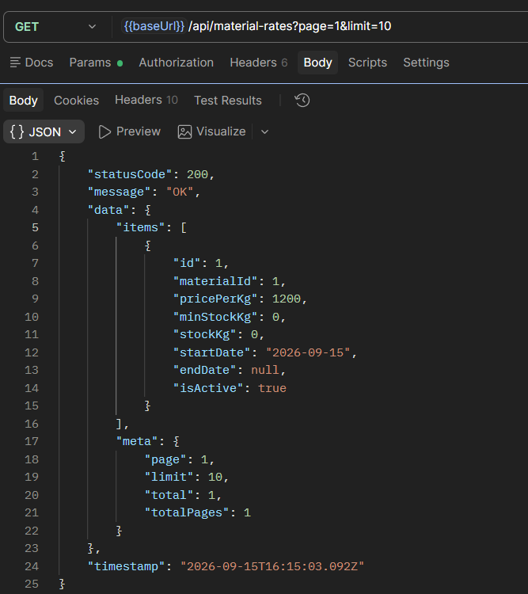
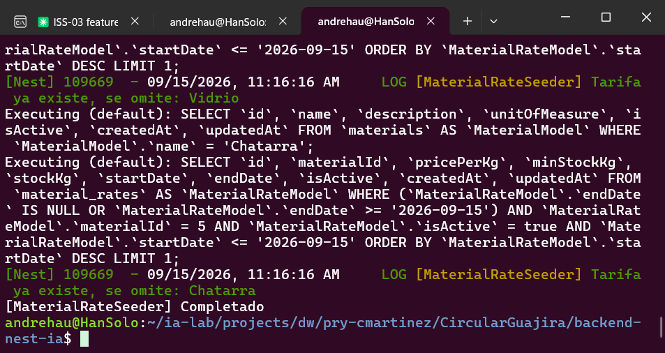

# ISS-05 — Feature `material-rates` (Tarifas y Control de Stock en Kg)

Issue #: Issue GitHub: backend-nest-ia #8

## 1. Objetivo / Especificación
Registrar la tarifa vigente por kilogramo de cada material reciclable (ISS-04) y el stock acumulado en planta, protegiendo las variaciones de inventario mediante una regla de dominio. Depende de `materials` (ISS-04).

- **Dominio:** entidad pura `MaterialRateEntity` (`id`, `materialId`, `pricePerKg`, `minStockKg`, `stockKg`, `startDate`, `endDate`, `isActive`) con el método `reduceStockKg(n)`, que lanza `InsufficientStockException` si `n < 0` o si dejaría `stockKg` en negativo. Interfaz `IMaterialRateRepository` (`create`, `findAll`, `findById`, `findActiveRateByMaterialAndDate`, `count`). Excepciones propias `MaterialRateNotFoundException` (404), `MaterialRateOverlapException` (409), `InsufficientStockException` (409) y `MaterialInactiveException` (409).
- **Aplicación:** `CreateMaterialRateUseCase` inyecta `MATERIAL_RATE_REPOSITORY` y `MATERIAL_REPOSITORY` (de `materials`): valida que `materialId` exista y esté activo, y que no haya ya una tarifa activa que se solape en fechas, antes de crear. DTOs `CreateMaterialRateDto` (`materialId` y `pricePerKg > 0` requeridos, `startDate` requerida; `minStockKg`/`stockKg`/`endDate` opcionales) y `UpdateMaterialRateDto` (reservado para una futura actualización; el controlador de este issue no expone `PATCH`). Los valores por defecto (`minStockKg: 0`, `stockKg: 0`, `isActive: true`) se resuelven en `MaterialRateMapper`, no en el DTO.
- **Infraestructura:** `MaterialRateModel` (tabla `material_rates`, `@ForeignKey(() => MaterialModel)` + `@BelongsTo`, `startDate`/`endDate` como `DATEONLY`), `MaterialRateRepository` (Sequelize), `MaterialRateSeeder` (siembra tarifas base para los 5 materiales de ISS-04: PET $1200/kg, Cartón $800/kg, Aluminio $3500/kg, Vidrio $400/kg, Chatarra $1000/kg; idempotente verificando por material si ya hay una tarifa activa vigente).

## 2. Criterios de aceptación (AC)
| # | Criterio |
|---|---|
| AC1 | `POST /api/material-rates` → `201` / `400` (DTO inválido) / `404` (`materialId` inexistente) / `409` (material inactivo o tarifa activa solapada) |
| AC2 | `GET /api/material-rates` → `200`, lista paginada en `data.items` + `data.meta` (`page`, `limit`, `total`, `totalPages`) |
| AC3 | `GET /api/material-rates/vigente/:materialId` → `200` con la tarifa activa a la fecha actual / `404` si no hay ninguna |
| AC4 | `GET /api/material-rates/:id` → `200` / `404` |
| AC5 | `pricePerKg` debe ser mayor a 0 (validación de DTO) |
| AC6 | `reduceStockKg(n)` lanza `InsufficientStockException` si `n < 0` o si el stock resultante sería negativo (invariante de dominio, sin endpoint propio en este issue) |
| AC7 | `MaterialRateSeeder` no duplica tarifas si ya existe una activa vigente para el material (idempotente) |

> **Historial del issue:** este archivo describió originalmente `material-rates` (versión actual). Durante la ejecución del proyecto se implementó por error una feature distinta (`products`, catálogo de inventario retail) en su lugar, documentada así en una versión anterior de este mismo archivo. Una auditoría posterior detectó la desviación de dominio (no correspondía a la narrativa de CircularGuajira ni al issue #8 real en GitHub) y se revirtió: `products/` fue eliminado y reemplazado por esta implementación de `material-rates`, alineada con el plan original. `sales/` (ISS-06, que dependía de `products/`) también se retiró en el mismo commit; ISS-06 se rehará como `settlements` en un issue aparte.

## 3. IA usada
CLAUDE CODE // Sonnet 5

15/09/2026
Naturaleza: PRÁCTICO. Eres asistente SOLO de ISS-05 (material-rates), no del backend entero.

Implementa los Criterios de Aceptación de trazabilidad/ISS-05.md siguiendo estrictamente el contrato de arquitectura en docs/Prompt.md (Clean Architecture, pista Business para el dominio de CircularGuajira).

Contexto del proyecto y limpieza de desviaciones: El proyecto ya tiene ISS-01 (esqueleto), ISS-02 (Sequelize y Common), ISS-03 (recyclers) e ISS-04 (materials). Elimina o desregistra por completo la carpeta `src/features/business/products/` para reemplazarla por `material-rates`. El registro dinámico de modelos de Sequelize se ubica en `src/infrastructure/database/sequelize/sequelize-model.registry.ts` (`MaterialRateModel` debe auto-registrarse en este archivo). La feature `materials` (ISS-04) expone `IMaterialRepository` y su token `MATERIAL_REPOSITORY` en `src/features/business/materials/domain/interfaces/material.repository.interface.ts`. NO borres ni modifiques docs/ ni trazabilidad/.

Requerimientos de implementación para ISS-05 (Feature material-rates en src/features/business/material-rates/):

1. Capa 1 — Domain (src/features/business/material-rates/domain/): entities/material-rate.entity.ts: Clase PURA. Campos: id, materialId (FK), pricePerKg (número > 0), minStockKg (número >= 0), stockKg (número >= 0), startDate (Date), endDate (Date | null), isActive (boolean). INVARIANTE DE DOMINIO: Incluye `reduceStockKg(n: number)` que lanza `InsufficientStockException` (409) si `stockKg - n < 0`. interfaces/material-rate.repository.interface.ts: Interfaz `IMaterialRateRepository` (create, findAll, findById, findActiveRateByMaterialAndDate, count) y token `MATERIAL_RATE_REPOSITORY`. exceptions/: `MaterialRateNotFoundException` (404), `MaterialRateOverlapException` (409), `InsufficientStockException` (409).

2. Capa 2 — Application (src/features/business/material-rates/application/): dto/: CreateMaterialRateDto (materialId, pricePerKg, minStockKg?, stockKg?, startDate, endDate?), UpdateMaterialRateDto, FindAllMaterialRatesQueryDto. mappers/material-rate.mapper.ts: Mapeador bidireccional (asigna valores por defecto en toCreateData/toEntity: minStockKg=0, stockKg=0, isActive=true). use-cases/: CreateMaterialRateUseCase (consulta si el material existe y está activo vía MATERIAL_REPOSITORY —404/409—, valida que no exista tarifa activa solapada —409—), GetActiveMaterialRateUseCase (retorna la tarifa vigente para un material en una fecha dada), FindAllMaterialRatesUseCase (paginado) y FindMaterialRateByIdUseCase.

3. Capa 3 — Infrastructure (src/features/business/material-rates/infrastructure/): persistence/models/material-rate.model.ts: Modelo `@Table({ tableName: 'material_rates' })` con FK a MaterialModel; auto-registrado en sequelize-model.registry.ts. persistence/repositories/material-rate.repository.ts: implementación concreta de IMaterialRateRepository. persistence/seeders/material-rate.seeder.ts: seeder idempotente que asigna tarifas base a los materiales de ISS-04 (PET: $1200/kg, Cartón: $800/kg, Aluminio: $3500/kg, Vidrio: $400/kg, Chatarra: $1000/kg). persistence/seeders/material-rate.seed-runner.ts: script ejecutable individual.

4. Capa 4 — Presentation (src/features/business/material-rates/presentation/): http/controllers/material-rates.controller.ts: Controlador NestJS en /api/material-rates con Swagger: POST /api/material-rates (201), GET /api/material-rates (200, paginado), GET /api/material-rates/vigente/:materialId (200 / 404), GET /api/material-rates/:id (200 / 404).

5. Registros y Configuración: Crear MaterialRatesModule importando MaterialsModule. Registrar MaterialRatesModule en BusinessModule y retirar ProductsModule. Reemplazar en package.json el script seed:products por "seed:material-rates": "node dist/features/business/material-rates/infrastructure/persistence/seeders/material-rate.seed-runner.js".

Prohibiciones duras: PROHIBIDO Auth, Users, JWT, Login, Guards o RBAC. PROHIBIDO usar sync({ force: true }) o alter: true.

**Ajustes hechos durante la ejecución (fuera del prompt original, necesarios para que compile/persista):**
- `sales/` (ISS-06) dependía directamente de `products/` en 3 archivos (`sales.module.ts`, `product-sale.model.ts`, `sale.repository.ts`). Borrar `products/` sin retirar `sales/` habría dejado el build roto; se confirmó con el usuario y se retiró `sales/` en el mismo commit. ISS-06 queda pendiente de rehacerse como `settlements`.
- `MaterialInactiveException` (409, "material inactivo") no estaba en la lista explícita de excepciones de dominio del prompt (solo `MaterialRateNotFoundException`, `MaterialRateOverlapException`, `InsufficientStockException`), pero el propio texto del caso de uso sí pide "409 si está inactivo"; se agregó como excepción propia de `material-rates` (no se pudo reutilizar la de `products` porque esa carpeta se eliminó).
- La validación de solapamiento de tarifas no usa un método dedicado (la interfaz no lo pide): se reutiliza `findActiveRateByMaterialAndDate(materialId, startDate)` — si ya hay una tarifa activa vigente en la fecha de inicio de la nueva, se considera solapada.
- **Bug de zona horaria corregido durante la verificación:** `startDate`/`endDate` se manejaban como `Date`, y al guardarse en una columna `DATEONLY` con el servidor en UTC-5, la fecha se guardaba un día antes de la enviada (`"2026-09-15"` se guardaba como `"2026-09-14"`). Se corrigió modelando `startDate`/`endDate` como `string` ISO (`YYYY-MM-DD`) de punta a punta (entidad, DTO de respuesta, modelo Sequelize), sin pasar por `new Date()` en el mapper; en el repositorio, la fecha de consulta (`Date`) se normaliza con `date.toISOString().slice(0, 10)` antes de comparar contra la columna.
- `UpdateMaterialRateDto` se creó tal como lo pide el prompt, pero no hay `UpdateMaterialRateUseCase` ni método `update` en `IMaterialRateRepository` (ninguno de los dos está en la lista de la sección 2/1 del prompt), y el controlador no expone `PATCH`: el DTO queda reservado para un futuro issue.
- Verificación funcional en caliente contra MySQL (`node dist/main.js` temporal): `POST` con material activo (201), `POST` solapado (409), `POST` con `materialId` inexistente (404), `POST` con material inactivo (409), `GET vigente/:materialId` (200 y 404), `GET /:id` (200 y 404) y `GET` paginado (200) respondieron correctamente; `npm run seed:material-rates` ejecutado dos veces confirmó la idempotencia. Build (`npm run build`) y lint (`npm run lint`) limpios. Esta verificación de humo no reemplaza las capturas formales de evidencia (sección 4), que quedan pendientes.

## 4. Evidencias (EVI)

Estas evidencias corresponden a la **segunda implementación** de este issue. La primera vez se construyó por error una feature `products` (catálogo de inventario tipo tienda) en vez de `material-rates`; una auditoría posterior detectó que eso no correspondía a la narrativa de CircularGuajira (comprar material a recicladores, pesarlo, aplicar tarifa, generar liquidación) ni al issue #8 real de GitHub, así que se eliminó `products/` y se reconstruyó como `material-rates`. Las capturas anteriores (`products`) se borraron de `trazabilidad/images/` por quedar obsoletas.

Durante esta segunda vuelta también apareció y se corrigió un bug real: `startDate` se estaba guardando un día antes del enviado, por un choque entre la zona horaria del servidor (UTC-5) y la columna `DATEONLY`. Las capturas de abajo (especialmente EVI-1) ya reflejan la fecha corregida.

Pruebas hechas con Postman contra la API local (`npm run start:dev`), con la tabla `material_rates` vaciada antes de empezar para que EVI-1 saliera limpio.

**EVI-1 (AC1 — `201 Created`):**
Método POST a `/api/material-rates` para el material `PET` (`materialId 1`), tarifa `1200` desde `"2026-09-15"`. Da `201` y devuelve la tarifa creada con `id 1` y `startDate: "2026-09-15"` — la fecha correcta, ya sin el desfase de día del bug de zona horaria.

**EVI-2 (AC1 — `409 Conflict`, tarifa solapada):**
Método POST a `/api/material-rates` repitiendo `materialId: 1` con otra fecha dentro del mismo rango. Da `409` porque ya existe una tarifa activa para ese material que se solapa.

**EVI-3 (AC1 — `404 Not Found`):**
Método POST a `/api/material-rates` con `materialId: 999999`, que no existe. Da `404` porque no encuentra ese material.

**EVI-4 (AC1 — `409 Conflict`, material inactivo):**
Se desactivó primero el material "Cobre" (`id 6`), y luego se intentó crear una tarifa para él. Da `409` porque el material está inactivo.

**EVI-5 (AC1/AC5 — `400 Bad Request`):**
Método POST a `/api/material-rates` enviando solo `{"pricePerKg":-100}`. Da `400` porque faltan `materialId`/`startDate` y porque `pricePerKg` tiene que ser un número positivo.

**EVI-6 (AC3 — tarifa vigente `200`):**
Método GET a `/api/material-rates/vigente/1`. Da `200` y devuelve la tarifa creada en EVI-1, la que está vigente hoy para ese material.

**EVI-7 (AC3 — tarifa vigente `404`):**
Método GET a `/api/material-rates/vigente/2` (Cartón), que todavía no tiene ninguna tarifa creada. Da `404`.

**EVI-8 (AC4 — detalle `200`):**
Método GET a `/api/material-rates/1`, la tarifa de EVI-1. Da `200` con el detalle completo.

**EVI-9 (AC4 — detalle `404`):**
Método GET a `/api/material-rates/999999`, un id que no existe. Da `404` con el mensaje de "no encontrada".

**EVI-10 (AC2 — listado paginado):**
Método GET a `/api/material-rates?page=1&limit=10`. Da `200` y devuelve la lista de tarifas junto con la información de paginación.

**EVI-11 (AC7 — seeder idempotente):**
Se corrió `npm run seed:material-rates` dos veces seguidas. La segunda vez el log muestra "Tarifa ya existe, se omite" para los 5 materiales (incluido PET, por la tarifa de EVI-1), es decir que no se duplicó ninguna.

**Nota sobre AC6:** `reduceStockKg(n)` es una regla de dominio sin endpoint propio en este issue (la usará ISS-06/`settlements` al registrar liquidaciones con pesaje), por lo que no tiene una evidencia de API asociada aquí.

Build y lint limpios: `npm run build` y `npm run lint` sin errores. Commit: `971d5eb` (push a `origin/main`).

## 5. Revisión humana

15-09-2026
revisor: Carlos Martinez
revisión conforme: Se ejecutaron todas las pruebas de las 11 evidencias (EVI-1 a EVI-11) y no hay observaciones, el issue se completó correctamente.

Con énfasis en lo sucedido: este issue se implementó dos veces. La primera vuelta construyó `products` (inventario tipo tienda), una feature que no correspondía al negocio de CircularGuajira ni al issue #8 real de GitHub; una auditoría de código lo detectó a tiempo, antes de avanzar más sobre esa base equivocada. Se corrigió eliminando `products/` (y `sales/`, que dependía de él) y reconstruyendo `material-rates` según el plan original. En el camino se encontró y se corrigió además un bug de zona horaria real en el manejo de `startDate`/`endDate`. Las 11 evidencias de esta segunda vuelta confirman que la implementación final sí corresponde al dominio correcto y funciona sin errores.

## 6. Gate
- **Estado:** APROBADO
- **Conclusión:** ISS-05 completado al 100% en su segunda implementación. Feature `material-rates` (alta con validación de material y solapamiento, consulta de tarifa vigente, listado paginado, consulta por id, en Clean Architecture) verificado y aprobado por revisión humana, tras corregir la desviación de dominio detectada en la primera vuelta (`products`).
- **Trazabilidad final:** Commit `971d5eb` (Refs #8)
