# ISS-05 — Feature `products` (Productos e Inventario)

Issue #: Issue GitHub: backend-nest-ia #8

## 1. Objetivo / Especificación
Registrar los productos terminados elaborados a partir de un material reciclable, con su precio, stock mínimo y cantidad en inventario, protegiendo las variaciones de stock mediante una regla de dominio. Depende de `materials` (ISS-04).

- **Dominio:** entidad pura `ProductEntity` (`id`, `name`, `brand`, `price`, `minStock`, `quantity`, `materialId`, `isActive`, `createdAt`, `updatedAt`) con el método `reduceStock(n)`, que lanza `InsufficientStockException` si `n < 0` o si dejaría la cantidad en negativo. Interfaz `IProductRepository` (`create`, `findAll`, `findById`, `update`, `count`). Excepciones propias `ProductNotFoundException` (404), `InsufficientStockException` (409) y `MaterialInactiveException` (409); reutiliza `MaterialNotFoundException` (404) ya definida en `materials` (ISS-04).
- **Aplicación:** `CreateProductUseCase` inyecta tanto `PRODUCT_REPOSITORY` como `MATERIAL_REPOSITORY` (de `materials`): valida que `materialId` exista y esté activo antes de crear. DTOs `CreateProductDto` (`name` y `price > 0` requeridos, `materialId` requerido; `brand`/`minStock`/`quantity` opcionales) y `UpdateProductDto` (parcial + `isActive`). Los valores por defecto (`minStock: 0`, `quantity: 0`, `isActive: true`) se resuelven en `ProductMapper`, no en el DTO, igual que `RecyclerMapper`/`MaterialMapper`.
- **Infraestructura:** `ProductModel` (tabla `products`, `@ForeignKey(() => MaterialModel)` + `@BelongsTo`), `ProductRepository` (Sequelize), `ProductSeeder` (siembra 1 producto demo "Lote PET Transparente" asociado al material `PET` de ISS-04; idempotente por `count()`, ya que `products` no tiene un campo único de negocio).

## 2. Criterios de aceptación (AC)
| # | Criterio |
|---|---|
| AC1 | `POST /api/products` → `201` / `400` (DTO inválido) / `404` (`materialId` inexistente) / `409` (material inactivo) |
| AC2 | `GET /api/products` → `200`, lista paginada en `data.items` + `data.meta` (`page`, `limit`, `total`, `totalPages`) |
| AC3 | `GET /api/products/:id` → `200` / `404` |
| AC4 | `price` debe ser mayor a 0 (validación de DTO) |
| AC5 | `reduceStock(n)` lanza `InsufficientStockException` si `n < 0` o si el inventario resultante sería negativo (invariante de dominio, sin endpoint propio en este issue) |
| AC6 | `ProductSeeder` no duplica el producto demo si ya existen productos (idempotente por `count()`) |
| AC7 | `PATCH /api/products/:id` → `200` / `404` (producto o material nuevo inexistente) / `409` (material nuevo inactivo) |

> **Nota de ajuste:** el borrador inicial de este archivo describía una feature `material-rates` (entidad `MaterialRate` con `pricePerKg`/`stockKg`, endpoint `/api/material-rates`). El prompt de ejecución (sección 3) reemplazó ese enfoque por una feature `products` (`/api/products`) con `price`/`quantity`/`minStock` y relación a `materials` vía `materialId`. Este archivo ya refleja lo realmente implementado para que la evidencia sea consistente con el comportamiento de la API.

## 3. IA usada
CLAUDE CODE // Sonnet 5

15/09/2026
Naturaleza: PRÁCTICO. Eres asistente SOLO de ISS-05, no del backend entero.

Implementa los Criterios de Aceptación de trazabilidad/ISS-05.md siguiendo estrictamente el contrato de arquitectura en docs/Prompt.md (Clean Architecture, pista Business para CircularGuajira).

Contexto del proyecto y convenciones establecidas: El proyecto ya tiene ISS-01 (esqueleto), ISS-02 (Sequelize y Common), ISS-03 (recyclers) e ISS-04 (materials). El registro dinámico de modelos de Sequelize se ubica en `src/infrastructure/database/sequelize/sequelize-model.registry.ts` (`ProductModel` debe auto-registrarse en este archivo importándolo e incluyéndolo en la lista de modelos). La feature `materials` (ISS-04) expone `IMaterialRepository` y su token `MATERIAL_REPOSITORY` en `src/features/business/materials/domain/interfaces/material.repository.interface.ts`. NO borres ni modifiques docs/ ni trazabilidad/.

Requerimientos de implementación para ISS-05 (Feature products en src/features/business/products/):

1. Capa 1 — Domain (src/features/business/products/domain/): entities/product.entity.ts: Clase TypeScript PURA (sin Sequelize ni NestJS). Campos: id, name, brand, price, minStock, quantity, materialId (FK al material), isActive, createdAt, updatedAt. INVARIANTE DE DOMINIO: Incluye el método `reduceStock(n: number): void` que lanza `InsufficientStockException` si `n < 0` o si `this.quantity - n < 0`. interfaces/product.repository.interface.ts: Interfaz `IProductRepository` (métodos: create, findAll, findById, update, count) y token `PRODUCT_REPOSITORY`. exceptions/: `ProductNotFoundException` (404), `InsufficientStockException` (409 - BusinessRuleException), `MaterialInactiveException` (409 - BusinessRuleException).

2. Capa 2 — Application (src/features/business/products/application/): dto/: CreateProductDto (name string no vacío, brand opcional, price número > 0, minStock int >= 0 opcional, quantity int >= 0 opcional, materialId int requerido), UpdateProductDto, FindAllProductsQueryDto. mappers/product.mapper.ts: Mapeador bidireccional; los valores por defecto (minStock 0, quantity 0, isActive true) se resuelven en el mapper (toEntity/toCreateData), no a nivel de DTO, manteniendo consistencia con RecyclerMapper y MaterialMapper. use-cases/: CreateProductUseCase (inyecta PRODUCT_REPOSITORY y MATERIAL_REPOSITORY, valida materialId con 404/409), FindAllProductsUseCase (paginado), FindProductByIdUseCase (404 si no existe), UpdateProductUseCase.

3. Capa 3 — Infrastructure (src/features/business/products/infrastructure/): persistence/models/product.model.ts: Modelo Sequelize `@Table({ tableName: 'products' })` con `@ForeignKey(() => MaterialModel)` en materialId y relación `@BelongsTo(() => MaterialModel)`; auto-registrado en sequelize-model.registry.ts. persistence/repositories/product.repository.ts: implementación concreta de IProductRepository con Sequelize. persistence/seeders/product.seeder.ts: seeder idempotente que consulta IMaterialRepository para asociar al menos 1 producto demo (ej. "Lote PET Transparente", price: 1500, quantity: 100, minStock: 10) a un material activo de ISS-04. persistence/seeders/product.seed-runner.ts: script ejecutable para el seeder individual.

4. Capa 4 — Presentation (src/features/business/products/presentation/): http/controllers/products.controller.ts: Controlador NestJS en /api/products con Swagger (@ApiTags('Products'), @ApiOperation): POST /api/products (201), GET /api/products (200, paginado), GET /api/products/:id (200 / 404), PATCH /api/products/:id (200 / 404 / 409).

5. Registros y Configuración: Crear ProductsModule importando MaterialsModule (para tener acceso a MATERIAL_REPOSITORY). Registrar ProductsModule en BusinessModule. Agregar en package.json el script explícito "seed:products": "node dist/features/business/products/infrastructure/persistence/seeders/product.seed-runner.js" para verificar la idempotencia en desarrollo.

Prohibiciones duras: PROHIBIDO incluir decoradores de Sequelize o NestJS dentro de domain/entities/. PROHIBIDO Auth, Users, JWT, Login, Guards o RBAC. PROHIBIDO usar sync({ force: true }) o alter: true. PROHIBIDO adelantar ISS-06 (sales / transacciones).

**Ajustes hechos durante la ejecución (fuera del prompt original, necesarios para que compile/persista):**
- `MaterialNotFoundException` para el caso "materialId no existe" (404) se reutilizó tal cual desde `materials/domain/exceptions/` (ISS-04) en lugar de redefinirla en `products`, siguiendo el principio de una sola fuente de verdad para ese error; `products` solo define sus propias tres excepciones (`ProductNotFoundException`, `InsufficientStockException`, `MaterialInactiveException`).
- El script `seed:products` se agregó tal como lo pidió el prompt, sin el prefijo `npm run build &&` que sí tienen `seed:recyclers`/`seed:materials`: hay que compilar (`npm run build`) antes de correrlo la primera vez o tras cambios de código.
- `UpdateProductUseCase` valida `materialId` (404/409) también en el `PATCH` cuando el producto cambia de material, reutilizando la misma lógica del `CreateProductUseCase`, para que AC7 sea consistente con AC1.
- El seeder usa `count()` (no un campo único de negocio) para decidir si ya existe algo que sembrar, porque `products` no tiene una restricción de unicidad como `documentNumber` (recyclers) o `name` (materials); si no encuentra el material `"PET"` activo, se omite con una advertencia en el log en vez de fallar.
- Verificación funcional en caliente contra MySQL (`node dist/main.js` temporal): `POST` con material activo (201), `POST` con `materialId` inexistente (404), `POST`/`PATCH` con material inactivo (409), `GET` paginado (200), `GET` id inexistente (404) y `PATCH` (200) respondieron correctamente; `npm run seed:products` ejecutado dos veces confirmó la idempotencia (segunda corrida: "ya existen productos, se omite"). Build (`npm run build`) y lint (`npm run lint`) limpios. Esta verificación de humo no reemplaza las capturas formales de evidencia (sección 4), que quedan pendientes.

## 4. Evidencias (EVI)

Pruebas hechas con Postman contra la API local (`npm run start:dev`), colección `ISS-04 Products` (el producto demo del seeder ya existía como `id 1`, por eso los productos de prueba salen con `id 2` en adelante).

**EVI-1 (AC1 — `201 Created`):**
Método POST a `/api/products` con un producto nuevo asociado al material `PET` (`materialId 1`). Da `201` y devuelve el producto creado con `id 2`.
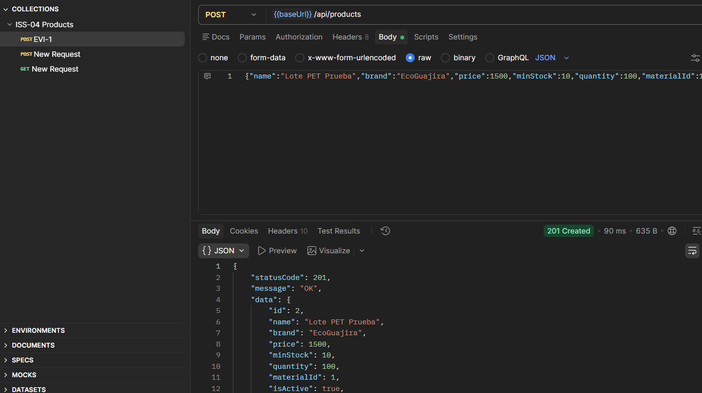

**EVI-2 (AC1/AC4 — `400 Bad Request`):**
Método POST a `/api/products` enviando solo `{"price":-10}`. Da `400` porque faltan `name` y `materialId`, y porque `price` tiene que ser un número positivo.
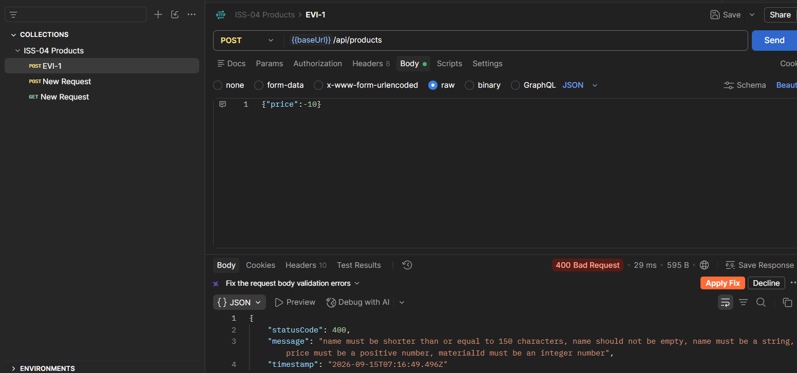

**EVI-3 (AC1 — `404 Not Found`):**
Método POST a `/api/products` con `materialId: 999999`, que no existe. Da `404` porque no encuentra ese material.
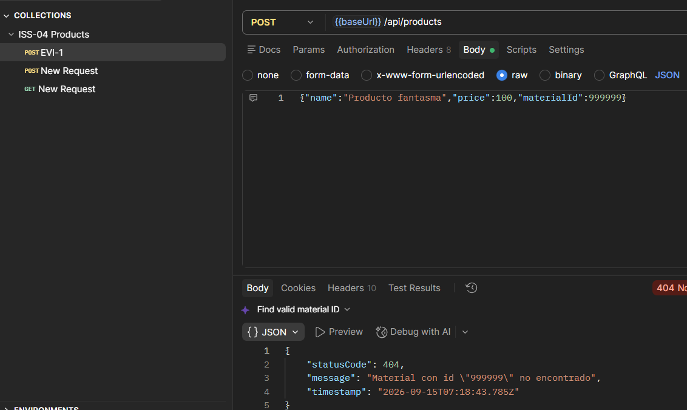

**EVI-4 (AC1 — `409 Conflict`, material inactivo):**
Primero se desactivó el material "Cobre" (`PATCH /api/materials/6` con `{"isActive":false}`, da `200`).
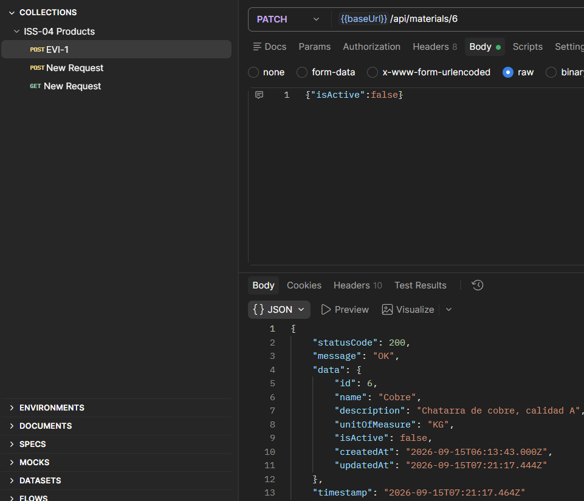
Luego, método POST a `/api/products` usando ese mismo material (`materialId: 6`), ya inactivo. Da `409` porque el material está inactivo.
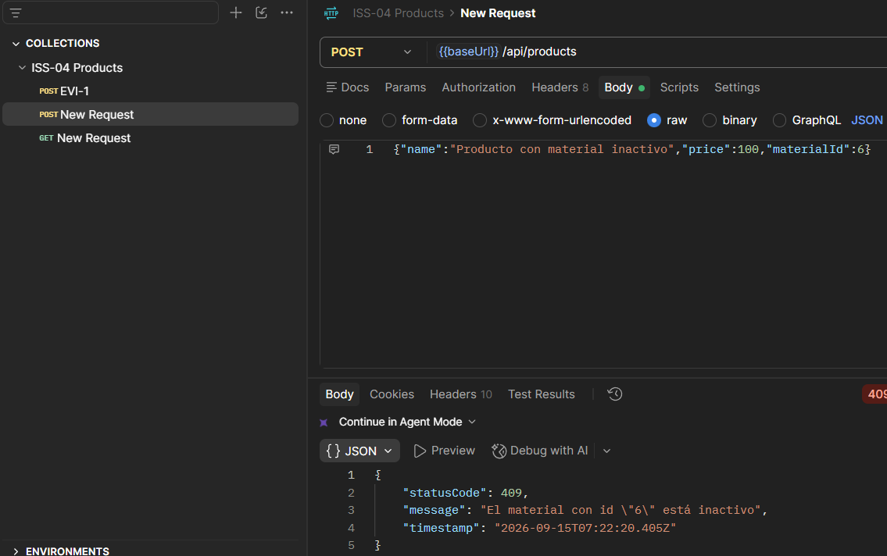

**EVI-5 (AC2 — listado paginado):**
Método GET a `/api/products?page=1&limit=10`. Da `200` y devuelve la lista de productos junto con la información de paginación.
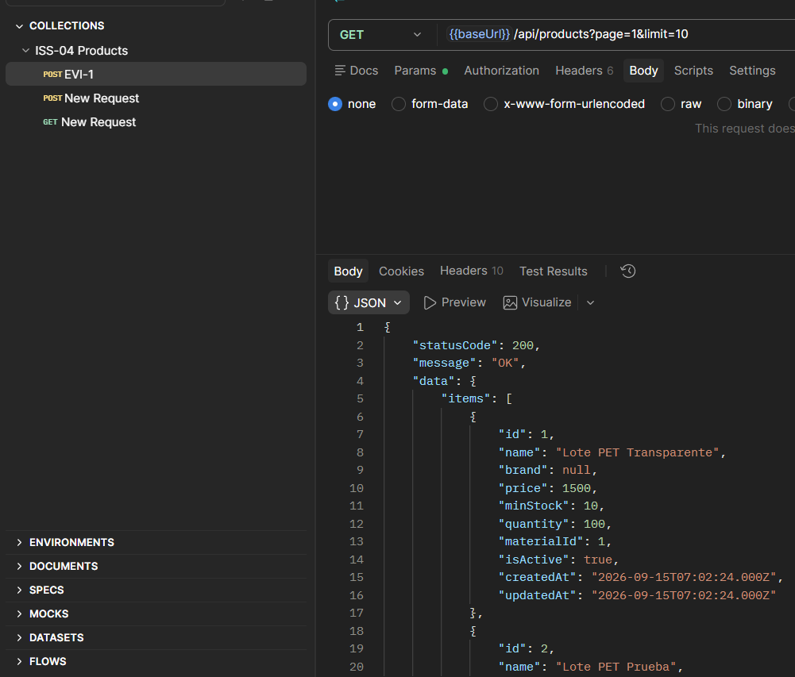

**EVI-6 (AC3 — detalle `200`):**
Método GET a `/api/products/2`, el producto creado en EVI-1. Da `200` y muestra el producto completo.
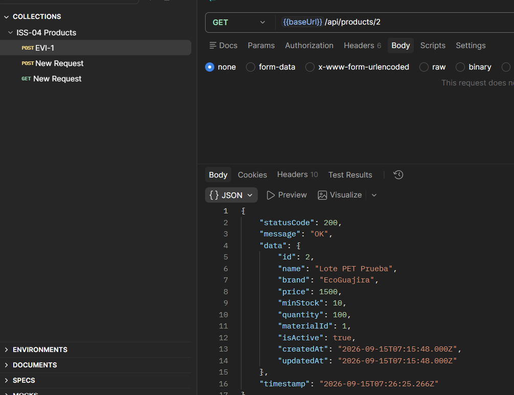

**EVI-7 (AC3 — detalle `404`):**
Método GET a `/api/products/999999`, un id que no existe. Da `404` con el mensaje de "no encontrado".
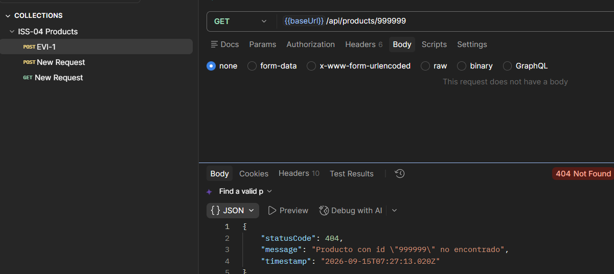

**EVI-8 (AC7 — `PATCH` `200`):**
Método PATCH a `/api/products/2` cambiando solo la cantidad (`quantity: 80`). Da `200` y devuelve el producto con el campo ya actualizado.
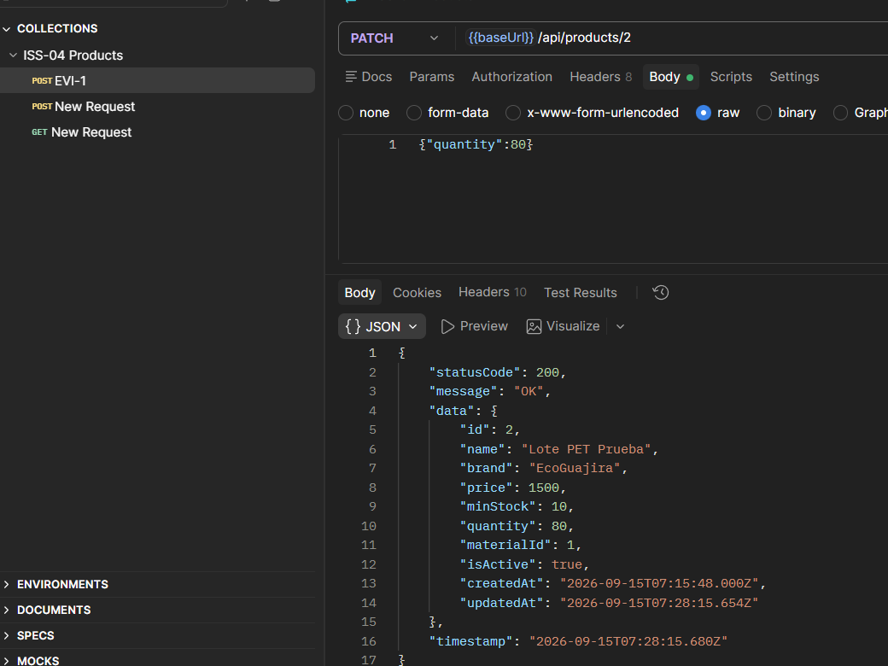

**EVI-8.1 (AC7 — `PATCH` `409`):**
Método PATCH a `/api/products/2` intentando cambiarlo al material "Vidrio" (`materialId: 5`), que en ese momento estaba inactivo. Da `409` porque el material está inactivo.
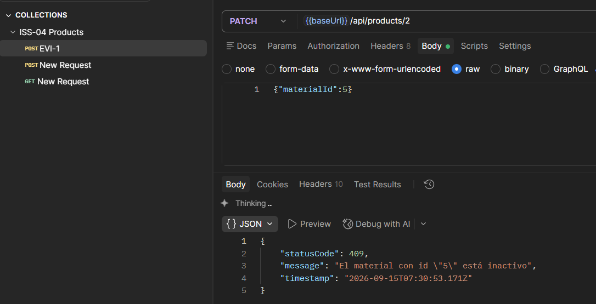

**EVI-9 (AC6 — seeder idempotente):**
Se corrió `npm run seed:products` dos veces seguidas. La segunda vez el log muestra "Ya existen productos, se omite la siembra demo", es decir que no se duplicó el producto demo.
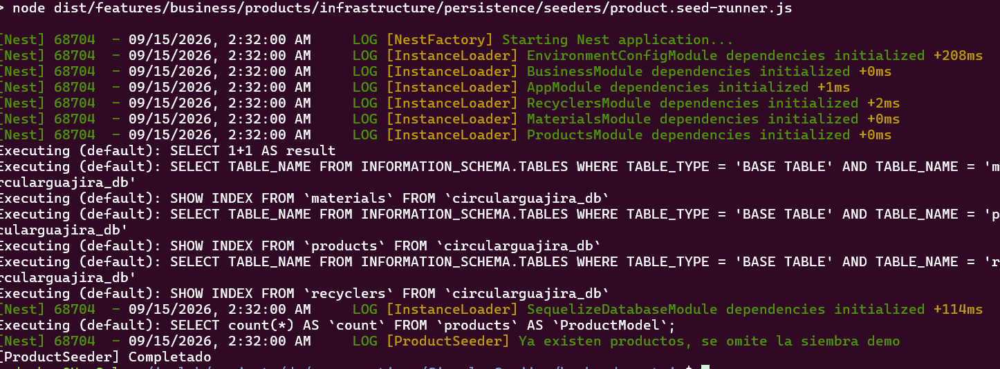

**Nota sobre AC5:** `reduceStock(n)` es una regla de dominio sin endpoint propio en este issue (la usará ISS-06 al registrar ventas), por lo que no tiene una evidencia de API asociada aquí.

Build y lint limpios: `npm run build` y `npm run lint` sin errores. Commit: `80fc2b4` (push a `origin/main`).

## 5. Revisión humana

15-09-2026
revisor: Carlos Martinez
revisión conforme: Se ejecutaron todas las pruebas de las 10 evidencias (EVI-1 a EVI-9, con EVI-4 y EVI-8.1 en dos partes) y no hay observaciones, el issue se completó correctamente.

## 6. Gate
- **Estado:** APROBADO
- **Conclusión:** ISS-05 completado al 100%. Feature `products` (alta con validación de material, listado paginado, consulta por id y actualización parcial en Clean Architecture) verificado y aprobado por revisión humana.
- **Trazabilidad final:** Commit `80fc2b4` (Refs #8)
