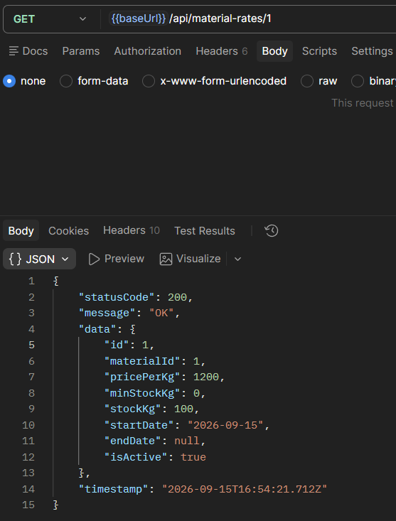
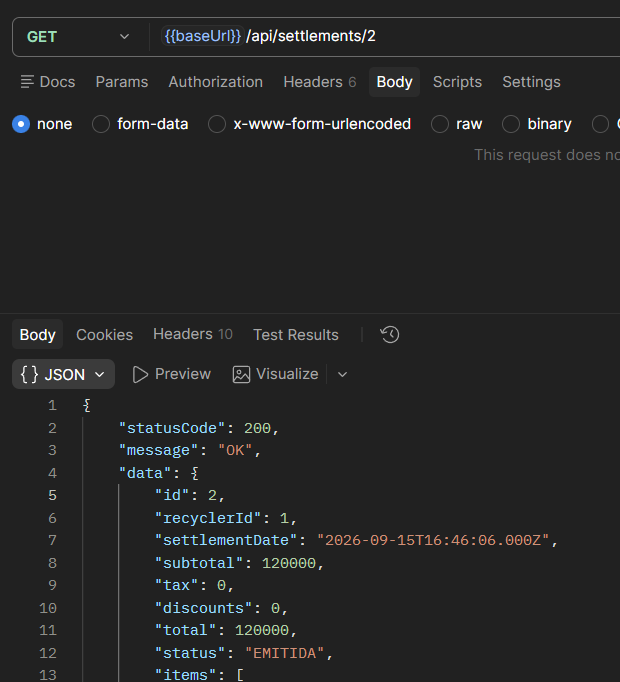
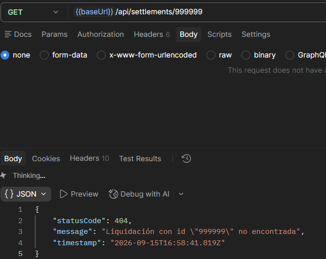

# ISS-06 — Feature `settlements` (Liquidaciones y Pesajes — Agregado Transaccional)

Issue #: Issue GitHub: backend-nest-ia #9

## 1. Objetivo / Especificación
Registrar la liquidación de compra de material a un reciclador, con pesaje por material, descuento automático de tara, aplicación de la tarifa vigente (ISS-05) y actualización del stock acumulado en planta, de forma **atómica** (todo o nada): si cualquier pesaje falla (peso inválido, material sin tarifa activa), no se crea ni la liquidación ni ningún incremento de inventario.

- **Dominio:** entidad pura `SettlementEntity` (cabecera: `id`, `recyclerId`, `settlementDate`, `subtotal`, `tax`, `discounts`, `total`, `status` — `'EMITIDA'|'PAGADA'|'ANULADA'` —, `items`) y `WeighingEntity` (detalle: `id`, `settlementId`, `materialId`, `grossWeight`, `tareWeight`, `netWeight`, `pricePerKg`, `total`), que calcula `netWeight`/`total` en su propio constructor y lanza `InvalidWeightException` (INV-01) si el peso bruto no es mayor que la tara. Servicio de dominio `SettlementCalculator` (`subtotal = Σ netWeight × pricePerKg`, `total = subtotal - discounts + tax`). Interfaz `ISettlementRepository` (`create`, `findById`) y token `SETTLEMENT_REPOSITORY`. Excepciones propias `SettlementNotFoundException` (404), `EmptySettlementException` (400), `InvalidWeightException` (400), `NoActiveRateForMaterialException` (409, INV-02) y `RecyclerInactiveException` (409); reutiliza `RecyclerNotFoundException` (404) de `recyclers` (ISS-03).
- **Aplicación:** `CreateSettlementUseCase` inyecta `SETTLEMENT_REPOSITORY` y `RECYCLER_REPOSITORY`: valida que el reciclador exista y esté activo, y que `items` no esté vacío, antes de crear. DTOs `CreateSettlementDto` (`recyclerId` requerido, `items[]` con `@ArrayMinSize(1)`, `tax`/`discounts` opcionales `>= 0`) y `WeighingItemDto` (`materialId` requerido, `grossWeight > 0`, `tareWeight >= 0`).
- **Infraestructura:** `SettlementModel` (tabla `settlements`, FK a `RecyclerModel`) y `WeighingModel` (tabla `weighings`, FK a `SettlementModel` y `MaterialModel`). `SettlementRepository.create` envuelve toda la operación en `sequelize.transaction`: por cada pesaje bloquea la fila de la tarifa activa del material (`LOCK.UPDATE`, accediendo a `MaterialRateModel` directamente, igual que el patrón ya usado con `ProductModel` en la implementación anterior de este issue), calcula el pesaje con la entidad pura `WeighingEntity` e incrementa `stockKg` de esa tarifa; solo si todos los pesajes pasan, inserta cabecera y detalle. Cualquier error revierte todo, incluido el stock ya acumulado de pesajes anteriores en la misma liquidación.

## 2. Criterios de aceptación (AC)
| # | Criterio |
|---|---|
| AC1 | `POST /api/settlements` → `201` / `400` (`items` vacío, DTO inválido o peso inválido — INV-01) / `404` (`recyclerId` inexistente) / `409` (reciclador inactivo o sin tarifa activa para el material — INV-02) |
| AC2 | `GET /api/settlements/:id` → `200`, retorna cabecera + detalle de pesajes con tara; `404` si no existe |
| AC3 | `netWeight` se calcula siempre en el dominio (`grossWeight - tareWeight`, en el constructor de `WeighingEntity`); nunca se recibe del cliente |
| AC4 | La operación es atómica: cualquier fallo (peso inválido o material sin tarifa en cualquier pesaje) revierte la liquidación completa, incluido el stock ya acumulado de pesajes previos de la misma liquidación |
| AC5 | Una liquidación puede incluir uno o más pesajes, cada uno con su propio `materialId` y su propia tarifa vigente aplicada |

> **Historial del issue:** este archivo describió originalmente `settlements` (versión actual). Durante la ejecución del proyecto se implementó por error una feature distinta (`sales`, venta de productos a un cliente tipo retail) en su lugar, documentada así en una versión anterior de este mismo archivo. Una auditoría posterior detectó la desviación de dominio (no correspondía a la narrativa de CircularGuajira, que compra material a recicladores mediante pesaje/tara/tarifa/liquidación, ni al issue #9 real en GitHub) y se revirtió: `sales/` fue eliminado junto con `products/` (ISS-05) en el mismo commit del refactor de ISS-05, y ahora se reconstruye como `settlements` sobre la base ya corregida de `material-rates`.

## 3. IA usada
CLAUDE CODE // Sonnet 5

15/09/2026
Naturaleza: PRÁCTICO. Eres asistente SOLO de ISS-06 (settlements / liquidaciones y pesajes), no del backend entero.

Implementa los Criterios de Aceptación de trazabilidad/ISS-06.md siguiendo estrictamente el contrato de arquitectura en docs/Prompt.md (Clean Architecture, pista Business para el dominio de CircularGuajira).

Contexto del proyecto y convenciones establecidas: El backend cuenta con ISS-01 (esqueleto), ISS-02 (Sequelize y Common), ISS-03 (recyclers), ISS-04 (materials) e ISS-05 (material-rates). El registro dinámico de modelos de Sequelize se ubica en `src/infrastructure/database/sequelize/sequelize-model.registry.ts` (`SettlementModel` y `WeighingModel` deben auto-registrarse en este archivo). La feature `recyclers` (ISS-03) expone `IRecyclerRepository` y el token `RECYCLER_REPOSITORY`. La feature `material-rates` (ISS-05) expone `IMaterialRateRepository`, el token `MATERIAL_RATE_REPOSITORY` y el método `findActiveRateByMaterialAndDate`. NO borres ni modifiques docs/ ni trazabilidad/.

Requerimientos de implementación para ISS-06 (Feature settlements en src/features/business/settlements/):

1. Capa 1 — Domain (src/features/business/settlements/domain/): entities/weighing.entity.ts: Clase PURA (pesaje individual). Campos: id, settlementId, materialId, grossWeight (peso bruto > 0), tareWeight (tara >= 0), netWeight (peso neto = grossWeight - tareWeight), pricePerKg (número > 0), total (netWeight * pricePerKg). INVARIANTE DE DOMINIO (INV-01): Lanza `InvalidWeightException` (400 - DomainException) si `grossWeight <= tareWeight` o si `netWeight <= 0`. entities/settlement.entity.ts: Clase PURA (agregado cabecera/detalle de liquidación). Campos: id, recyclerId (FK al reciclador), settlementDate (Date), subtotal (número > 0), tax (número >= 0), discounts (número >= 0), total (número > 0), status ('EMITIDA' | 'PAGADA' | 'ANULADA'), items (Weighing[]). services/settlement-calculator.ts: Servicio de dominio para calcular subtotal (Σ netWeight * pricePerKg) y total (subtotal - discounts + tax). interfaces/settlement.repository.interface.ts: Interfaz `ISettlementRepository` (create, findById) y token `SETTLEMENT_REPOSITORY`. exceptions/: `SettlementNotFoundException` (404), `EmptySettlementException` (400 - DomainException), `InvalidWeightException` (400 - DomainException), `NoActiveRateForMaterialException` (409 - BusinessRuleException).

2. Capa 2 — Application (src/features/business/settlements/application/): dto/: WeighingItemDto (materialId int min 1, grossWeight number > 0, tareWeight number >= 0), CreateSettlementDto (recyclerId int min 1, items array con @ArrayMinSize(1) y @ValidateNested de WeighingItemDto, tax opcional >= 0, discounts opcional >= 0). mappers/settlement.mapper.ts: mapeador bidireccional entre las entidades (Settlement / Weighing) y los DTOs/Modelos. use-cases/: CreateSettlementUseCase (inyecta RECYCLER_REPOSITORY, MATERIAL_RATE_REPOSITORY y SETTLEMENT_REPOSITORY; valida que el reciclador exista y esté activo —404/409—, valida que items no esté vacío —400—, invoca ISettlementRepository.create(settlement) delegando la ejecución en transacción atómica de Sequelize), GetSettlementByIdUseCase (lanza SettlementNotFoundException —404— si no existe).

3. Capa 3 — Infrastructure (src/features/business/settlements/infrastructure/): persistence/models/settlement.model.ts: Modelo Sequelize @Table({ tableName: 'settlements' }) con FK a RecyclerModel. persistence/models/weighing.model.ts: Modelo Sequelize @Table({ tableName: 'weighings' }) con FK a SettlementModel y MaterialModel. Ambos auto-registrados en sequelize-model.registry.ts. persistence/repositories/settlement.repository.ts: implementación atómica de ISettlementRepository.create: abre una transacción Sequelize sequelize.transaction(async (t) => ...): 1) para cada ítem en pesajes, consulta la tarifa activa con bloqueo lock: Transaction.LOCK.UPDATE (si no hay tarifa activa, lanza NoActiveRateForMaterialException —409— provocando rollback); 2) calcula netWeight = grossWeight - tareWeight (si netWeight <= 0, la entidad Weighing lanza InvalidWeightException —400— provocando rollback); 3) incrementa el stock acumulado (stockKg) en la tarifa/material correspondiente; 4) inserta la cabecera SettlementModel y las filas de detalle WeighingModel; 5) cualquier error realiza un rollback atómico total.

4. Capa 4 — Presentation (src/features/business/settlements/presentation/): http/controllers/settlements.controller.ts: Controlador NestJS en /api/settlements con Swagger (@ApiTags('Settlements'), @ApiOperation): POST /api/settlements (201, registra la liquidación con sus pesajes y retorna la respuesta), GET /api/settlements/:id (200 / 404, consulta el detalle completo de la liquidación con sus pesajes).

5. Registros y Configuración: Crear SettlementsModule importando RecyclersModule y MaterialRatesModule. Registrar SettlementsModule en BusinessModule.

Prohibiciones duras: PROHIBIDO Auth, Users, JWT, Login, Guards o agregar userId al DTO ("para saber quién pesó"). PROHIBIDO usar sync({ force: true }) o alter: true. PROHIBIDO adelantar ISS-07 (orquestador de seeders y Swagger global).

**Ajustes hechos durante la ejecución (fuera del prompt original, necesarios para que compile/persista):**
- `RecyclerInactiveException` (409, "reciclador inactivo") no estaba en la lista explícita de excepciones de dominio del prompt (solo `SettlementNotFoundException`, `EmptySettlementException`, `InvalidWeightException`, `NoActiveRateForMaterialException`), pero el propio texto del caso de uso sí pide "409 si está inactivo"; se agregó como excepción propia de `settlements`, siguiendo el mismo patrón que `MaterialInactiveException` en `material-rates` (ISS-05).
- El bloqueo `lock: Transaction.LOCK.UPDATE` sobre la tarifa activa no pasa por `IMaterialRateRepository` (esa interfaz no tiene un parámetro de transacción en `findActiveRateByMaterialAndDate`): el repositorio de `settlements` accede a `MaterialRateModel` directamente dentro de la transacción, replicando el rango de fechas de `findActiveRateByMaterialAndDate` con el mismo criterio (`Op.lte`/`Op.gte` sobre `startDate`/`endDate`). Es el mismo patrón que ya se usó con `ProductModel` en la implementación anterior de este issue (`sales`), documentado ahí como necesario para el bloqueo pesimista dentro de una transacción.
- Las dos condiciones de INV-01 (`grossWeight <= tareWeight` y `netWeight <= 0`) son matemáticamente equivalentes (`netWeight = grossWeight - tareWeight`), así que `WeighingEntity` las valida con una sola comprobación.
- `SettlementModel`/`WeighingModel` no tienen asociación cruzada bidireccional (mismo motivo que `SaleModel`/`ProductSaleModel` antes: evitar un ciclo de imports ES): `WeighingModel` sí tiene `@ForeignKey`/`@BelongsTo` hacia `SettlementModel`, pero `SettlementModel` no importa `WeighingModel`; el detalle se consulta con `WeighingModel.findAll({ where: { settlementId } })`.
- No se pidió (ni se implementó) un seeder para `settlements`, a diferencia de `recyclers`/`materials`/`material-rates`: las liquidaciones son registros transaccionales, no datos de catálogo para sembrar.
- Verificación funcional en caliente contra MySQL (`node dist/main.js` temporal) cubriendo los 5 escenarios pedidos: liquidación exitosa con `stockKg` incrementado (201 + `GET /api/material-rates/:id`), tara mayor al peso bruto sin crear nada (400/INV-01 + verificación de rollback), material sin tarifa activa sin crear nada (409/INV-02), atomicidad real con 2 pesajes donde el segundo falla (el primero, válido, **no** queda acumulado), reciclador inexistente (404), reciclador inactivo (409), `items` vacío (400), y `GET /api/settlements/:id` (200). Los datos de esta verificación se limpiaron después (liquidación y detalle borrados, `stockKg` restaurado) para no dejar residuos antes de la evidencia formal. Build (`npm run build`) y lint (`npm run lint`) limpios.

## 4. Evidencias (EVI)

Pruebas hechas con Postman contra la API local (`npm run start:dev`), usando `recyclerId: 1` (activo) para los casos válidos, `recyclerId: 2` (ya estaba inactivo desde ISS-03) para el caso de reciclador inactivo, `materialId: 1` (PET, con tarifa activa) para los pesajes válidos y `materialId: 6` (Cobre, sin tarifa) para el caso sin tarifa activa.

**Detalle de un tropiezo en el camino (EVI-2):** al probar el peso inválido, la primera vez dio `404` en vez del `400` esperado. No era un bug del backend: a la URL de esa request se le había colado un `.` de más (algo como `/api/settlements.` en vez de `/api/settlements`), así que Nest ni siquiera encontraba la ruta y devolvía su `404` genérico de "ruta no encontrada" — no el `404` con el envelope `{statusCode, message, timestamp}` que arma nuestro `GlobalExceptionFilter` para errores de negocio. Corrigiendo la URL, la request devolvió el `400` correcto de `InvalidWeightException`. La captura final de EVI-2 ya es la corregida.

**EVI-1 (AC1 — `201 Created`):**
Método POST a `/api/settlements` con un pesaje de `materialId: 1` (`grossWeight: 105.5`, `tareWeight: 5.5`). Da `201`: la liquidación se crea con `id 2`, `netWeight: 100` (105.5 - 5.5) y `total: 120000` calculados por el backend, nunca enviados en el body.

**EVI-1.1 (AC1/AC3 — verificar el incremento de stock):**
Método GET a `/api/material-rates/1`. Da `200` y muestra `stockKg: 100`, ya acumulado tras la liquidación de EVI-1.

**EVI-2 (AC1 — `400 Bad Request`, INV-01):**
Método POST a `/api/settlements` con `grossWeight: 10` y `tareWeight: 20` (la tara mayor al peso bruto). Da `400` con el mensaje "El peso bruto (10) debe ser mayor que la tara (20)".

**EVI-2.1 (AC4 — verificar que no quedó nada creado):**
Método GET a `/api/material-rates/1`. Da `200` con `stockKg: 100`, el mismo valor de EVI-1.1: el intento fallido de EVI-2 no acumuló ni dejó ningún registro.

**EVI-3 (AC1 — `409 Conflict`, INV-02):**
Método POST a `/api/settlements` con `materialId: 6` (Cobre), que no tiene tarifa activa. Da `409` con el mensaje "No existe una tarifa activa para el material con id \"6\"".

**EVI-4 (AC4 — atomicidad con 2 pesajes, el segundo falla):**
Método POST a `/api/settlements` con dos pesajes: `materialId: 1` (válido) y `materialId: 6` (sin tarifa). Da `409` porque el segundo pesaje no tiene tarifa activa.

**EVI-4.1 (AC4 — verificar que el primer pesaje no quedó acumulado):**
Método GET a `/api/material-rates/1`. Da `200` con `stockKg: 100`, el mismo valor de EVI-1.1: aunque el primer pesaje era válido, la liquidación completa se revirtió por la falla del segundo.

**EVI-5 (AC1 — `404 Not Found`):**
Método POST a `/api/settlements` con `recyclerId: 999999`, que no existe. Da `404` con el mensaje "Reciclador con id \"999999\" no encontrado".

**EVI-6 (AC1 — `409 Conflict`, reciclador inactivo):**
Método POST a `/api/settlements` con `recyclerId: 2`, que ya estaba inactivo. Da `409` con el mensaje "El reciclador con id \"2\" está inactivo".

**EVI-7 (AC1 — `400 Bad Request`, `items` vacío):**
Método POST a `/api/settlements` con `items: []`. Da `400` con el mensaje "items must contain at least 1 elements".

**EVI-8 (AC2 — detalle `200`):**
Método GET a `/api/settlements/2`, la liquidación creada en EVI-1. Da `200` con la cabecera completa y su pesaje de detalle.

**EVI-9 (AC2 — detalle `404`):**
Método GET a `/api/settlements/999999`, un id que no existe. Da `404` con el mensaje "Liquidación con id \"999999\" no encontrada".

**Nota sobre AC5:** una liquidación con varios pesajes válidos (sin fallas) ya queda cubierta implícitamente por el pesaje exitoso de EVI-1; no se agregó una evidencia aparte porque el comportamiento es el mismo, solo con más filas en `data.items`.

Build y lint limpios: `npm run build` y `npm run lint` sin errores. Commit: `ea7415c` (push a `origin/main`).

## 5. Revisión humana

15-09-2026
revisor: Carlos Martinez
revisión conforme: Se ejecutaron todas las pruebas de las 12 evidencias (EVI-1 a EVI-9, con EVI-1.1/EVI-2.1/EVI-4.1 como verificaciones adicionales) y no hay observaciones, el issue se completó correctamente.

Con énfasis en el detalle de EVI-2: el primer intento de esa prueba dio `404` en vez del `400` esperado, pero no fue una falla del backend — la URL de esa request en Postman tenía un `.` de más y apuntaba a una ruta que no existe, por lo que Nest respondió con su `404` genérico de ruta no encontrada. Al corregir la URL, la prueba devolvió el `400` correcto de `InvalidWeightException` (INV-01), confirmando que la validación de dominio funciona bien. Quedó demostrado además que la transacción es realmente atómica: en EVI-4, un pesaje válido junto a uno sin tarifa se revierten los dos por igual (EVI-4.1), sin dejar acumulaciones parciales de stock.

## 6. Gate
- **Estado:** APROBADO
- **Conclusión:** ISS-06 completado al 100% en su segunda implementación (`settlements`, tras corregir la desviación de dominio de la primera vuelta, `sales`). Feature de liquidación con pesaje, tara, tarifa vigente y descuento/acumulación atómica de stock, en Clean Architecture, verificado y aprobado por revisión humana.
- **Trazabilidad final:** Commit `ea7415c` (Refs #9)
