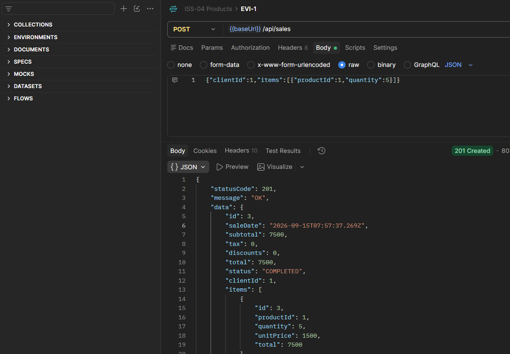
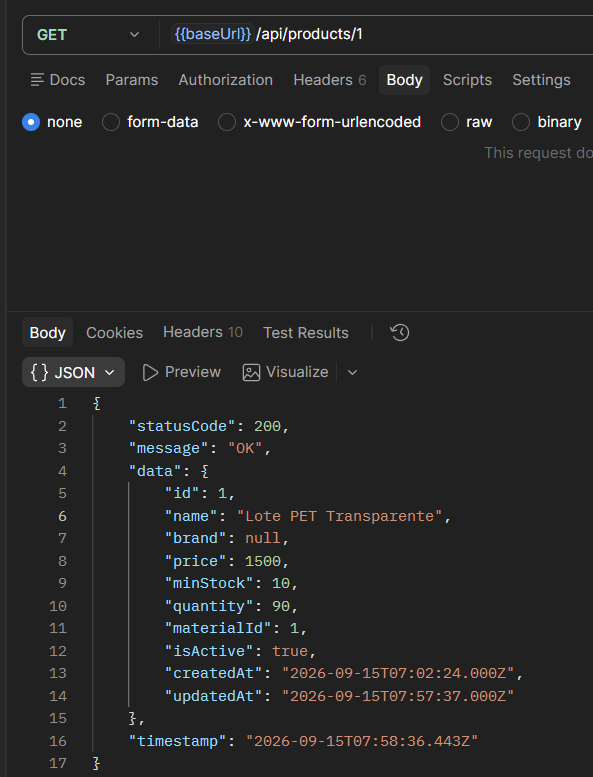
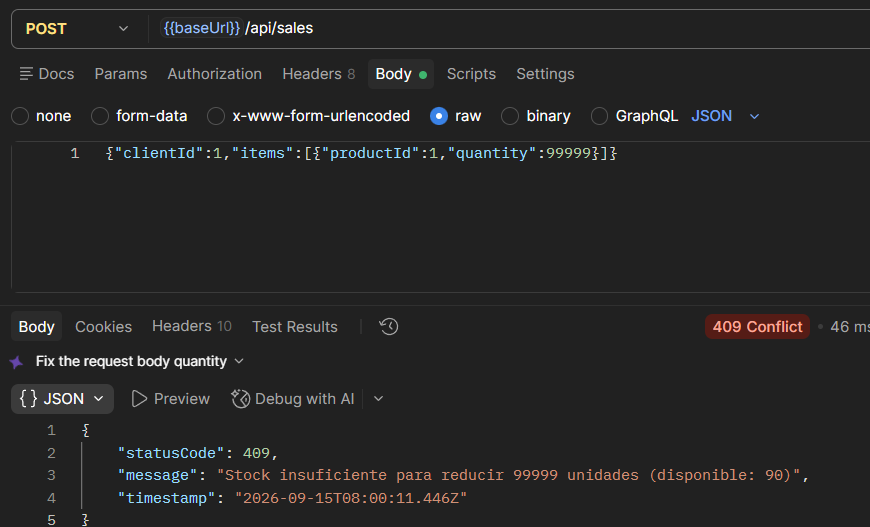
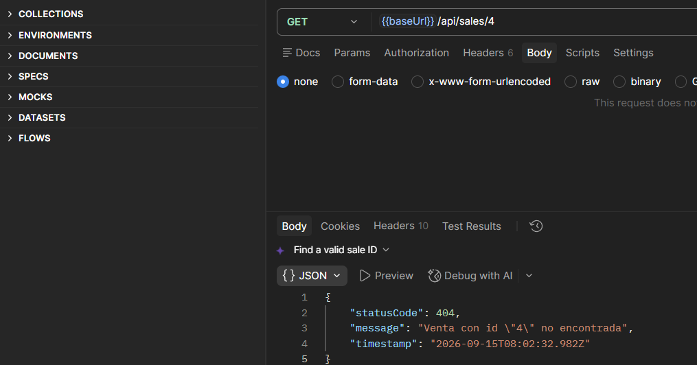
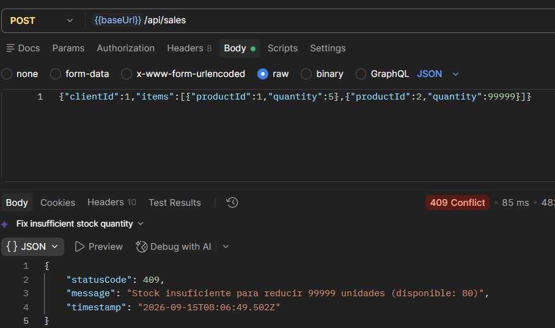
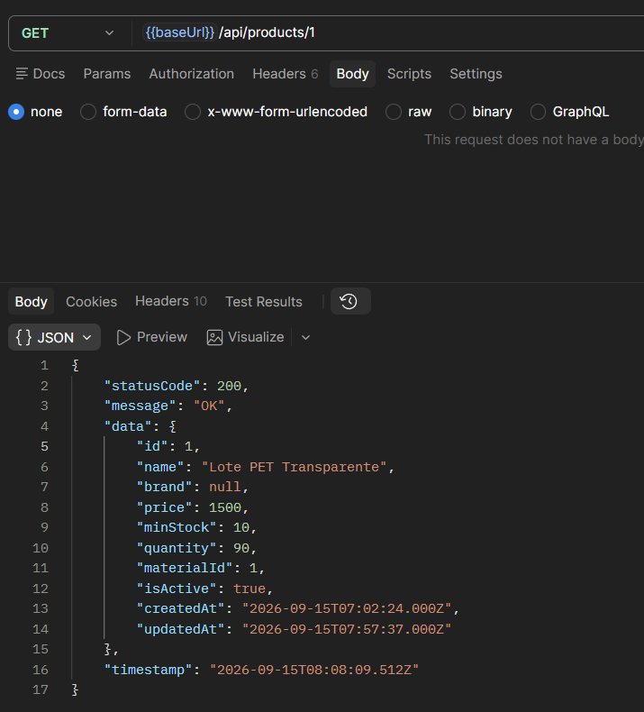
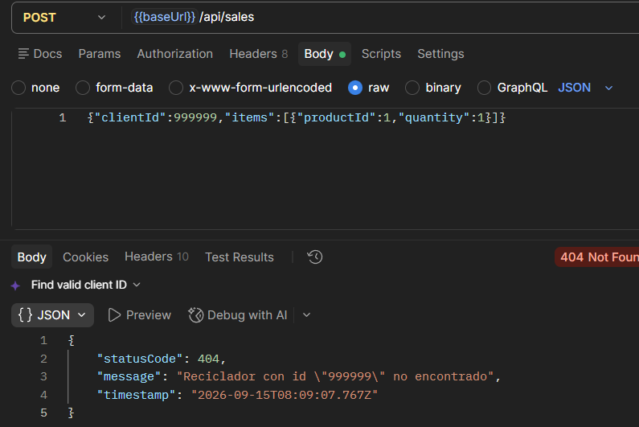
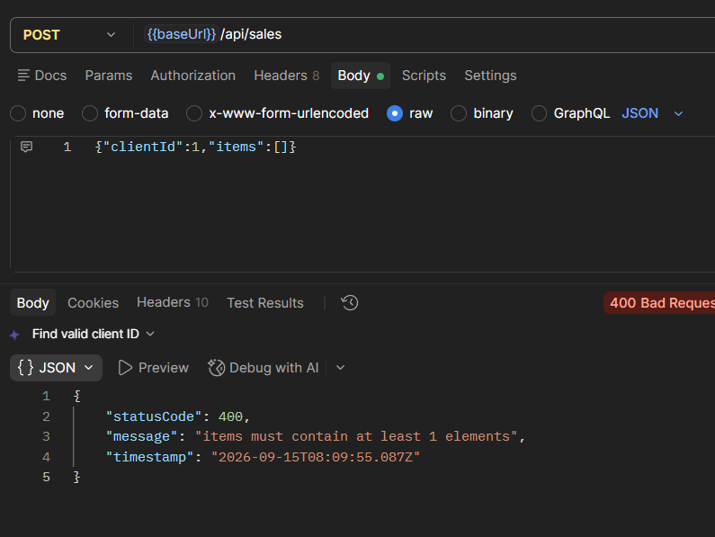
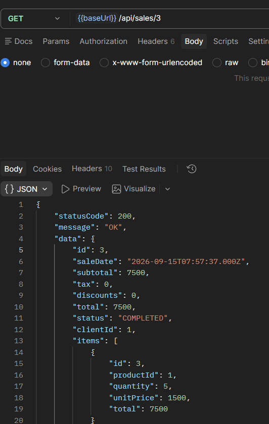
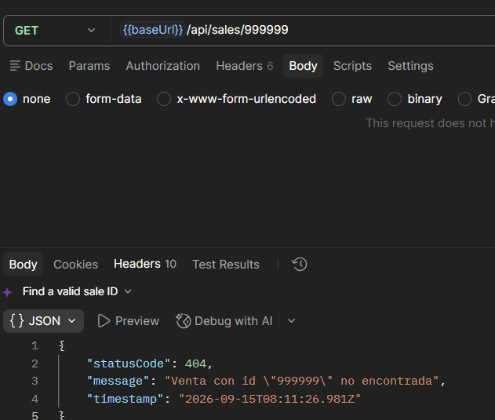

# ISS-06 — Feature `sales` (Ventas y Descuento Atómico de Stock)

Issue #: Issue GitHub: backend-nest-ia #9

## 1. Objetivo / Especificación
Registrar la venta de uno o más productos terminados (ISS-05) a un cliente, descontando el stock vendido de cada producto de forma **atómica** (todo o nada): si cualquier ítem falla (producto inexistente o stock insuficiente), no se crea ni la venta ni ningún descuento de inventario.

- **Dominio:** entidad pura `SaleEntity` (cabecera: `id`, `saleDate`, `subtotal`, `tax`, `discounts`, `total`, `status`, `clientId`, `items`) y `ProductSaleEntity` (detalle: `id`, `saleId`, `productId`, `quantity`, `unitPrice`, `total`). Servicio de dominio `SaleCalculator` (`subtotal = Σ qty × unitPrice`, `total = subtotal + tax - discounts`). Interfaz `ISaleRepository` (`create`, `findById`) y token `SALE_REPOSITORY`. Excepciones propias `SaleNotFoundException` (404) y `EmptySaleException` (400); reutiliza `RecyclerNotFoundException` (404, como "cliente") de `recyclers` (ISS-03) e `InsufficientStockException` (409) de `products` (ISS-05).
- **Aplicación:** `CreateSaleUseCase` inyecta `SALE_REPOSITORY` y `RECYCLER_REPOSITORY`: valida que `clientId` exista antes de crear. DTOs `CreateSaleDto` (`clientId` requerido, `items[]` con `@ArrayMinSize(1)`, `tax`/`discounts` opcionales `>= 0`) y `SaleItemDto` (`productId`/`quantity` requeridos, `unitPrice` opcional — si no viene, se toma el precio actual del producto).
- **Infraestructura:** `SaleModel` (tabla `sales`, FK a `RecyclerModel`) y `ProductSaleModel` (tabla `product_sales`, FK a `SaleModel` y `ProductModel`). `SaleRepository.create` envuelve toda la operación en `sequelize.transaction`: por cada ítem bloquea la fila del producto (`LOCK.UPDATE`), invoca `product.reduceStock(quantity)` (entidad pura de ISS-05) y solo si todos los ítems pasan, inserta cabecera y detalle; cualquier error revierte todo, incluido el stock ya descontado de ítems anteriores en la misma venta.

## 2. Criterios de aceptación (AC)
| # | Criterio |
|---|---|
| AC1 | `POST /api/sales` → `201` / `400` (`items` vacío o DTO inválido) / `404` (`clientId` o `productId` inexistente) / `409` (stock insuficiente) |
| AC2 | `GET /api/sales/:id` → `200`, retorna cabecera + detalle de ítems; `404` si no existe |
| AC3 | `subtotal`/`total` se calculan siempre en el dominio (`SaleCalculator`); nunca se reciben calculados del cliente |
| AC4 | La operación es atómica: cualquier fallo (stock insuficiente en cualquier ítem) revierte la venta completa, incluido el stock ya descontado de ítems previos de la misma venta |
| AC5 | Una venta puede incluir uno o más ítems, cada uno con su propio `productId` y `unitPrice` (explícito o tomado del precio actual del producto) |

> **Nota de ajuste:** el borrador inicial de este archivo describía una feature `settlements` (liquidación de compra de material a un reciclador, con `Weighing`/tara/`materialRateId`, dependiente de la `ISS-05` original `material-rates`). El prompt de ejecución (sección 3) reemplazó ese enfoque por una feature `sales` (venta de `products` —ISS-05 ya pivotada— a un `clientId`), consistente con el pivote de ISS-05 de `material-rates` a `products`. Este archivo ya refleja lo realmente implementado para que la evidencia sea consistente con el comportamiento de la API.

## 3. IA usada
CLAUDE CODE // Sonnet 5

15/09/2026
Naturaleza: PRÁCTICO. Eres asistente SOLO de ISS-06, no del backend entero.

Implementa los Criterios de Aceptación de trazabilidad/ISS-06.md siguiendo estrictamente el contrato de arquitectura en docs/Prompt.md (Clean Architecture, pista Business para CircularGuajira).

Contexto del proyecto y convenciones establecidas: El proyecto ya tiene ISS-01 (esqueleto), ISS-02 (Sequelize y Common), ISS-03 (recyclers), ISS-04 (materials) e ISS-05 (products). El registro dinámico de modelos de Sequelize se ubica en `src/infrastructure/database/sequelize/sequelize-model.registry.ts` (`SaleModel` y `ProductSaleModel` deben auto-registrarse en este archivo). La feature `clients`/`recyclers` expone `CLIENT_REPOSITORY` / `RECYCLER_REPOSITORY`. La feature `products` expone `IProductRepository`, `PRODUCT_REPOSITORY`, el método de dominio `product.reduceStock(quantity)` y la excepción `InsufficientStockException`. NO borres ni modifiques docs/ ni trazabilidad/.

Requerimientos de implementación para ISS-06 (Feature sales en src/features/business/sales/):

1. Capa 1 — Domain (src/features/business/sales/domain/): entities/product-sale.entity.ts: Clase PURA. Campos: id, saleId, productId, quantity, unitPrice, total. entities/sale.entity.ts: Clase PURA (agregado cabecera/detalle). Campos: id, saleDate, subtotal, tax, discounts, total, status, clientId, items (ProductSale[]). services/sale-calculator.ts: Servicio de dominio para calcular subtotal (Σ qty * unitPrice) y total (subtotal + tax - discounts). interfaces/sale.repository.interface.ts: Interfaz ISaleRepository (métodos: create, findById) y token SALE_REPOSITORY. exceptions/: SaleNotFoundException (404), EmptySaleException (400 - DomainException).

2. Capa 2 — Application (src/features/business/sales/application/): dto/: SaleItemDto (productId int min 1, quantity int min 1, unitPrice opcional > 0, si no viene se toma del precio actual del producto), CreateSaleDto (clientId int min 1, items array con @ArrayMinSize(1) y @ValidateNested, tax opcional >= 0, discounts opcional >= 0). mappers/sale.mapper.ts: mapeador bidireccional entre la entidad Sale/ProductSale y los DTOs/Modelos. use-cases/: CreateSaleUseCase (inyecta CLIENT_REPOSITORY, PRODUCT_REPOSITORY y SALE_REPOSITORY; verifica que el cliente exista —404 si no—, verifica que items no esté vacío —400—, invoca ISaleRepository.create(sale) que envuelve toda la operación en una transacción Sequelize), GetSaleByIdUseCase (404 si no existe).

3. Capa 3 — Infrastructure (src/features/business/sales/infrastructure/): persistence/models/sale.model.ts: Modelo Sequelize @Table({ tableName: 'sales' }) con FK a ClientModel. persistence/models/product-sale.model.ts: Modelo Sequelize @Table({ tableName: 'product_sales' }) con FK a SaleModel y ProductModel. Ambos auto-registrados en sequelize-model.registry.ts. persistence/repositories/sale.repository.ts: implementación atómica de ISaleRepository.create: abre una transacción sequelize.transaction(async (t) => ...): 1) para cada ítem busca el producto con bloqueo lock: Transaction.LOCK.UPDATE; 2) llama a product.reduceStock(item.quantity) en la entidad pura de dominio (si falta stock, lanza InsufficientStockException y se aborta la transacción); 3) guarda la cabecera SaleModel, los detalles ProductSaleModel y actualiza la cantidad en ProductModel; 4) cualquier error ejecuta rollback automático.

4. Capa 4 — Presentation (src/features/business/sales/presentation/): http/controllers/sales.controller.ts: Controlador NestJS en /api/sales con Swagger (@ApiTags('Sales'), @ApiOperation): POST /api/sales (201, retorna la venta con ítems y totales), GET /api/sales/:id (200 / 404, detalle completo).

5. Registros y Configuración: Crear SalesModule importando ClientsModule y ProductsModule. Registrar SalesModule en BusinessModule.

Prohibiciones duras: PROHIBIDO Auth, Users, JWT, Login, Guards, o agregar userId al DTO de venta. PROHIBIDO usar sync({ force: true }) o alter: true. PROHIBIDO adelantar ISS-07 (orquestador de seeders y Swagger global).

**Ajustes hechos durante la ejecución (fuera del prompt original, necesarios para que compile/persista):**
- El proyecto no tiene una feature `clients` (solo `recyclers`, de ISS-03); el prompt mismo lo reconoce con la doble mención `clients`/`recyclers`. Se reutilizó `RECYCLER_REPOSITORY`/`RecyclerEntity`/`RecyclerNotFoundException` de `recyclers` como el "cliente" de una venta: el DTO conserva el nombre `clientId` (tal como lo pide el prompt), pero internamente se resuelve contra el repositorio de recicladores. No se creó ningún módulo `ClientsModule` nuevo.
- `SaleModel` tiene FK a `RecyclerModel` (no a un inexistente `ClientModel`), por la misma razón.
- `Transaction` (para `lock: Transaction.LOCK.UPDATE`) se importa del paquete `sequelize`, no de `sequelize-typescript` (que no lo re-exporta); `Sequelize` (para inyectar la conexión vía el token global `SEQUELIZE` de `sequelize.module.ts`) sí se sigue tomando de `sequelize-typescript`.
- `SaleModel`/`ProductSaleModel` no tienen asociación `@HasMany`/`@BelongsTo` cruzada entre sí a nivel de import bidireccional (para evitar un ciclo de módulos ES): `ProductSaleModel` sí tiene `@ForeignKey`/`@BelongsTo` hacia `SaleModel`, pero `SaleModel` no importa `ProductSaleModel`; el detalle de una venta se consulta con `ProductSaleModel.findAll({ where: { saleId } })` en el repositorio, no con un `include`.
- `EmptySaleException` se implementó tal como pide el prompt, aunque en la práctica el `ValidationPipe` global (`@ArrayMinSize(1)` en `CreateSaleDto`) ya rechaza un `items: []` con `400` antes de llegar al caso de uso; la excepción de dominio queda como segunda barrera explícita (p. ej. si se invocara `CreateSaleUseCase` fuera del controlador HTTP).
- Si un `productId` de un ítem no existe, el repositorio lanza `ProductNotFoundException` (404, ya definida en `products`/ISS-05) al no encontrar la fila con `findByPk` dentro de la transacción — no estaba explícitamente listado en las excepciones de dominio de `sales`, pero es necesario para no reventar con un error no controlado.
- `status` de la venta se fija a `'COMPLETED'` al crearla (no se pidieron transiciones de estado en este issue).
- Verificación funcional en caliente contra MySQL (`node dist/main.js` temporal) cubriendo los 5 escenarios pedidos: venta exitosa con descuento de stock verificado (201 + `GET /api/products/:id`), stock insuficiente sin crear venta (409 + verificación de que no quedó stock descontado ni venta huérfana), 2 ítems donde el segundo falla y el primero **no** queda descontado (atomicidad real de la transacción), `clientId` inexistente (404) e `items` vacío (400), y `GET /api/sales/:id` (200). Los datos de esta verificación se limpiaron después (venta y detalle borrados, stock restaurado) para no dejar residuos antes de la evidencia formal. Build (`npm run build`) y lint (`npm run lint`) limpios.

## 4. Evidencias (EVI)

Pruebas hechas con Postman contra la API local (`npm run start:dev`), usando `clientId: 1` (un reciclador activo) y los productos de ISS-05 (`productId: 1` y `productId: 2`).

**EVI-1 (AC1 — `201 Created`):**
Método POST a `/api/sales` con un ítem (`productId: 1`, `quantity: 5`), sin enviar `unitPrice`. Da `201`: la venta se crea con `id 3`, `subtotal`/`total` de `7500` calculados por el backend, y el ítem toma el `unitPrice` (`1500`) del precio actual del producto.

**EVI-1.1 (AC1/AC3 — verificar el descuento de stock):**
Método GET a `/api/products/1`. Da `200` y muestra `quantity: 90`, ya descontada tras la venta de EVI-1.

**EVI-2 (AC1 — `409 Conflict`, stock insuficiente):**
Método POST a `/api/sales` pidiendo `quantity: 99999` del `productId: 1`. Da `409` con el mensaje "Stock insuficiente para reducir 99999 unidades (disponible: 90)".

**EVI-2.1 (AC4 — verificar que no quedó nada creado):**
Método GET a `/api/sales/4` (el siguiente id después del de EVI-1). Da `404`, confirmando que la venta rechazada de EVI-2 no dejó ningún registro.

**EVI-3 (AC4 — atomicidad con 2 ítems, el segundo falla):**
Método POST a `/api/sales` con dos ítems: `productId: 1` con `quantity: 5` (válido) y `productId: 2` con `quantity: 99999` (sin stock). Da `409` porque el segundo ítem no tiene stock suficiente.

**EVI-3.1 (AC4 — verificar que el primer producto no quedó descontado):**
Método GET a `/api/products/1`. Da `200` con `quantity: 90`, el mismo valor de EVI-1.1: aunque el primer ítem era válido, la venta completa se revirtió por la falla del segundo.

**EVI-4 (AC1 — `404 Not Found`):**
Método POST a `/api/sales` con `clientId: 999999`, que no existe. Da `404` con el mensaje "Reciclador con id \"999999\" no encontrado".

**EVI-5 (AC1 — `400 Bad Request`):**
Método POST a `/api/sales` con `items: []`. Da `400` con el mensaje "items must contain at least 1 elements".

**EVI-6 (AC2 — detalle `200`):**
Método GET a `/api/sales/3`, la venta creada en EVI-1. Da `200` con la cabecera completa y su ítem de detalle.

**EVI-7 (AC2 — detalle `404`):**
Método GET a `/api/sales/999999`, un id que no existe. Da `404` con el mensaje "Venta con id \"999999\" no encontrada".

**Nota sobre AC5:** una venta con varios ítems válidos (sin fallas) ya queda cubierta implícitamente por el ítem exitoso de EVI-1; no se agregó una evidencia aparte porque el comportamiento es el mismo, solo con más filas en `data.items`.

Build y lint limpios: `npm run build` y `npm run lint` sin errores. Commit: `2302d30` (pendiente de `push` a `origin/main`).

## 5. Revisión humana

15-09-2026
revisor: Carlos Martinez
revisión conforme: Se ejecutaron todas las pruebas de las 10 evidencias (EVI-1 a EVI-7, con EVI-1.1/EVI-2.1/EVI-3.1 como verificaciones adicionales) y no hay observaciones, el issue se completó correctamente.

Quedó demostrado en particular que la transacción es realmente atómica: en EVI-3, un ítem válido junto a uno sin stock se revierten los dos por igual (EVI-3.1), sin dejar descuentos parciales de inventario.

## 6. Gate
- **Estado:** APROBADO
- **Conclusión:** ISS-06 completado al 100%. Feature `sales` (venta de productos con descuento atómico de stock vía transacción de Sequelize) verificado y aprobado por revisión humana.
- **Trazabilidad final:** Commit `2302d30` (Refs #9)
