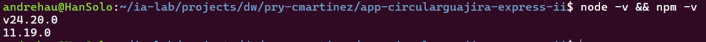
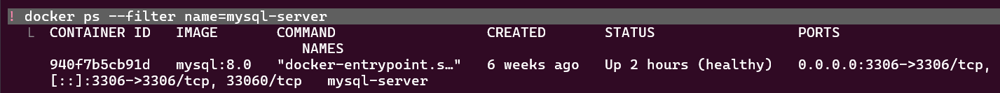
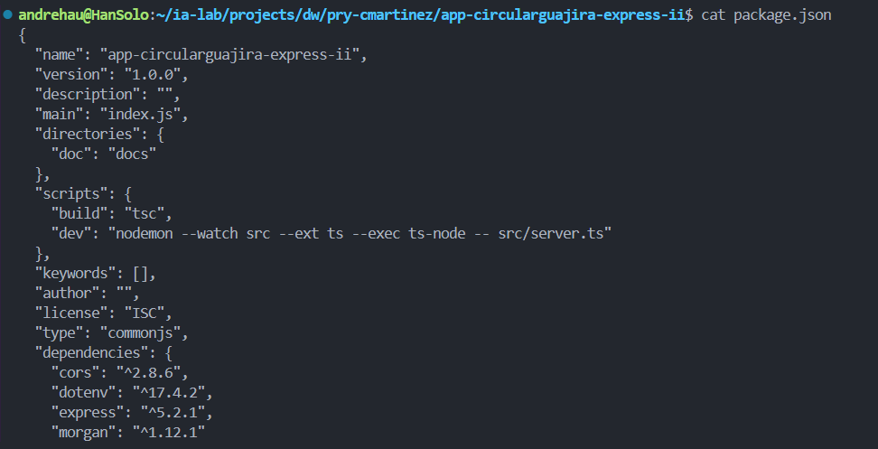
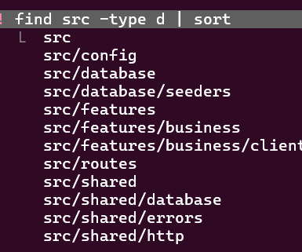
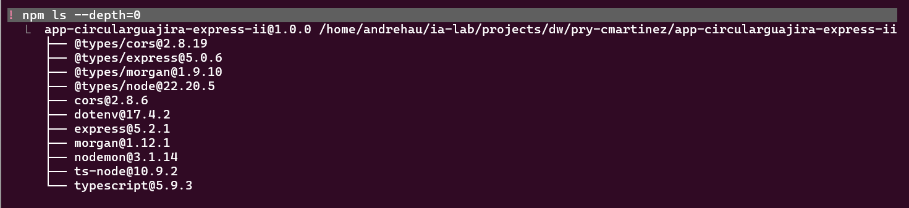
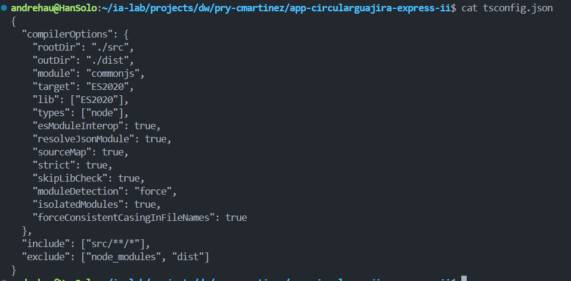
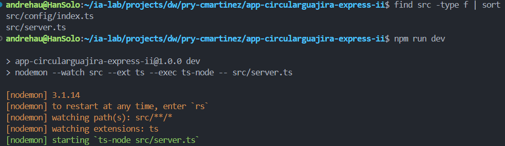

# Proceso de creación del backend de CircularGuajira

## Propósito y alcance

Este documento organiza en 16 bloques ISS la construcción del backend de **CircularGuajira**, plataforma para gestionar la cadena de reciclaje: recicladores y organizaciones, materiales y tarifas, rutas y puntos de recolección, recolecciones, pesajes y liquidaciones. La **Fase I** entrega el dominio funcional sin autenticación; la **Fase II** incorpora sesiones y autorización basada en roles (RBAC).

## Criterios técnicos

- Tecnologías: Node.js, Express, TypeScript, Sequelize y PostgreSQL o MySQL, según la configuración del proyecto.
- Organizar el código por *features* del dominio. Separar rutas, controller, service, repository, model, validaciones y pruebas cuando aplique.
- Mantener las reglas de negocio en services, la persistencia en repositories y el manejo HTTP en controllers y rutas.
- Configurar credenciales y secretos mediante variables de entorno; no guardarlos en el repositorio.
- Validar entradas, centralizar errores y probar reglas de negocio, integridad y permisos.
- Usar transacciones para operaciones que escriban registros relacionados y conservar la tarifa y los valores utilizados al generar una liquidación.

## Fase I · Business (dominio CircularGuajira)

**Objetivo:** implementar y documentar la API de negocio, verificable localmente y todavía sin autenticación.

### ISS-00 — Requisitos previos

Preparar Node.js, npm, TypeScript, Express, Sequelize y el motor relacional seleccionado. Definir configuración por ambiente y scripts de instalación, desarrollo, compilación y pruebas.

Criterios de aceptación (ISS-00)

- [x] node -v muestra v20+ (lab: v24.x)
- [x] npm -v responde
- [x] Motor de BD accesible (MySQL recomendado para el primer sync)

### Pasos

```bash
node -v && npm -v
docker ps --filter name=mysql-server
```

### Verificación del ISS

```bash
node -v && npm -v
```

**Verificación:** instalación limpia, compilación y arranque local; conexión configurable sin credenciales en el código.

#### Evidencias

**Ev1 — Node y npm:** `node -v && npm -v` devuelve v24.20.0 y 11.19.0.



**Ev2 — MySQL:** contenedor `mysql-server` (mysql:8.0) arriba y healthy en el puerto 3306.



### ISS-01 — Esqueleto del proyecto

Crear la aplicación Express y la estructura por *features* para el dominio de reciclaje. Separar configuración e infraestructura compartida, y centralizar el registro de rutas.

Criterios de aceptación (ISS-01)

- [x] 2.1 Existe package.json con "type": "commonjs" y scripts build / dev
- [x] 2.2 Árbol src/ con config, database/seeders, routes, shared, features/business/clients (auth fuera de alcance de este lab)
- [x] 2.3 Dependencias Express/TS instaladas (npm ls --depth=0)
- [x] 2.4 Existe tsconfig.json (rootDir: ./src, outDir: ./dist, strict: true)
- [x] 2.5 Existen src/server.ts y src/config/index.ts (esqueleto App)
- [x] npx tsc --noEmit sin errores al cerrar el ISS

### Pasos

```bash
npm init -y
```

Parche a `package.json`: en `scripts` quedan solo `build` y `dev`, y se asegura `"type": "commonjs"`.

```json
{
  "scripts": {
    "build": "tsc",
    "dev": "nodemon --watch src --ext ts --exec ts-node -- src/server.ts"
  },
  "type": "commonjs"
}
```

```bash
node -e "const p=require('./package.json'); console.log(p.scripts)"
```

Estructura de carpetas por features:

```bash
mkdir -p \
  src/config \
  src/database/seeders \
  src/routes \
  src/shared/errors \
  src/shared/http \
  src/shared/database \
  src/features/business/clients
find src -type d | sort
```

Dependencias base (TypeScript en 5.9.x por compatibilidad con ts-node):

```bash
npm install express@^5.2.1 cors@^2.8.6 dotenv@^17.4.2 morgan@^1.12.1

npm install -D typescript@~5.9.2 ts-node@^10.9.2 nodemon@^3.1.14 \
  @types/node@^22.20.3 @types/express@^5.0.6 \
  @types/cors@^2.8.19 @types/morgan@^1.9.10

npm ls --depth=0
```

`tsconfig.json`:

```bash
: > tsconfig.json
cat >> tsconfig.json << 'EOF'
{
  "compilerOptions": {
    "rootDir": "./src",
    "outDir": "./dist",
    "module": "commonjs",
    "target": "ES2020",
    "lib": ["ES2020"],
    "types": ["node"],
    "esModuleInterop": true,
    "resolveJsonModule": true,
    "sourceMap": true,
    "strict": true,
    "skipLibCheck": true,
    "moduleDetection": "force",
    "isolatedModules": true,
    "forceConsistentCasingInFileNames": true
  },
  "include": ["src/**/*"],
  "exclude": ["node_modules", "dist"]
}
EOF

test -f tsconfig.json && npx tsc --showConfig | head -20
```

Servidor y App (esqueleto: `dbConnection` y el registro de rutas quedan como placeholder hasta ISS-02/03):

```bash
: > src/server.ts
cat >> src/server.ts << 'EOF'
import { App } from './config/index';

async function main() {
    const app = new App();
    await app.listen();
}

main();
EOF

: > src/config/index.ts
cat >> src/config/index.ts << 'EOF'
import dotenv from "dotenv";
import express, { Application } from "express";
import morgan from "morgan";
import cors from "cors";

dotenv.config();

export class App {
  public app: Application;

  constructor(private port?: number | string) {
    this.app = express();
    this.settings();
    this.middlewares();
    this.routes();
  }

  private settings(): void {
    this.app.set("port", this.port || process.env.PORT || 4000);
  }

  private middlewares(): void {
    this.app.use(morgan("dev"));
    this.app.use(cors());
    this.app.use(express.json());
    this.app.use(express.urlencoded({ extended: false }));
  }

  private routes(): void {
    // Placeholder: las rutas de cada feature se registran desde src/routes/index.ts (ISS-03 en adelante).
    this.app.get("/health", (_req, res) => {
      res.json({ status: "ok" });
    });
  }

  private async dbConnection(): Promise<void> {
    // Placeholder: la conexión con Sequelize y el sync se agregan en ISS-02.
  }

  async listen() {
    await this.dbConnection();
    this.app.listen(this.app.get("port"));
    console.log(`🚀 Servidor ejecutándose en puerto ${this.app.get("port")}`);
  }
}
EOF
```

### Verificación del ISS

```bash
npx tsc --noEmit
find src -type f | sort
npm run dev
curl localhost:4000/health
```

**Verificación:** servidor inicia, responde a una ruta de salud y admite el registro modular de rutas.

#### Evidencias

**Ev1 — package.json:** `cat package.json` muestra `"type": "commonjs"` y los scripts `build` y `dev`.



**Ev2 — Estructura src/:** `find src -type d | sort` muestra config, database/seeders, routes, shared y features/business/clients.



**Ev3 — Dependencias:** `npm ls --depth=0` lista express 5.2.1, cors, dotenv, morgan, typescript 5.9.3, ts-node, nodemon y los @types.



**Ev4 — tsconfig.json:** `cat tsconfig.json` muestra rootDir `./src`, outDir `./dist` y strict `true`.



**Ev5 — Esqueleto App:** `find src -type f | sort` muestra `src/config/index.ts` y `src/server.ts`; `npm run dev` levanta nodemon y ejecuta `ts-node src/server.ts`.



**Ev6 — Type-check:** `npx tsc --noEmit` termina sin errores.


### Commit

```bash
git add .gitignore package.json package-lock.json tsconfig.json \
  src/server.ts src/config/index.ts \
  docs/PROCESO.md docs/images/Ev1-ISS-00.png docs/images/Ev2-ISS-00.png \
  docs/images/Ev1-ISS-01.png docs/images/Ev2-ISS-01.png docs/images/Ev3-ISS-01.png \
  docs/images/Ev4-ISS-01.png docs/images/Ev5-ISS-01.png docs/images/Ev6-ISS-01.png
git commit -m "ISS-01: Esqueleto del proyecto"
git push origin main
```

### ISS-02 — Infraestructura de base de datos

Configurar Sequelize, conexión, modelos, asociaciones y migraciones para la base relacional. Definir convenciones para claves, fechas, restricciones e índices.

**Verificación:** conexión comprobable y migraciones ejecutables; los errores no exponen secretos.

### ISS-03 — Feature `collectors` (recicladores)

Implementar la gestión de recicladores y organizaciones mediante las capas Controller → Service → Repository → Model. Definir relaciones y validaciones del dominio, además de las operaciones API necesarias.

**Verificación:** persistencia, validaciones y respuestas de error probadas.

### ISS-04 — Seeders con Faker

Crear seeders repetibles con datos de desarrollo para materiales, rutas, tarifas vigentes y recicladores. Mantener las relaciones válidas y evitar duplicados al volver a ejecutarlos.

**Verificación:** los seeders se ejecutan en orden y generan datos relacionados utilizables en pruebas.

### ISS-05 — Swagger / OpenAPI

Documentar rutas, parámetros, cuerpos, respuestas y errores mediante Swagger/OpenAPI. Mantener la especificación alineada con los endpoints implementados.

**Verificación:** documentación cargada y endpoints de la Fase I consultables.

### ISS-06 — Feature `materials` (materiales y `TarifaMaterial`)

Implementar el catálogo de materiales reciclables y sus tarifas, incluidas las fechas de vigencia. Definir cómo se determina la tarifa aplicable a una operación.

**Verificación:** relaciones y vigencia validadas; no se aplica una tarifa fuera del período establecido.

### ISS-07 — Feature `routes` (rutas y puntos de recolección)

Implementar la coordinación de rutas y sus puntos asociados, con validaciones de pertenencia y operaciones de consulta y administración.

**Verificación:** se pueden administrar y consultar rutas sin asociaciones inválidas.

### ISS-08 — Features `weighing` / `settlements` (recolección, pesaje y liquidación)

Implementar el flujo central: registrar la recolección, pesar por material, descontar la tara para obtener el peso neto, aplicar la tarifa vigente y generar una liquidación verificable. Guardar los valores y referencias usados en el cálculo para mantener trazabilidad; ejecutar escrituras relacionadas en una transacción.

**Verificación:** pruebas de peso neto, importe, tarifa aplicable, entradas inválidas y consistencia ante fallos.

### Compuerta `CIERRE-BUSINESS`

La Fase I se cierra cuando las features están integradas, las migraciones y seeders funcionan, OpenAPI documenta la API y las pruebas cubren el flujo desde la recolección hasta la liquidación. El dominio debe poder probarse sin autenticación en desarrollo. Registrar pendientes antes de iniciar la Fase II.

## Fase II · Auth con RBAC (planta y logística)

**Objetivo:** proteger la API y aplicar permisos por rol y recurso. Roles iniciales: `ADMIN`, `LOGISTICA`, `BASCULA`, `PLANTA` y `FINANZAS`.

### ISS-09 — Auth base (seguridad y modelos)

Definir la configuración de seguridad, el hashing de contraseñas y los modelos base de autenticación y autorización. Establecer validación de credenciales y respuestas seguras ante errores.

**Verificación:** secretos configurables por ambiente y contraseñas persistidas únicamente como hashes.

### ISS-10 — Feature `users` (identidad y contraseña)

Gestionar las identidades del personal de báscula, planta, logística y finanzas. Definir validaciones, unicidad y estados de usuario; no devolver ni registrar contraseñas en texto plano.

**Verificación:** altas y consultas cumplen las reglas de identidad y protegen credenciales.

### ISS-11 — Features `roles` y `resources`

Registrar los roles iniciales y los recursos/acciones protegidos. Incluir, entre otros, `POST /recolecciones`, `POST /pesajes`, `POST /lotes-material` y `POST /liquidaciones`. Definir la matriz de acceso según las responsabilidades del negocio.

**Verificación:** roles y recursos se inicializan de forma repetible y la matriz queda documentada.

### ISS-12 — Features `roleUsers` y `resourceRoles`

Implementar la asignación de roles a usuarios y de recursos/acciones a roles, respetando integridad y mínimo privilegio.

**Verificación:** asignaciones persistidas y permisos efectivos derivados correctamente.

### ISS-13 — Middlewares de acceso

Incorporar middlewares de autenticación y autorización en las rutas. Aplicar la matriz de acceso; por ejemplo, limitar el registro de pesajes a `BASCULA` y la aprobación de liquidaciones a `FINANZAS`.

**Verificación:** pruebas de acceso permitido y denegado por endpoint; las solicitudes no autorizadas no ejecutan la operación.

### ISS-14 — Feature `refreshTokens` (sesiones)

Gestionar sesiones y tokens de renovación, con expiración, rotación y revocación. Proteger su almacenamiento y evitar renovar sesiones invalidadas.

**Verificación:** renovación, expiración y revocación probadas.

### ISS-15 — Feature `session` (login y perfil)

Implementar inicio de sesión, renovación de sesión y consulta del perfil autenticado con roles y permisos efectivos. Excluir credenciales e información sensible de las respuestas.

**Verificación:** pruebas de login válido e inválido, perfil protegido y permisos devueltos.

### Compuerta `CIERRE-AUTH`

El backend se cierra cuando las features de negocio continúan funcionando protegidas por RBAC, los flujos de sesión están integrados, cada rol tiene permisos explícitos y existen pruebas de autenticación, autorización y negocio. Actualizar OpenAPI con los requisitos de autenticación y documentar la configuración necesaria para ejecutar el proyecto.

## Secuencia y entregables

1. Completar los bloques en orden, incorporando pruebas y migraciones con cada feature.
2. Integrar y verificar el dominio antes de habilitar seguridad: `CIERRE-BUSINESS`.
3. Incorporar usuarios, roles, permisos y sesiones; proteger las rutas y repetir las pruebas de negocio: `CIERRE-AUTH`.
4. Entregar en cada bloque código integrado, pruebas y documentación o configuración pertinente; registrar decisiones y pendientes del alcance.
