# Motores de Base de Datos con Docker 

> **Estudiante:** Carlos Andres Martinez Jauregui
> **Fecha de ejecución:** 20 de agosto de 2026
> **Entorno:** WSL2 sobre Windows

Este documento registra, paso a paso, la ejecución de la guía para
levantar los cuatro motores de base de datos (MySQL, PostgreSQL, SQL Server
y Oracle XE) en WSL usando Docker Compose.

---

## 1. Requisitos previos

Antes de empezar verifiqué que WSL2 y Docker estuvieran disponibles. Docker
ya estaba instalado de una sesión anterior, así que solo confirmé versiones:

```bash
$ sudo docker --version
Docker version 29.7.2, build a7dcaa6

$ sudo docker compose version
Docker Compose version v2.29.7
```

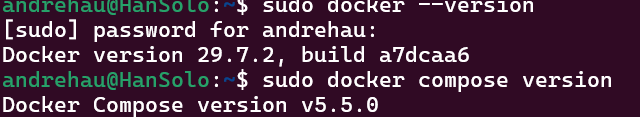

**Explicación:** estos dos comandos verifican que el motor de Docker y el
plugin de Compose estén disponibles.

---

## 2. Paso 1: Crear carpetas

```bash
$ mkdir -p ~/ia-lab/services/motores-bd/{mysql,postgres,mssql,oracle}
$ mkdir -p ~/ia-lab/data/{mysql,postgres,mssql,oracle}
$ tree ~/ia-lab/
```

Salida:

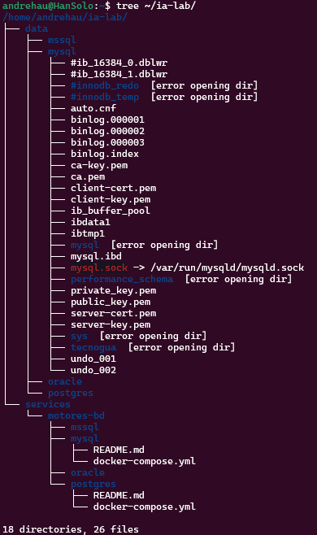

**Explicación:** se separan dos tipos de carpetas. `services/` guarda la
configuración de cada motor (el `docker-compose.yml`, el `.env` y el
`README.md`). `data/` guarda los datos reales de las bases de datos, fuera
del contenedor, para que no se pierdan si el contenedor se borra o se
recrea.

---

## 3. Paso 2: Crear la red Docker compartida

```bash
$ docker network inspect ia-lab-network >/dev/null 2>&1 || docker network create ia-lab-network
$ docker network ls | grep ia-lab
```

Salida:

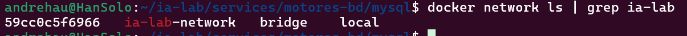

**Explicación:** los cuatro motores necesitan estar en la misma red Docker
para poder comunicarse entre sí (por ejemplo, si más adelante un script o
una app necesita conectarse a más de un motor).

---

## 4. Paso 3: MySQL

### 4.1 docker-compose.yml y .env

Creé el archivo de configuración con la imagen `mysql:8.0`, mapeando el
puerto `3306`, montando el volumen de datos y agregando un healthcheck.
El `.env` define `MYSQL_ROOT_PASSWORD` y `MYSQL_DATABASE=tecnogua`.

**Explicación:** el `.env` separa las credenciales del archivo de
Compose, así el `docker-compose.yml` no expone contraseñas directamente 

### 4.2 Levantar el contenedor

```bash
$ cd ~/ia-lab/services/motores-bd/mysql
$ docker compose up -d
```

Verificación:

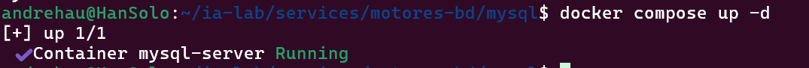

**Resultado:** MySQL quedó corriendo y en estado `healthy`. 

---

## 5. Paso 4: PostgreSQL

### 5.1 docker-compose.yml y .env

Usé la imagen `postgres:17`, expuesta en el puerto `5433` (no el `5432`
por defecto, para evitar choques con una instalación local de Postgres).
El `.env` define `POSTGRES_DB=ialab`, `POSTGRES_USER=ialab` y la
contraseña.

### 5.2 Levantar el contenedor

```bash
$ cd ~/ia-lab/services/motores-bd/postgres
$ docker compose up -d
```
Verificación:

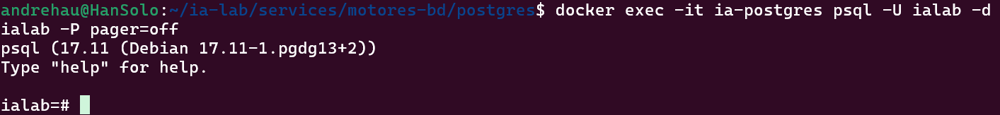

---

## 6. Paso 5: SQL Server

### 6.1 docker-compose.yml y .env

Usé la imagen oficial `mcr.microsoft.com/mssql/server:2022-latest`,
puerto `1433`, y en el `.env` acepté la licencia (`ACCEPT_EULA=Y`) y
definí la contraseña del usuario `SA` y la edición `Developer` (gratuita
para uso académico).

### 6.2 Levantar el contenedor

```bash
$ cd ~/ia-lab/services/motores-bd/mssql
$ docker compose up -d
```

Verificación:
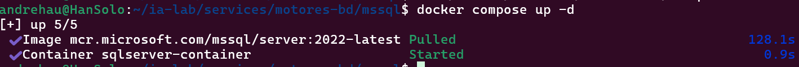

---

## 7. Paso 6: Oracle XE

### 7.1 docker-compose.yml y .env

Usé la imagen `gvenzl/oracle-xe`, con los puertos `1521` (listener) y
`8080` (interfaz web APEX). El `.env` define `ORACLE_PASSWORD` y
`ORACLE_DATABASE=XE`.

### 7.2 Levantar el contenedor

```bash
$ cd ~/ia-lab/services/motores-bd/oracle
$ docker compose up -d
```

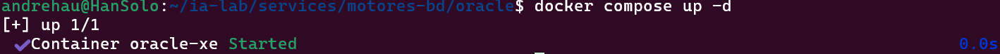


---

## 8. Paso 7: Scripts de control

Creé `start-all.sh` y `stop-all.sh` en
`~/ia-lab/services/motores-bd/` y les di permisos de ejecución con
`chmod +x`.

**Explicación:** en lugar de entrar carpeta por carpeta a correr
`docker compose up -d`, estos scripts recorren las cuatro carpetas
(`mysql`, `postgres`, `mssql`, `oracle`) en un ciclo `for` y levantan o
detienen todo de una sola vez. Es simplemente una automatización de los
pasos 3 a 7 hechos manualmente.

---

## 9. Paso 8: Levantar todo junto

Con los cuatro motores ya creados individualmente, probé el script
completo para confirmar que funciona de punta a punta:

```bash
$ ~/ia-lab/services/motores-bd/start-all.sh
```

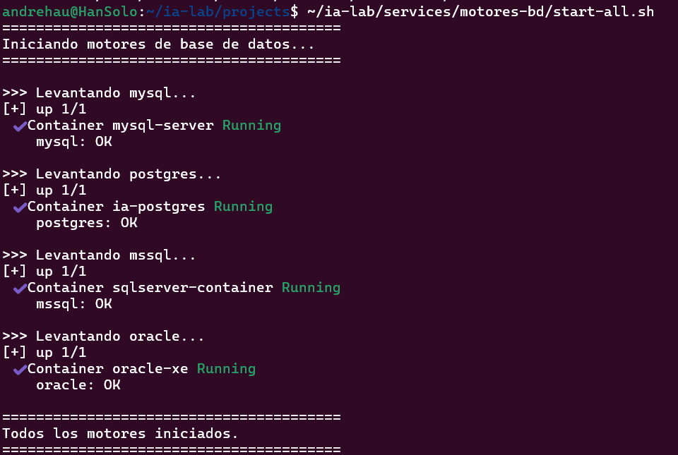

Verificación final de estado:

```bash
$ docker ps --format "table {{.Names}}\t{{.Status}}\t{{.Ports}}"
```
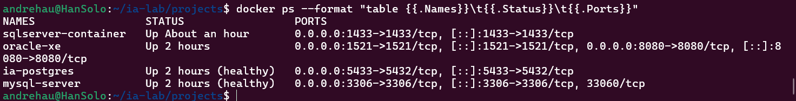

Los cuatro motores quedaron corriendo simultáneamente, cada uno en su
puerto correspondiente.

---

## 10. Paso 9: Crear usuarios con acceso remoto

Antes de crear usuarios propios, obtuve la IP de WSL para usarla al
conectarme desde otro equipo de la red:

```bash
$ hostname -I
172.19.32.39
```

### 10.1 MySQL

**Conexión remota confirmada:**
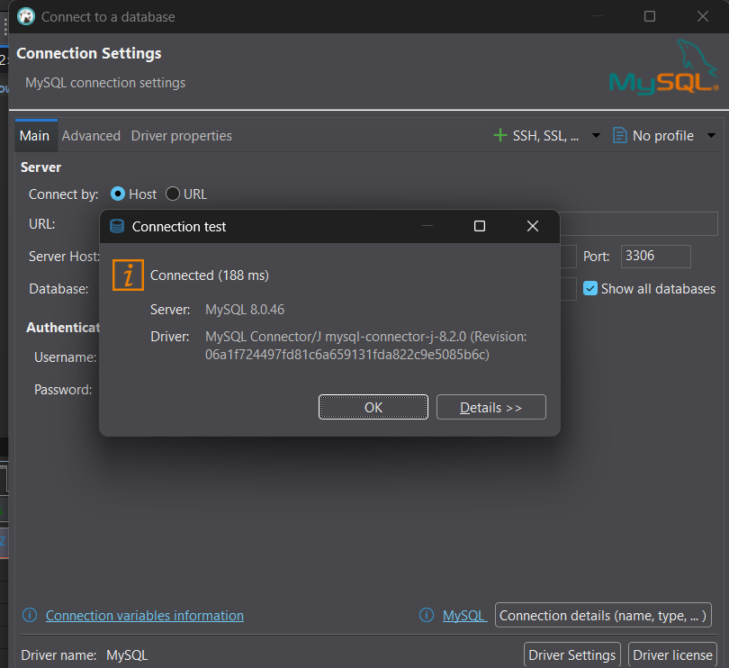

### 10.2 PostgreSQL

**Conexión remota confirmada:**
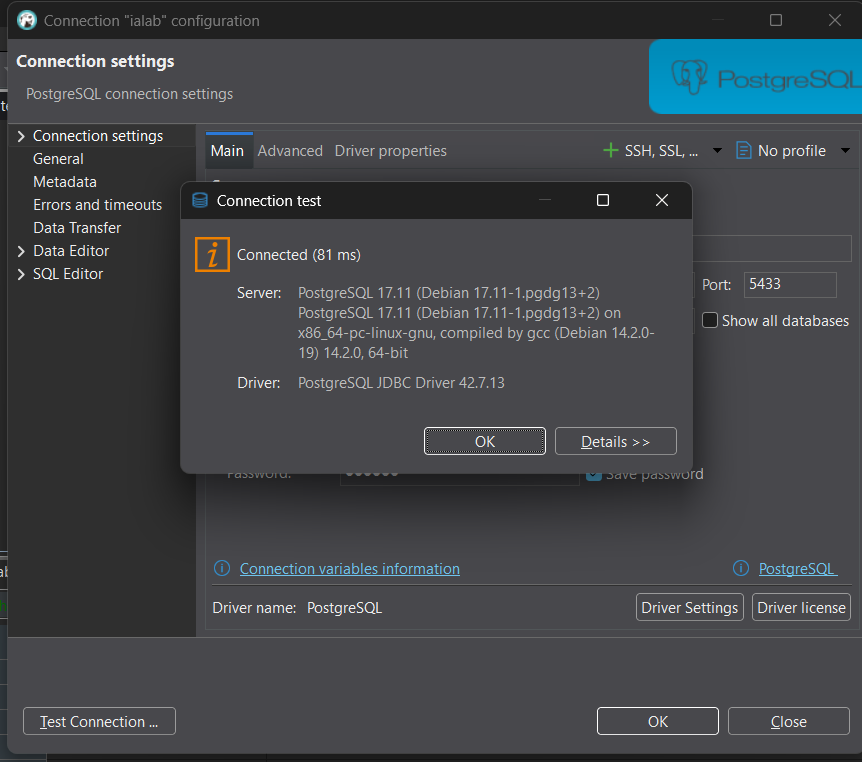

### 10.3 SQL Server

**Conexión remota confirmada:**
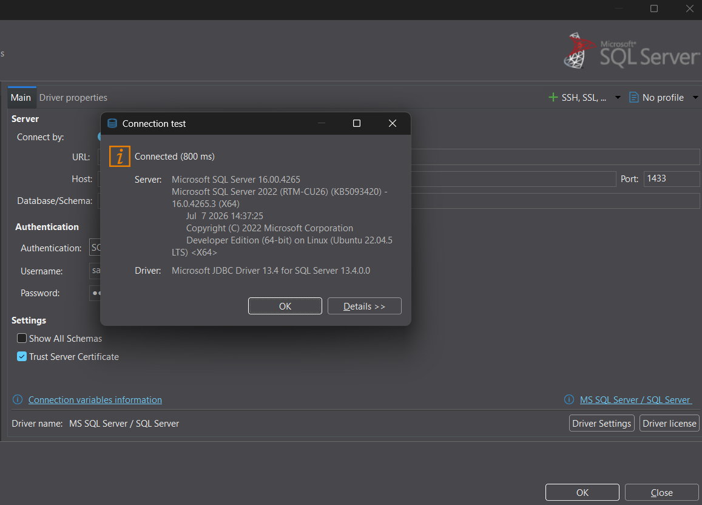

### 10.4 Oracle

**Conexión remota confirmada:**
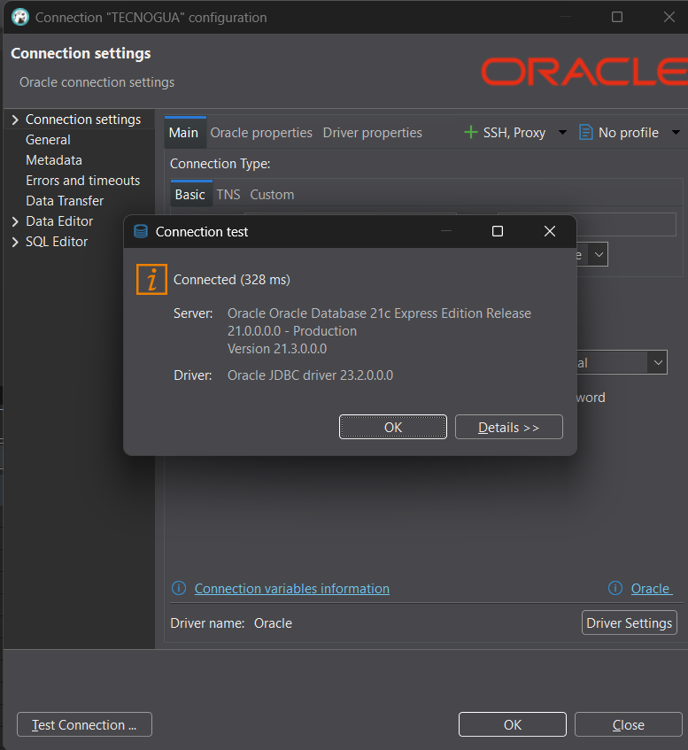

---

## Resumen

| Motor      | Puerto | Usuario admin | Usuario creado | Estado final |
|------------|--------|----------------|-----------------|--------------|
| MySQL      | 3306   | root           | estudiante      | Corriendo |
| PostgreSQL | 5433   | ialab          | estudiante      | Corriendo |
| SQL Server | 1433   | SA             | estudiante      | Corriendo |
| Oracle XE  | 1521   | SYSTEM         | estudiante      | Corriendo |


Separar `.env` del `docker-compose.yml` evita exponer contraseñas y
facilita reutilizar la misma plantilla en otro entorno.

---

